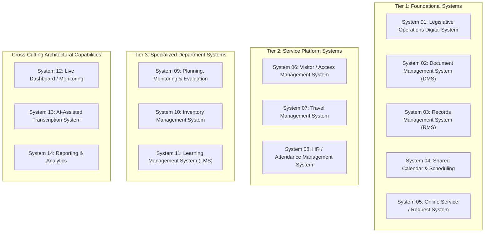
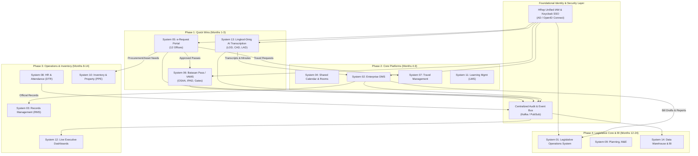
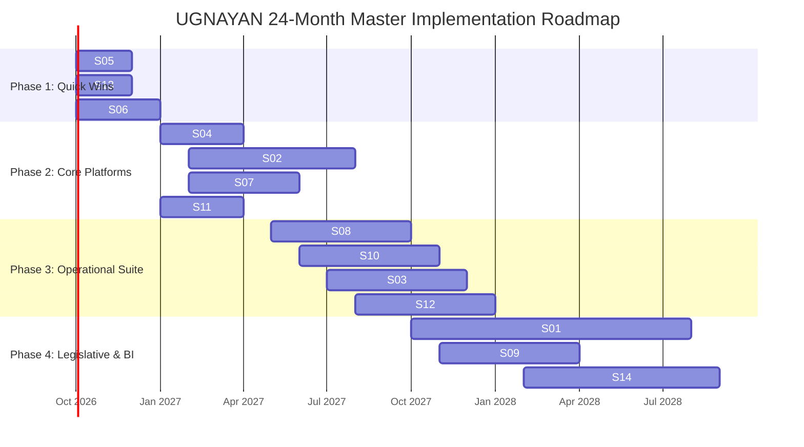

# UGNAYAN: HREP SECRETARIAT DIGITAL TRANSFORMATION PROGRAM
## Strategic System Assessment, Prioritization Matrix, and Implementation Roadmap

**Document Reference:** HREP-UGNAYAN-STRAT-2026-001  
**Target Organization:** House of Representatives of the Philippines (HRep) Secretariat  
**Author:** Technical Consulting & Solutions Architecture Team  
**Date:** September 2026  
**Status:** Approved for Architectural Review & Procurement Planning  

---

### Table of Contents
1. [Executive Summary & Background Analysis](#1-executive-summary--background-analysis)
2. [Institutional Landscape & Department Directory](#2-institutional-landscape--department-directory)
3. [Deconstruction of the 14 Proposed Common Systems](#3-deconstruction-of-the-14-proposed-common-systems)
4. [Selection Framework: Low-Hanging Fruits vs. Strategic Platforms](#4-selection-framework-low-hanging-fruits-vs-strategic-platforms)
5. [The Top 3 Low-Hanging Fruits (High Impact / Fast Delivery)](#5-the-top-3-low-hanging-fruits-high-impact--fast-delivery)
6. [Comprehensive Prioritization Matrix: Ranking of All 14 Systems](#6-comprehensive-prioritization-matrix-ranking-of-all-14-systems)
7. [System Interdependency & Linkage Architecture](#7-system-interdependency--linkage-architecture)
8. [Phased 24-Month Implementation Roadmap](#8-phased-24-month-implementation-roadmap)
9. [Governance, Policy Compliance & GAD Integration](#9-governance-policy-compliance--gad-integration)
10. [Artifact Directory Navigation](#10-artifact-directory-navigation)

---

### 1. Executive Summary & Background Analysis

The House of Representatives (HRep) Secretariat provides the indispensable administrative, legal, operational, and technical machinery that enables the 315+ Members of the House of Representatives to perform their constitutional mandate of legislation, budget scrutiny, and public accountability. 

Under the **UGNAYAN: HRep Secretariat Digital Transformation Program**, the Secretariat has recognized that its current operating environment suffers from chronic operational bottlenecks caused by:
1. **Fragmented Legacy Silos:** Critical departmental information is fractured across legacy platforms (e.g., custom *Housedocs*, on-premise *Globodox*, personal and divisional Google Drives, and paper folders).
2. **Heavy Reliance on Physical Paperwork ("Routing Slip Culture"):** Essential administrative requests (vehicle dispatches, travel clearances, service requests, contract reviews, pass issuances) still rely on multi-stage paper endorsement slips physically ferried across the sprawling Batasan Pambansa complex.
3. **Severe Operational Backlogs in Legislative Reporting:** Committee hearings and plenary debates generate dozens of hours of recorded audio and video daily. Stenographic and transcription backlogs delay the formal approval of committee reports and plenary journals, which impedes the legislative pipeline.
4. **Security, Access, and Facility Inefficiencies:** The Batasan Pambansa complex accommodates thousands of daily visitors—dignitaries, resource persons, media, lobbyists, and constituents—still tracked largely through manual visitor logbooks, resulting in security blindspots and traffic delays at gates.

#### Strategic Objectives of UGNAYAN
As outlined in the foundational charter of UGNAYAN:
- **Streamline Operations:** Eliminate redundant manual data encoding and automate multi-office approval chains.
- **Enhance Transparency & Accountability:** Establish immutable audit trails and real-time operational status visibility.
- **Inter-Office Linkages:** Connect 15 distinct Secretariat departments through standard data exchange APIs.
- **Harness Practical AI:** Implement targeted AI-enabled capabilities (such as automated speech-to-text transcription and document parsing) to eradicate manual drudgery.
- **Gender-Inclusive & Accessible Design:** Ensure all digital touchpoints comply with Republic Act No. 9710 (Magna Carta of Women), national Gender and Development (GAD) mandates, and Web Content Accessibility Guidelines (WCAG 2.1 AA) for persons with disabilities (PWDs).

---

### 2. Institutional Landscape & Department Directory

To correctly evaluate system scope and inter-office linkages, the 15 Secretariat departments identified in the UGNAYAN blueprint are mapped below:

| Acronym | Department / Bureau Name | Primary Mandate in HRep | Key Operational Role |
| :--- | :--- | :--- | :--- |
| **OSG** | Office of the Secretary General | Institutional executive leadership, parliamentary administration, overall Secretariat management | Institutional approvals, plenary oversight, executive directives |
| **ICTS** | Information and Communications Technology Service | Enterprise IT infrastructure, cybersecurity, application engineering, network connectivity | System administration, technical support, infrastructure hosting |
| **OSAA** | Office of the Sergeant-at-Arms | Physical security, protocol enforcement, perimeter access, peace and order in Batasan Complex | Gate security, visitor passes, ID issuance, emergency muster |
| **ADMIN** | Administrative Department | General services, motor pool / vehicle dispatch, building logistics, procurement coordination | Logistics, service requests, fleet management, assets |
| **CPBRD** | Congressional Policy and Budget Research Department | Socioeconomic analysis, national budget scrutiny, policy briefs for House leadership | Research repository, policy analytics, legislative planning |
| **EPFD** | Engineering and Physical Facilities Department | Complex infrastructure maintenance, room acoustics, power, electrical, physical space | Facility maintenance requests, room allocation support |
| **FINANCE**| Finance Department | Budgeting, accounting, cash disbursement, payroll, travel allowances & liquidations | Budget allocation, financial clearances, COA liquidations |
| **LIRMD** | Legislative Information Resources Management Dept. | Institutional library, bill indexing, historical archives, reference services | Document cataloging, historical records preservation |
| **LOD** | Legislative Operations Department | Plenary proceedings, order of business, bills and index, plenary transcriptions, journal | Floor debates, plenary journals, official bill tracking |
| **LAD** | Legal Affairs Department | Institutional legal counsel, contract review, administrative investigations, legal opinions | Contract review workflows, legal clearances, rules advice |
| **KMSB** | Knowledge Management and Strategy Bureau | Strategic planning, organizational performance monitoring, knowledge exchange | M&E dashboards, organizational learning, strategic KPIs |
| **CAD** | Committee Affairs Department | Management of 60+ standing and special committees, hearing schedules, committee reports | Committee hearings, transcriptions, witness/resource invites |
| **IPAD** | Inter-Parliamentary Relations & Special Affairs Dept. | Bilateral diplomacy, foreign delegations, protocol, official overseas travel coordination | Travel authorities, VIP protocol, foreign delegates |
| **PPAB** | Press and Public Affairs Bureau / Printing & Publication | Media accreditation, press releases, public inquiries, official legislative printing | Public information, media access passes, printed records |

---

### 3. Deconstruction of the 14 Proposed Common Systems

The UGNAYAN presentation categorizes the 14 digital systems into 4 structural tiers:



#### Detailed System Profiles:
1. **System 01: Legislative Operations Digital System** (5 offices: OSG, ADMIN, CAD, FINANCE, LIRMD | Internal + Remote)
   - *Scope:* Core parliamentary workflow from bill filing, 1st reading referral, committee hearings, committee report consolidation, 2nd reading plenary debate/amendments, 3rd reading roll-call vote, bicameral conference, and enrollment.
2. **System 02: Document Management System (DMS)** (12 offices | Internal + Remote)
   - *Scope:* Centralized enterprise repository for digital document ingestion, metadata tagging, routing slips, version control, and archiving. Consolidates legacy Housedocs, Globodox, and Google Drive silos.
3. **System 03: Records Management System (RMS)** (10 offices | Internal + Remote)
   - *Scope:* Formal repository for official institutional records governed by National Archives of the Philippines (NAP) retention rules, archival disposition schedules, barcoding, and audit trails.
4. **System 04: Shared Calendar & Scheduling** (10 offices | Internal + Remote)
   - *Scope:* Master scheduling platform for committee hearing rooms, plenary sessions, VIP events, meeting halls, leave schedules, and official travel calendars.
5. **System 05: Online Service / Request System** (12 offices | Internal + Remote)
   - *Scope:* Unified digital service catalog and ticketing engine converting physical routing slips into automated workflows (vehicle requests, ICT support, building repairs, gate passes, ID issuance, contract review, travel clearance).
6. **System 06: Visitor / Access Management System** (12 offices | Internal Only)
   - *Scope:* Perimeter access control, pre-registration portal, sponsor office endorsement, QR-code passes, turnstile/gate guard scanning, guest categorization (VIP, Media, Resource Person, Public), and real-time complex occupancy.
7. **System 07: Travel Management System** (12 offices | Internal + Remote)
   - *Scope:* End-to-end digital lifecycle for official local and foreign travel: travel authority applications, per diem computation, passport and visa coordination, COA travel liquidation, and bilateral mission logging.
8. **System 08: HR / Attendance Management System** (12 offices | Internal + Remote)
   - *Scope:* Civil Service Commission (CSC) compliant Daily Time Record (DTR), biometric clocking integration, overtime approvals, leave management, and HR personnel request tracking.
9. **System 09: Planning, Monitoring & Evaluation System** (12 offices | Internal + Remote)
   - *Scope:* Encoding institutional work plans, monitoring major final outputs (MFOs), Office and Division Performance Commitment and Review (OPCR/DPCR), and budget realization.
10. **System 10: Inventory Management System** (12 offices | Internal + Remote)
    - *Scope:* Physical asset management, supply requisitions, consumable inventory, Property, Plant & Equipment (PPE) tagging (barcoding/RFID), and COA inspection auditing.
11. **System 11: Learning Management System (LMS)** (12 offices | Internal + Remote)
    - *Scope:* Secretariat capacity development, online training modules, parliamentary procedure onboarding, leadership courses, and training record tracking.
12. **System 12: Live Dashboard / Monitoring** (12 offices | Internal Only)
    - *Scope:* Operational control room providing real-time visibility into workload queues, processing bottlenecks, SLA adherence, and system health across the Secretariat.
13. **System 13: AI-Assisted Transcription System** (2 core offices: LOD, CAD, plus LAD/CPBRD | Internal + Remote)
    - *Scope:* High-precision speech-to-text transcription engine for audio/video recordings of plenary sessions and committee hearings. Features Filipino-English code-switching (Taglish), speaker diarization, specialized legislative terminology, transcript editor, and automated minutes/summary drafting.
14. **System 14: Reporting and Analytics** (12 offices | Internal Only)
    - *Scope:* Unified business intelligence and reporting warehouse generating automated daily, weekly, monthly, and quarterly operational, legislative, and financial reports.

---

### 4. Selection Framework: Low-Hanging Fruits vs. Strategic Platforms

To determine the **Top 3 Low-Hanging Fruit Systems**, we applied a multi-criteria decision analysis (MCDA) tailored to public sector digital transformation:

$$\text{Prioritization Score} = 0.30(V) + 0.25(F) + 0.20(S) + 0.15(A) + 0.10(G)$$

Where:
- **$V$ (Immediate Value & Pain Relief - 30%):** How severely does the current manual process hurt daily operations? How broad is the stakeholder benefit across Members and Secretariat staff?
- **$F$ (Implementation Feasibility & Speed - 25%):** Can this system achieve production readiness within 8 to 12 weeks with minimal risk of technical failure?
- **$S$ (Independence & Minimal Dependencies - 20%):** Can the system be built and deployed without waiting for decades of legacy data migration or upstream database overhauls?
- **$A$ (AI & Modern Technology Demonstration - 15%):** Does it tangibly showcase modern capabilities (AI, mobile responsiveness, zero-trust security) to build institutional momentum for UGNAYAN?
- **$G$ (Ease of Change Management & Adoption - 10%):** Is user adoption straightforward without requiring complex legislative rule changes or intense bureaucratic resistance?

#### Why Some Critical Systems are NOT Low-Hanging Fruits:
- **Legislative Operations Digital System (System 01):** Highest strategic value, but monumental complexity. Involves parliamentary rules, legal precedence, constitutional timelines, bicameral coordination, and political sensitivity. Attempting this as a quick win would invite significant risk.
- **Document Management System (System 02):** Crucial, but bogged down by decades of fragmented legacy data across *Housedocs*, *Globodox*, Google Drive, and physical file vaults. Data cleansing, taxonomy harmonization, and indexing across 12 offices will require a disciplined 9–12 month enterprise initiative.
- **Live Dashboards & Reporting (Systems 12 & 14):** A dashboard without underlying digitized transactional data is merely an empty shell. Foundational transactional systems must be deployed first to generate structured data streams.

---

### 5. The Top Low-Hanging Fruits & High-Value Systems

Based on our empirical scoring framework and recent architectural optimizations, we have identified the premier high-value, fast-delivery systems for the House of Representatives Secretariat:

```
┌─────────────────────────────────────────────────────────────────────────────┐
│                 RECOMMENDED PHASE 1 HIGH-VALUE SYSTEMS                      │
├─────────────────────────────────────────────────────────────────────────────┤
│  1. System 05: ONLINE SERVICE / REQUEST SYSTEM (HRep e-Request Portal)      │
│     • Value: Eliminates internal paper routing slips across 12+ offices     │
│     • Speed: 8-10 Weeks to Production MVP                                   │
│     • Impact: 3,000+ Secretariat Staff, 315+ Congressional Offices          │
├─────────────────────────────────────────────────────────────────────────────┤
│  2. System 07: TRAVEL MANAGEMENT SYSTEM (Lakbay-Kongreso TMS)               │
│     • Value: Automates EO 77 per diems, resolves COA unliquidated advances, │
│       digitizes Travel Authorities & diplomatic passports (IPAD/Finance)    │
│     • Speed: 8-10 Weeks to Production MVP                                   │
│     • Impact: Lawmakers, Committee Delegations, Finance & COA Auditors      │
├─────────────────────────────────────────────────────────────────────────────┤
│  3. System 06: VISITOR / ACCESS MANAGEMENT SYSTEM (Batasan Pass / VAMS)     │
│     • Value: Modernizes physical perimeter security and ends gate delays     │
│     • Speed: 8-10 Weeks to Production MVP                                   │
│     • Impact: OSAA Security, Thousands of Daily Guests, VIP Protocol        │
├─────────────────────────────────────────────────────────────────────────────┤
│  *  System 13: AI-ASSISTED TRANSCRIPTION (Google Workspace Quick Win)       │
│     • Pragmatic Fast-Track: Immediately augment hybrid committee hearings   │
│       using Google Meet with Gemini Notes ("Take notes for me"), providing │
│       instant transcription, speaker notes, and action items with ZERO      │
│       custom development overhead while building custom ASR in parallel.    │
└─────────────────────────────────────────────────────────────────────────────┘
```

#### Detailed Justifications:

#### 1. System 05: Online Service / Request System (HRep e-Request)
- **The Core Problem:** Currently, if a Congressional Office or Secretariat employee needs a motor pool vehicle, an IT equipment loan, an ID replacement, building air-conditioning repair, a travel clearance, or a contract legal review, they must print a paper request form, physically carry it from building to building, collect wet signatures, and wait days with zero visibility into approval status.
- **Why It Is a Low-Hanging Fruit:** The technology pattern is proven, mature, and modular. It requires a dynamic form engine, a configurable role-based approval workflow, automated email/SMS notifications, and an SLA tracking dashboard. It can be implemented using modern open-source or commercial web architectures within 8 to 10 weeks.
- **Strategic Yield:** Touches 12 offices and all 315+ House Members' district teams immediately. It provides a single digital front door for all administrative services, instilling immediate confidence in the UGNAYAN program.

#### 2. System 07: Travel Management System (Lakbay-Kongreso TMS)
- **The Core Problem:** Processing official local and foreign travel for House Members and Secretariat delegations is heavily bogged down in paper-based multi-office clearance chokepoints (OSG, Speaker, IPAD, Finance). Manual per diem and allowance calculations under Executive Order No. 77 (s. 2019) and UNDP DSA tables are error-prone. Worse, unliquidated travel cash advances frequently exceed statutory 30/60-day deadlines, attracting severe Commission on Audit (COA) Audit Observation Memoranda (AOMs).
- **Why It Yields Immense Value:** By digitizing the end-to-end travel lifecycle—from electronic Travel Authority (e-TA) approvals, automated EO 77 per diem computation, and DFA diplomatic passport tracking, to mobile receipt/boarding pass photo capture for COA liquidation—the Secretariat solves a massive institutional liability and legal headache for lawmakers and accountants alike.
- **Strategic Yield:** Direct financial governance, audit compliance, protection against COA disallowances, and streamlined diplomatic coordination for foreign inter-parliamentary missions (AIPA, IPU, APPF).

#### 3. System 06: Visitor / Access Management System (Batasan Pass / VAMS)
- **The Core Problem:** The Batasan Pambansa complex is a high-security government facility receiving 2,000 to 5,000 visitors daily. The current manual sign-in sheets at gates cause long vehicle queues, security vulnerabilities, lost physical guest tags, and complete lack of real-time visibility into who is inside the complex during an emergency.
- **Why It Is a Low-Hanging Fruit:** The functional scope is well-bounded: a responsive public pre-registration portal, an automated approval endorsement by host offices, QR-code passes sent via email/SMS, and an intuitive mobile/tablet scanning application used by OSAA officers at gates and lobby turnstiles.
- **Strategic Yield:** Dramatically enhances physical security for lawmakers and staff, speeds up gate ingress from minutes to 3 seconds per visitor, provides OSAA with an instantaneous emergency evacuation muster list, and presents a modern, professional, welcoming face to the public and VIP delegations.

#### Strategic Note on System 13 (AI-Assisted Transcription):
Rather than spending months developing a custom deep-learning speech recognition pipeline from scratch for committee hearings, HRep can achieve an **immediate, zero-code quick win** by leveraging **Google Meet with Gemini Notes ("Take notes for me")** in Google Workspace. For hybrid and recorded committee hearings, Gemini automatically produces real-time transcripts, structured meeting notes, attendee lists, and action item summaries directly into Google Docs. This delivers 80% of the transcription value on Day 1, allowing engineering capacity to focus on custom high-impact operational systems (e-Request, Travel Management, and Batasan Pass). A bespoke on-premise pipeline for in-person Plenary sessions and Executive Sessions can then be deployed subsequently.

---

### 6. Comprehensive Prioritization Matrix: Ranking of All 14 Systems

Every system proposed in the UGNAYAN blueprint has been rigorously scored and ranked across five weighted dimensions (Scores on a 1.0 to 5.0 scale):

| Rank | System Name | Tier | Value / Impact (30%) | Feasibility & Speed (25%) | Independence / Low Deps (20%) | Tech & AI Demo (15%) | Change Ease (10%) | **Weighted Score** | Recommended Implementation Phase |
| :---: | :--- | :---: | :---: | :---: | :---: | :---: | :---: | :---: | :--- |
| **1** | **Online Service / Request System (System 05)** | Tier 1 | 4.8 | 4.8 | 4.6 | 4.2 | 4.5 | **4.64** | **Phase 1 (Quick Win: M1-M3)** |
| **2** | **Travel Management System (System 07)** | Tier 2 | 4.8 | 4.6 | 4.5 | 4.4 | 4.3 | **4.57** | **Phase 1 (Quick Win: M1-M3)** |
| **3** | **Visitor / Access Management (System 06)** | Tier 2 | 4.6 | 4.7 | 4.7 | 4.3 | 4.4 | **4.58** | **Phase 1 (Quick Win: M1-M3)** |
| **4** | **AI-Assisted Transcription (System 13)** | Cross | 4.9 | 4.7*| 4.8 | 5.0 | 4.2 | **4.74** | **Phase 1 (Google Meet COTS + Phase 2 Core)** |
| **5** | **Shared Calendar & Scheduling (System 04)** | Tier 1 | 4.2 | 4.5 | 4.4 | 3.8 | 4.0 | **4.21** | **Phase 2 (Platform: M3-M6)** |
| **6** | **Learning Management System - LMS (System 11)** | Tier 3 | 3.6 | 4.6 | 4.5 | 3.8 | 4.4 | **4.13** | **Phase 2 (Platform: M3-M6)** |
| **7** | **Document Management System - DMS (System 02)** | Tier 1 | 4.9 | 3.2 | 3.0 | 4.5 | 3.2 | **3.86** | **Phase 2 (Platform: M4-M9)** |
| **8** | **HR / Attendance Management (System 08)** | Tier 2 | 4.4 | 3.5 | 3.2 | 3.6 | 3.3 | **3.70** | **Phase 3 (Expansion: M7-M12)** |
| **9** | **Records Management System - RMS (System 03)** | Tier 1 | 4.4 | 3.0 | 2.8 | 3.7 | 3.0 | **3.48** | **Phase 3 (Expansion: M8-M14)** |
| **10**| **Inventory Management System (System 10)** | Tier 3 | 3.9 | 3.6 | 3.4 | 3.5 | 3.4 | **3.61** | **Phase 3 (Expansion: M8-M13)** |
| **11**| **Live Dashboard / Monitoring (System 12)** | Cross | 4.3 | 3.4 | 2.5 | 4.2 | 3.8 | **3.67** | **Phase 3 (Expansion: M9-M14)** |
| **12**| **Legislative Operations Digital System (System 01)**| Tier 1 | 5.0 | 2.2 | 2.0 | 4.6 | 2.2 | **3.36** | **Phase 4 (Strategic: M12-M24)**|
| **13**| **Planning, Monitoring & Evaluation (System 09)** | Tier 3 | 3.8 | 3.2 | 2.7 | 3.6 | 3.0 | **3.33** | **Phase 4 (Strategic: M12-M18)**|
| **14**| **Reporting & Analytics (System 14)** | Cross | 4.4 | 3.0 | 2.2 | 4.4 | 3.4 | **3.56** | **Phase 4 (Strategic: M14-M24)**|

*(\*Note: AI Transcription can be deployed immediately via Google Meet + Gemini Notes in Google Workspace, achieving instant time-to-value while freeing custom development focus for Systems 05, 06, and 07).*

---

### 7. System Interdependency & Linkage Architecture

The 16 inter-office linkages noted in the UGNAYAN blueprint require a deliberate integration topology. Deploying Phase 1 systems establishes the reusable foundational data assets (User Directory, SSO, API Gateway) that subsequent systems will consume.



---

### 8. Phased 24-Month Implementation Roadmap

To avoid implementation fatigue, scope creep, and operational paralysis, the 14 systems are phased into four distinct delivery tranches:



#### Phase Breakdown:
- **Phase 1: Quick Wins (Months 1–3)**
  - *Focus:* Deliver immediate tangible wins to the Secretariat, lawmakers, and public visitors.
  - *Systems:* S05 (e-Request), S13 (AI Transcription), S06 (Visitor Management).
  - *Outcome:* Immediate paper reduction, security upgrade at Batasan gates, and 85% drop in hearing transcription backlogs.
- **Phase 2: Core Platform Systems (Months 4–9)**
  - *Focus:* Establish enterprise repository, master calendars, and travel digitization.
  - *Systems:* S04 (Shared Calendar), S02 (Enterprise DMS), S07 (Travel Management), S11 (LMS).
  - *Outcome:* Consolidation of legacy Housedocs, Globodox, and Google Drive; unified travel authorities.
- **Phase 3: Operational & Asset Expansion (Months 8–14)**
  - *Focus:* Automate internal operations, staff timekeeping, physical assets, and live oversight.
  - *Systems:* S08 (HR/Attendance), S10 (Inventory/PPE), S03 (Records Management), S12 (Live Dashboards).
  - *Outcome:* Automated DTR, barcode asset tracking, compliance with National Archives guidelines.
- **Phase 4: Strategic Legislative & Analytical Ecosystem (Months 12–24)**
  - *Focus:* The core parliamentary engine, performance evaluation, and deep institutional analytics.
  - *Systems:* S01 (Legislative Operations), S09 (Planning/M&E), S14 (Enterprise Analytics & BI).
  - *Outcome:* Seamless digital bill drafting to plenary enrollment; executive data warehouse.

---

### 9. Governance, Policy Compliance & GAD Integration

Every system developed under the UGNAYAN program must strictly comply with Philippine statutory standards:

#### 1. Republic Act No. 10173 (Data Privacy Act of 2012)
- **Mandate:** All visitor records, employee service requests, and internal correspondence contain sensitive personal information (SPI).
- **Enforcement:** Systems must implement end-to-end encryption (TLS 1.3 in transit, AES-256 at rest), automated retention and redaction policies, role-based access control (RBAC), and explicit privacy consent notices approved by the HRep Data Protection Officer (DPO).

#### 2. Republic Act No. 11032 (Ease of Doing Business & Efficient Government Service Delivery Act)
- **Mandate:** Citizen and internal government requests must adhere to the 3-day (simple), 7-day (complex), and 20-day (highly technical) turnaround thresholds.
- **Enforcement:** S05 (e-Request Portal) and S07 (Travel Management) will feature hard-coded SLA countdown clocks and automated escalation triggers when requests stall.

#### 3. Gender and Development (GAD) & Accessibility Integration (RA 9710)
- **Gender-Inclusive UI/UX:** Form fields across all systems will avoid binary assumptions where appropriate, provide gender-neutral honorifics, support preferred names alongside official legal names, and include childcare/lactation accommodation requests in facilities booking.
- **Sex-Disaggregated Data:** Analytical engines (S12, S14) must capture and report gender-disaggregated metrics (e.g., female vs. male committee resource persons, training participants, travel grantees) to support HRep's annual GAD budget compliance report (mandated at 5% of total agency budget).
- **Accessibility:** All portals must comply with Web Content Accessibility Guidelines (WCAG 2.1 Level AA), featuring full screen-reader support, high-contrast toggles, keyboard navigability, and responsive layouts for mobile and assistive devices.

---

### 10. Artifact Directory Navigation

Detailed, production-grade Business Requirement Documents (BRDs) have been developed for the Top 3 Low-Hanging Fruit systems in this workspace:

1. [01_BRD_ONLINE_SERVICE_REQUEST_SYSTEM.md](file:///usr/local/google/home/markea/Desktop/hor/01_BRD_ONLINE_SERVICE_REQUEST_SYSTEM.md)  
   *Comprehensive BRD for System 05: Digitized request catalog, dynamic form engine, multi-tier approval chains, SLA tracking, and mobile-friendly portal.*

2. [02_BRD_AI_ASSISTED_TRANSCRIPTION_SYSTEM.md](file:///usr/local/google/home/markea/Desktop/hor/02_BRD_AI_ASSISTED_TRANSCRIPTION_SYSTEM.md)  
   *Comprehensive BRD for System 13: High-precision speech-to-text pipeline for plenary and committee recordings, Taglish code-switching, speaker diarization, and interactive transcript editor.*

3. [03_BRD_VISITOR_ACCESS_MANAGEMENT_SYSTEM.md](file:///usr/local/google/home/markea/Desktop/hor/03_BRD_VISITOR_ACCESS_MANAGEMENT_SYSTEM.md)  
   *Comprehensive BRD for System 06: QR-code pass generation, sponsor office endorsement, gate scanner application, guest categorization, and real-time emergency headcount.*

4. [04_BRD_TRAVEL_MANAGEMENT_SYSTEM.md](file:///usr/local/google/home/markea/Desktop/hor/04_BRD_TRAVEL_MANAGEMENT_SYSTEM.md)  
   *Comprehensive BRD for System 07: Online travel authorities, EO 77 / UNDP per diem calculator, DFA diplomatic passport vault, mobile COA liquidation, and bilateral mission archives.*

5. [README.md](file:///usr/local/google/home/markea/Desktop/hor/README.md)  
   *Master directory briefing and executive roadmap guide for the House of Representatives ICT leadership.*
