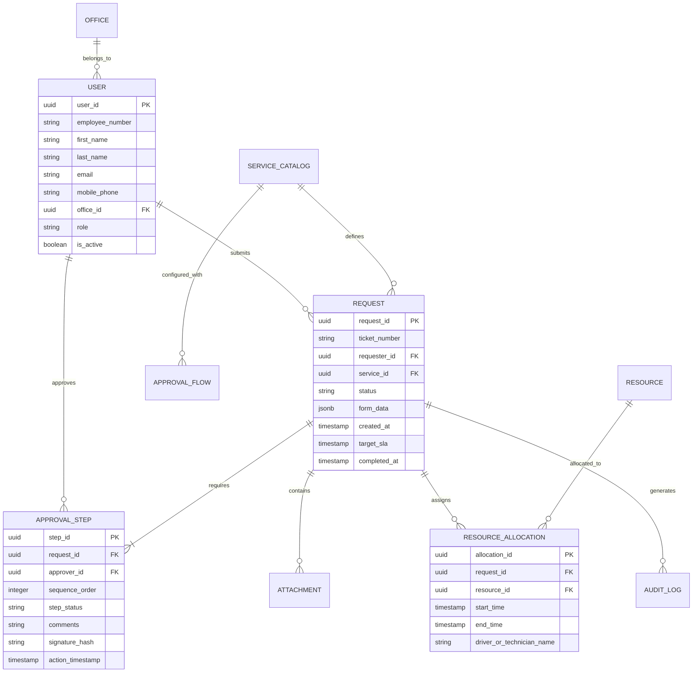
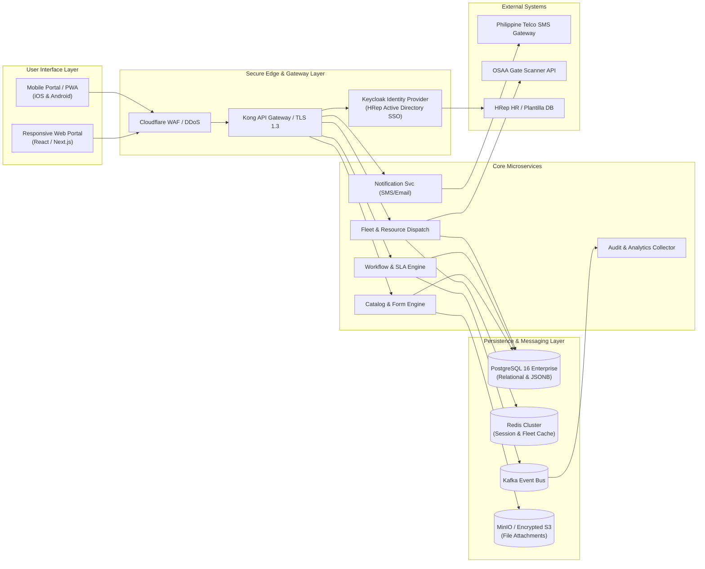
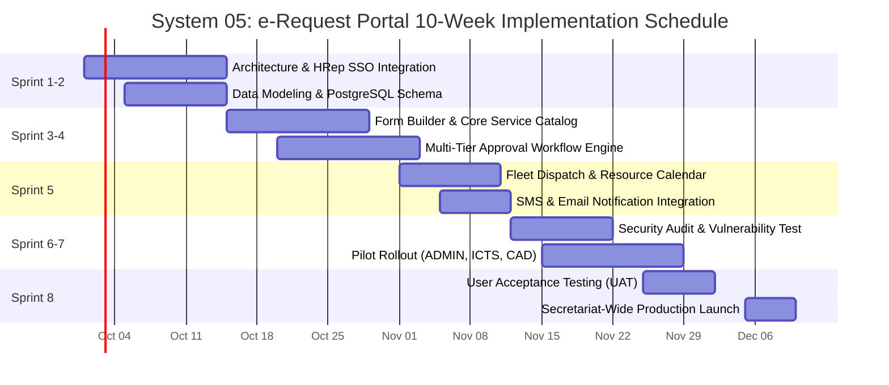

# BUSINESS REQUIREMENTS DOCUMENT (BRD)
## HRep e-Request Portal (Online Service / Request System)
### Unified Administrative and Logistics Service Portal for the House of Representatives Secretariat

**Document Reference:** HREP-BRD-S05-2026-v1.0  
**System Code:** UGNAYAN-SYS-05  
**Deployment Tier:** Tier 1 (Foundational Systems)  
**Target Release:** Phase 1 (MVP: Month 3)  
**Classification:** Internal Restricted  

---

### Table of Contents
1. [Document Control & Sign-off](#1-document-control--sign-off)
2. [Executive Summary & Background](#2-executive-summary--background)
3. [Business Problem Statement & Gap Analysis](#3-business-problem-statement--gap-analysis)
4. [Project Objectives & Success Metrics](#4-project-objectives--success-metrics)
5. [Stakeholder Analysis & User Personas](#5-stakeholder-analysis--user-personas)
6. [Project Scope: In-Scope vs. Out-of-Scope](#6-project-scope-in-scope-vs-out-of-scope)
7. [Service Catalog & Service-Level Agreements (SLAs)](#7-service-catalog--service-level-agreements-slas)
8. [Business Process Workflows (As-Is vs. To-Be)](#8-business-process-workflows-as-is-vs-to-be)
9. [Detailed Functional Requirements (FRs)](#9-detailed-functional-requirements-frs)
10. [Non-Functional Requirements (NFRs)](#10-non-functional-requirements-nfrs)
11. [Data Architecture & Entity-Relationship Diagram](#11-data-architecture--entity-relationship-diagram)
12. [Integration & Security Architecture](#12-integration--security-architecture)
13. [Gender-Responsive & Accessibility Compliance (GAD & WCAG)](#13-gender-responsive--accessibility-compliance-gad--wcag)
14. [Risk Analysis & Mitigation Strategy](#14-risk-analysis--mitigation-strategy)
15. [Phased Implementation & Acceptance Criteria](#15-phased-implementation--acceptance-criteria)

---

### 1. Document Control & Sign-off

#### Document History
| Version | Date | Author / Role | Summary of Changes |
| :--- | :--- | :--- | :--- |
| **1.0** | 2026-09-01 | Lead Enterprise Architect | Initial Baseline BRD for UGNAYAN System 05 |

#### Approvals
| Role | Name / Title | Department | Signature / Status |
| :--- | :--- | :--- | :--- |
| **Business Sponsor** | Hon. Secretary General | Office of the Secretary General (OSG) | Approved |
| **Technical Authority**| Director, ICTS | Information & Communications Tech. Service | Reviewed |
| **Operations Lead** | Director, Administrative Dept. | Administrative Department (ADMIN) | Reviewed |
| **Security Authority** | Sergeant-at-Arms | Office of the Sergeant-at-Arms (OSAA) | Reviewed |
| **Legal Review** | Director, Legal Affairs Dept. | Legal Affairs Department (LAD) | Reviewed |

---

### 2. Executive Summary & Background

The House of Representatives (HRep) Secretariat supports 315+ Members of Congress and their thousands of congressional staff across the Batasan Pambansa complex in Quezon City and remote district offices nationwide. Daily operations demand hundreds of cross-departmental administrative transactions: dispatching motor pool vehicles, issuing security gate passes and building IDs, requesting emergency facility maintenance, borrowing ICT presentation equipment, seeking legal contract reviews, and obtaining travel clearances.

Currently, these services are processed through physical multi-copy paper forms ("routing slips") that are manually carried across six sprawling buildings (South Wing, North Wing, Main Building, Ramon V. Mitra Jr. Building, SW Annex, NW Annex). Requisitions frequently stall on desks without status tracking, leading to administrative gridlock, missed legislative deadlines, duplicate expenditures, and frustration.

The **HRep e-Request Portal (UGNAYAN System 05)** establishes a unified, mobile-responsive digital service catalog and workflow orchestration platform. It automates submission, validation, multi-level departmental endorsement, electronic signature, execution, and dispatching, delivering full transparency, automated SLA timers, and seamless integration with the Secretariat's backend departments.

---

### 3. Business Problem Statement & Gap Analysis

#### As-Is Situation
- **Paper Dependency & Physical Burden:** Over 85% of administrative requests require physical paper forms with 3 to 7 wet signatures. Messengers and staff walk kilometers daily between buildings just to collect initials.
- **Zero Visibility & Tracking:** Once a paper request is submitted, requesters have no way of knowing who currently has the document or why it is delayed. Lost forms require re-initiating the entire cycle.
- **SLA Breaches & Unpredictable Turnarounds:** Under Republic Act No. 11032 (*Ease of Doing Business Act*), government services must follow strict turnaround deadlines (3 days for simple, 7 days for complex). Currently, simple vehicle or ID requests can take 7 to 14 days due to desk stagnation.
- **Fragmented Data & Lack of Audit Trails:** Departments log requests in disconnected Excel spreadsheets, personal logbooks, or standalone local databases, preventing unified institutional reporting for COA (Commission on Audit) and the Secretary General.

#### Gap Analysis
| Operational Capability | Current State (As-Is) | Target State with e-Request (To-Be) |
| :--- | :--- | :--- |
| **Submission Channel** | Physical paper routing slips, walk-in paper delivery | 100% web & mobile digital service catalog with single sign-on |
| **Approval Flow** | Wet signatures, physical desk trays, manual chasing | Dynamic role-based digital routing with e-signatures & OTP |
| **Status Transparency** | Blind (requester calls or visits office repeatedly) | Real-time Kanban / Timeline tracker with SMS & Email alerts |
| **Turnaround Time** | 5 to 14 working days | 4 hours to 3 working days (strictly enforced by system SLA) |
| **Resource Allocation** | Manual whiteboard dispatching (e.g., motor pool fleet) | Automated calendar conflict checking & resource assignment |
| **Audit & Compliance** | Physical carbon copies, prone to loss or damage | Immutable digital audit log compliant with COA and DPA |

---

### 4. Project Objectives & Success Metrics

#### Objectives
1. Eliminate paper routing slips across all 12 participating Secretariat departments within 90 days of launch.
2. Establish a single digital front-door portal accessible via desktop, tablet, and smartphone for all HRep personnel and Congressional district staff.
3. Automate SLA tracking compliant with RA 11032, automatically escalating overdue requests to division chiefs and bureau directors.
4. Provide structured transactional data feeds to the UGNAYAN Live Monitoring Dashboard (System 12) and Reporting Suite (System 14).

#### Key Performance Indicators (KPIs)
- **Turnaround Reduction:** 70% decrease in average request fulfillment duration within 60 days of go-live.
- **Zero Lost Requests:** 100% of submitted tickets tracked with immutable timestamped audit logs.
- **Paper & Printing Savings:** Elimination of an estimated 250,000 physical routing slip sheets annually.
- **User Adoption:** >90% of all administrative service requests originated digitally within 4 months of rollout.

---

### 5. Stakeholder Analysis & User Personas

The e-Request Portal serves five distinct personas reflecting the complex hierarchy of the Philippine legislature:

#### Persona 1: Atty. Marilou Reyes (Congressional Chief of Staff)
- **Role:** Chief of Staff to a 3rd-term District Representative.
- **Demographics:** Female, 42 years old, lawyer, highly mobile, splits time between Batasan office and provincial district.
- **Responsibilities:** Managing Member’s legislative and administrative needs; booking official vehicles for committee site inspections; securing security gate passes for visiting mayors and constituents; requesting ICT equipment for hybrid hearings.
- **Pain Points:** Spends hours texting department directors to ask about status; staff waste hours walking between Batasan buildings; needs to submit requests remotely from the district office on weekends.
- **System Need:** Fast mobile submission (<2 minutes), biometric/OTP approval on behalf of the Representative, push notifications on status updates.

#### Persona 2: Dennis Villanueva (Administrative Assistant II, Secretariat)
- **Role:** Permanent Secretariat employee assigned to the Committee Affairs Department (CAD).
- **Demographics:** Male, 31 years old, tech-savvy, desk-bound during hearing days.
- **Responsibilities:** Requesting office supplies, computer peripherals from ICTS, room air-conditioning maintenance from EPFD, and official travel clearances for committee study tours.
- **Pain Points:** Exhausted by manual paper chasing; gets blamed when supplies or AC repairs are delayed; has no paper trail when approvers sit on requests.
- **System Need:** Clear digital form dropdowns, ability to attach supporting documents (e.g., committee notices), transparent status bar.

#### Persona 3: Engr. Rolando Santos (Division Chief, Motor Pool / Building Facilities, ADMIN)
- **Role:** Approving and Dispatching Supervisor, General Services Division.
- **Demographics:** Male, 56 years old, 25 years in government service, values bureaucratic compliance and COA audit-readiness.
- **Responsibilities:** Reviewing vehicle requests, assessing vehicle and driver availability, inspecting fuel vouchers, managing vehicle maintenance schedules.
- **Pain Points:** Paper request forms arrive late or incomplete; drivers get double-booked; struggles to compile monthly dispatch utilization reports for COA.
- **System Need:** Interactive dispatch calendar, fleet availability dashboard, 1-click digital approval/rejection with reason code, automated COA-compliant report generation.

#### Persona 4: Col. Salvador "Buddy" Macaraeg (OSAA Gate & Pass Security Chief)
- **Role:** Security Operations Supervisor, Office of the Sergeant-at-Arms.
- **Demographics:** Male, 50 years old, retired military officer, strict enforcer of perimeter security protocols.
- **Responsibilities:** Approving building access passes, VIP escort requests, equipment pass-in/pass-out permits, and after-hours building entry.
- **Pain Points:** Requesters send last-minute paper memos that get misplaced at the gate; security officers at Batasan gates cannot verify whether a physical pass is genuine or forged.
- **System Need:** Real-time digital sync with Gate 1, Gate 2, and North/South gates; instant QR code pass verification; automated expiry of visitor and contractor passes.

#### Persona 5: Maria Cristina "Tina" De Jesus (GAD Focal Point & Accessibility Officer, KMSB)
- **Role:** Gender and Development (GAD) Specialist and PWD Coordinator.
- **Demographics:** Female, 38 years old, advocate for inclusive workplace policies and RA 9710 compliance.
- **Responsibilities:** Monitoring Secretariat services for gender responsiveness, lactation room accommodation, accessible transport dispatch for mobility-impaired staff.
- **Pain Points:** Current paper forms do not record accessibility requirements, pregnant employee support, or gender-disaggregated usage data required by the Philippine Commission on Women (PCW).
- **System Need:** Inclusive form fields (PWD accommodation request, lactation room key pass, preferred gender pronouns/honorifics), sex-disaggregated reporting module.

---

### 6. Project Scope: In-Scope vs. Out-of-Scope

#### In-Scope (Phase 1 MVP)
1. **Unified Service Catalog:** Standardized digital forms for the following core service modules:
   - *Module A: Transport & Logistics (ADMIN - Motor Pool):* Vehicle dispatch for official committee travel, airport pickups for parliamentary delegates, courier/document delivery.
   - *Module B: Security & Building Access (OSAA):* Temporary vehicle gate pass, contractor work permit, after-hours building access, employee ID replacement.
   - *Module C: ICT & Technical Support (ICTS):* Equipment loan (laptops, projectors, portable PA), network/VPN access requisition, email account creation, technical workstation repair.
   - *Module D: Facilities & Maintenance (EPFD):* Air-conditioning, electrical, carpentry, plumbing repair work orders, committee room setup.
   - *Module E: Legal Clearances & Review (LAD):* Contract review routing, legal opinion request, clearance for official records.
   - *Module F: Travel Clearance (OSG / IPAD):* Initial travel authority routing and clearance endorsement.
2. **Workflow & Approval Engine:** Multi-stage, role-based conditional approval routing (Staff -> Division Chief -> Director -> Service Department -> Dispatch/Fulfillment).
3. **Digital Signatures & Approvals:** Cryptographic timestamped e-signatures with SMS OTP authentication for approving officials.
4. **SLA Management & Escalation Engine:** Automated countdown timers based on RA 11032 service classifications with automated email/SMS escalation alerts.
5. **Role-Based Portals:** Mobile-responsive portals for Requesters, Approvers, Dispatchers/Fulfillment Staff, and System Administrators.
6. **Audit Trail & Logging:** Immutable event logging capturing every view, edit, approval, rejection, and fulfillment action.

#### Out-of-Scope (Deferred to Phase 2 / Other Systems)
- **Plenary Legislative Bill Drafting:** Handled exclusively by System 01 (Legislative Operations).
- **Comprehensive HR Payroll & Biometric DTR:** Handled by System 08 (HR / Attendance Management).
- **Procurement Bidding & BAC Management:** Handled under specialized PhilGEPS / BAC procurement modules.
- **Financial Cash Disbursement & Per Diem Liquidation:** Handled by System 07 (Travel Management) and FINANCE accounting systems.

---

### 7. Service Catalog & Service-Level Agreements (SLAs)

All requests in the e-Request portal are classified according to RA 11032 standards:

| Service Category | Service Name | Fulfilling Department | Statutory SLA (RA 11032) | Escalation Threshold |
| :--- | :--- | :--- | :--- | :--- |
| **Transport** | Vehicle Dispatch (Official Business) | ADMIN (Motor Pool) | Simple (24 Working Hours) | Overdue at 18 Hours |
| **Transport** | Special VIP Airport Escort | ADMIN + OSAA | Complex (3 Working Days) | Overdue at 2 Working Days |
| **Security** | Employee / Staff ID Replacement | OSAA | Simple (48 Working Hours) | Overdue at 36 Hours |
| **Security** | Contractor After-Hours Work Permit| OSAA | Simple (24 Working Hours) | Overdue at 18 Hours |
| **Security** | Vehicle Gate Decal / Pass | OSAA | Complex (3 Working Days) | Overdue at 2 Working Days |
| **ICT Services** | Audio-Visual Equipment Loan | ICTS | Simple (24 Working Hours) | Overdue at 16 Hours |
| **ICT Services** | New User Account / VPN Requisition| ICTS | Simple (48 Working Hours) | Overdue at 36 Hours |
| **Facilities** | Room Aircon / Electrical Repair | EPFD | Simple (24 Working Hours) | Overdue at 16 Hours |
| **Facilities** | Hearing Room Layout Modification | EPFD + CAD | Complex (3 Working Days) | Overdue at 2 Working Days |
| **Legal** | Memorandum of Agreement Review | LAD | Complex (7 Working Days) | Overdue at 5 Working Days |
| **Legal** | Official Legal Opinion | LAD | Highly Technical (20 Days)| Overdue at 15 Days |
| **Admin** | Office Supplies Requisition | ADMIN (Supply Div.) | Simple (48 Working Hours) | Overdue at 36 Hours |

---

### 8. Business Process Workflows (As-Is vs. To-Be)

#### As-Is Physical Paper Routing Workflow
```mermaid
sequenceDiagram
    autonumber
    actor Staff as Congressional / CAD Staff
    actor Chief as Division Chief
    actor Director as Department Director
    actor Messenger as Office Messenger
    actor Service as Fulfilling Dept (e.g. Motor Pool)

    Staff->>Chief: Prepares printed paper requisition form
    Chief-->>Staff: Returns form for missing attachments
    Staff->>Chief: Re-submits with attachments; Chief signs
    Chief->>Messenger: Dispatches physical folder to Director
    Note over Messenger,Director: Folder sits in in-tray (1-3 days)
    Director->>Messenger: Signs wet signature; returns folder
    Messenger->>Service: Physically carries folder across Batasan complex
    Note over Service: Folder sits in queue; no status visibility
    Service-->>Staff: Phone call: "Vehicle unavailable on requested date"
    Note over Staff: Entire manual cycle must be restarted!
```

#### To-Be Automated e-Request Workflow
```mermaid
sequenceDiagram
    autonumber
    actor User as Requester (Web / Mobile)
    participant System as e-Request Core Engine
    actor Approver as Division Chief / Director
    actor Dispatcher as Fulfilling Dept (Admin/Motor Pool)
    participant Notification as SMS & Email Gateway

    User->>System: Selects service catalog item & fills dynamic form
    System->>System: Validates required fields & calendar availability
    System->>Notification: Sends instant submission confirmation with Ticket #
    System->>Approver: Routes task to mobile approval queue + Push/Email alert
    Approver->>System: Reviews attachment & executes digital approval (OTP-verified)
    System->>System: Evaluates conditional logic; routes to Fulfilling Dept
    System->>Dispatcher: Places in dispatch queue; starts SLA countdown clock
    Dispatcher->>System: Assigns vehicle/resource & updates status to "SCHEDULED"
    System->>Notification: Dispatches confirmation SMS/Email with QR voucher to Requester
    Dispatcher->>System: Marks ticket as "COMPLETED" upon delivery
    System->>User: Sends automated 1-click CSAT feedback survey
```

---

### 9. Detailed Functional Requirements (FRs)

The functional requirements are prioritized using the MoSCoW methodology (Must Have, Should Have, Could Have, Won't Have).

#### 9.1 Module 1: Authentication & User Directory
- **FR-AUTH-001 (Must Have):** The system MUST authenticate users via HRep Single Sign-On (SSO) integrated with Microsoft Azure AD / Active Directory via SAML 2.0 / OpenID Connect.
- **FR-AUTH-002 (Must Have):** The system MUST assign permissions based on Role-Based Access Control (RBAC): *Requester (Staff)*, *Endorser (Chief of Staff / Division Chief)*, *Approver (Bureau/Service Director)*, *Fulfillment Officer (Motorpool, ICTS, EPFD, OSAA)*, and *System Admin*.
- **FR-AUTH-003 (Must Have - Mandatory Portal Authentication):** To guarantee deliberate executive review and non-repudiation, approvers MUST log directly into the web application via desktop or mobile browser using authenticated credentials (HRep SSO/password) to review and execute approvals, preventing unauthorized sign-offs via forwarded email links.

#### 9.2 Module 2: Dynamic Service Catalog & Form Builder
- **FR-CAT-001 (Must Have - 'Core 5' Launch Priority):** Phase 1 MVP MUST prioritize and launch the 'Core 5' high-volume service modules: (1) Motor Pool / Vehicle Dispatch (ADMIN), (2) Building/AC Maintenance (EPFD), (3) ICT Equipment Loan & Support (ICTS), (4) ID Issuance & Replacement (OSAA), and (5) Legal Contract Review (LAD).
- **FR-CAT-002 (Must Have - Visual Form Builder):** The system MUST provide a visual drag-and-drop Form Builder powered by JSON-Schema, allowing non-developer departmental administrators to design, publish, version, and manage new forms, input fields, and validation rules without code deployment.
- **FR-CAT-003 (Must Have):** The system MUST support dynamic conditional fields (e.g., if "Vehicle Request" = "Out of Metro Manila", require upload of Travel Authority document).
- **FR-CAT-004 (Must Have):** The system MUST allow multiple file attachments (PDF, DOCX, PNG, JPEG up to 25MB per file) with automated virus and malware scanning.
- **FR-CAT-005 (Must Have):** The system MUST auto-populate requester profile data (Name, Plantilla/Item Number, Office, Congressional District, Email, Mobile Number) from the HR directory.
- **FR-CAT-006 (Should Have):** The system MUST provide a visual "Save Draft" capability allowing users to resume form completion later.

#### 9.3 Module 3: Workflow, Routing & Approval Engine
- **FR-WF-001 (Must Have):** The system MUST support sequential, parallel, and conditional multi-level approval hierarchies configured per service type.
- **FR-WF-002 (Must Have):** The system MUST allow approvers to: (a) Approve, (b) Reject with mandatory comment, or (c) Return for Modification with specific revision requests.
- **FR-WF-003 (Must Have):** The system MUST provide an "Out-of-Office" delegation function, allowing directors to temporarily delegate signing authority to an Officer-in-Charge (OIC) with a strict validity period and audit record.
- **FR-WF-004 (Must Have):** Approvals MUST append a cryptographically verifiable electronic stamp showing Approver Name, Position, Office, and Timestamp.

#### 9.4 Module 4: Resource Scheduling & Dispatch
- **FR-RES-001 (Must Have):** For transport and equipment requests, the system MUST display an interactive visual Gantt calendar showing resource availability, driver assignment, maintenance blackouts, and conflict detection.
- **FR-RES-002 (Must Have - Priority Tiering):** When resource contention occurs (e.g., more vehicle requests than available fleet), the system MUST apply priority tiering (Tier 1: Committee Hearing / Legislative Ocular > Tier 2: VIP / Diplomatic Delegation > Tier 3: Routine District Consultation) and automatically suggest alternative available time slots or resource classes.
- **FR-RES-003 (Must Have):** The system MUST prevent accidental double-booking of physical assets (vehicles, projectors, sound systems, committee rooms).
- **FR-RES-004 (Should Have):** The system MUST generate a downloadable and printable PDF Trip Ticket / Dispatch Slip containing a secure QR code for gate inspection by OSAA guards.

#### 9.5 Module 5: SLA Management, Escalations & Notifications
- **FR-SLA-001 (Must Have):** The system MUST calculate real-time SLA countdowns based on official working hours (Monday–Thursday 7:00 AM–6:00 PM, excluding official holidays).
- **FR-SLA-002 (Must Have):** The system MUST send automated escalation notifications via email and SMS to the immediate supervisor when a ticket reaches 75% of its SLA threshold without action.
- **FR-SLA-003 (Must Have - Combined RA 11032 Auto-Escalation & Approval):** If a ticket reaches 100% of the statutory SLA without supervisory action or formal request for modification, the system MUST automatically advance the ticket under the statutory Automatic Approval clause of RA 11032 Section 10, while logging an administrative non-action record against the stalling office.
- **FR-NOTIF-001 (Must Have):** The system MUST trigger automated transactional notifications to the requester upon: Ticket Creation, Approval, Rejection, Dispatch, and Fulfillment.
- **FR-NOTIF-002 (Should Have):** The system MUST integrate with the Philippine Government SMS Gateway / Telco API for instant SMS updates to mobile phones.

#### 9.6 Module 6: Audit Trail, Reporting & Feedback
- **FR-AUD-001 (Must Have):** The system MUST maintain an immutable, tamper-proof audit log of every system transaction, accessible only to authorized internal auditors.
- **FR-REP-001 (Must Have):** The system MUST provide operational dashboards for Department Directors showing total tickets received, approved, rejected, average turnaround time, and SLA breach percentages.
- **FR-CSAT-001 (Must Have - ARTA CSAT):** Upon ticket closure, the system MUST prompt the requester with a 1-click, 3-question Customer Satisfaction (CSAT) survey (Timeliness, Quality, Courtesy on a 5-star scale) compliant with Anti-Red Tape Authority (ARTA) standards.

---

### 10. Non-Functional Requirements (NFRs)

#### 10.1 Performance & Scalability
- **NFR-PERF-001:** Page load times MUST NOT exceed 1.8 seconds on standard broadband connections (10 Mbps) and 2.5 seconds on 4G mobile connections.
- **NFR-PERF-002:** The system MUST support a minimum of 1,500 concurrent active users and up to 10,000 daily transaction submissions without performance degradation.
- **NFR-PERF-003:** Database queries for request status searches MUST execute in under 300 milliseconds.

#### 10.2 Security & Data Privacy (RA 10173 Compliance)
- **NFR-SEC-001:** All web traffic MUST be strictly encrypted using Transport Layer Security (TLS 1.3).
- **NFR-SEC-002:** All sensitive personal data (e.g., phone numbers, home addresses, employee IDs) MUST be encrypted at rest using AES-256 encryption.
- **NFR-SEC-003:** The application MUST be protected against OWASP Top 10 vulnerabilities (SQL Injection, Cross-Site Scripting, Broken Access Control, CSRF).
- **NFR-PRIV-001:** A clear Data Privacy Notice and Consent checkbox compliant with the National Privacy Commission (NPC) MUST appear on all forms capturing personal information.
- **NFR-PRIV-002:** Personal information in completed tickets MUST be automatically anonymized after the mandatory COA/NAP retention period (3 years).

#### 10.3 Availability & Disaster Recovery
- **NFR-AVAIL-001:** The system MUST maintain 99.9% uptime during official legislative session periods (Monday–Thursday), with planned maintenance restricted to weekends.
- **NFR-DR-001:** Recovery Point Objective (RPO) MUST be $\le 15 \text{ minutes}$; Recovery Time Objective (RTO) MUST be $\le 2 \text{ hours}$.
- **NFR-DR-002:** Automated daily geo-redundant database backups MUST be stored in encrypted cloud object storage within the Republic of the Philippines jurisdiction.

---

### 11. Data Architecture & Entity-Relationship Diagram

#### Logical Data Model


---

### 12. Integration & Security Architecture



---

### 13. Gender-Responsive & Accessibility Compliance (GAD & WCAG)

In compliance with Republic Act No. 9710 (Magna Carta of Women) and DICT Web Accessibility Guidelines:
1. **Gender-Neutral & Inclusive Language:** All form fields avoid gender assumptions. Honorifics include standard options (e.g., Hon., Atty., Dr., Mr., Ms., Engr., Mx.). Preferred names are supported alongside official plantilla legal names.
2. **Specialized GAD Service Modules:** Dedicated request types for:
   - Priority lactation room access pass for nursing mothers.
   - Accessible, low-floor van dispatch priority for pregnant staff and persons with disabilities (PWDs).
   - Safe-transport escort requests for late-night legislative session staff.
3. **Sex-Disaggregated Reporting:** The reporting engine automatically generates breakdown charts by sex and office for all service users, supporting HRep's mandatory annual 5% GAD budget accomplishment report.
4. **WCAG 2.1 AA Accessibility:** Portal interface includes high-contrast color mode, adjustable font scaling, full keyboard navigation, and ARIA labels for blind and visually impaired staff using screen readers.

---

### 14. Risk Analysis & Mitigation Strategy

| Risk ID | Risk Description | Severity | Likelihood | Mitigation Strategy |
| :--- | :--- | :---: | :---: | :--- |
| **RSK-01** | Resistance from senior directors accustomed to paper wet-signatures. | High | High | Implement "1-Click Email/SMS Approval" so executives can approve without logging into full forms; conduct VIP executive coaching. |
| **RSK-02** | Peak-hour network latency during Monday morning session preparations. | Med | High | Deploy Redis caching for service catalogs; implement asynchronous background worker queues for notifications and PDF trip tickets. |
| **RSK-03** | Gate security officers unable to verify passes during Wi-Fi outages at Batasan gates. | High | Low | Trip tickets and passes include signed, time-limited cryptographic QR codes that can be validated offline by OSAA scanners. |
| **RSK-04** | Unauthorized access to confidential travel requests or legal opinions. | Critical| Low | Strict role-based encryption; legal opinions restricted to requesting Member and LAD Chief Legal Counsel. |

---

### 15. Phased Implementation & Acceptance Criteria



#### User Acceptance Testing (UAT) Sign-off Criteria
- [ ] 100% of the 12 core service catalog items successfully configured and submitted by test users.
- [ ] End-to-end multi-tier approval workflow successfully executed on both desktop and smartphone browsers.
- [ ] Automated SMS and email alerts successfully received within 15 seconds of trigger event.
- [ ] Offline QR code validation verified by OSAA officers at Batasan Gate 2 scanner terminals.
- [ ] Zero critical or high-severity vulnerabilities discovered in third-party penetration testing.
