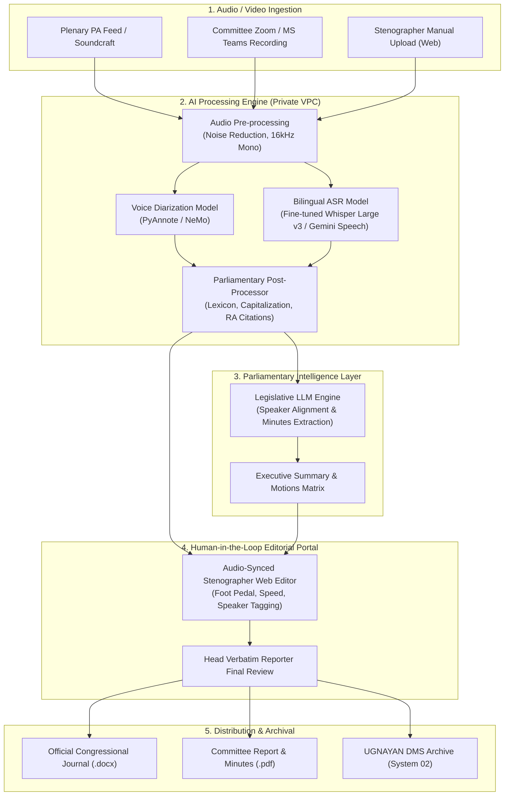
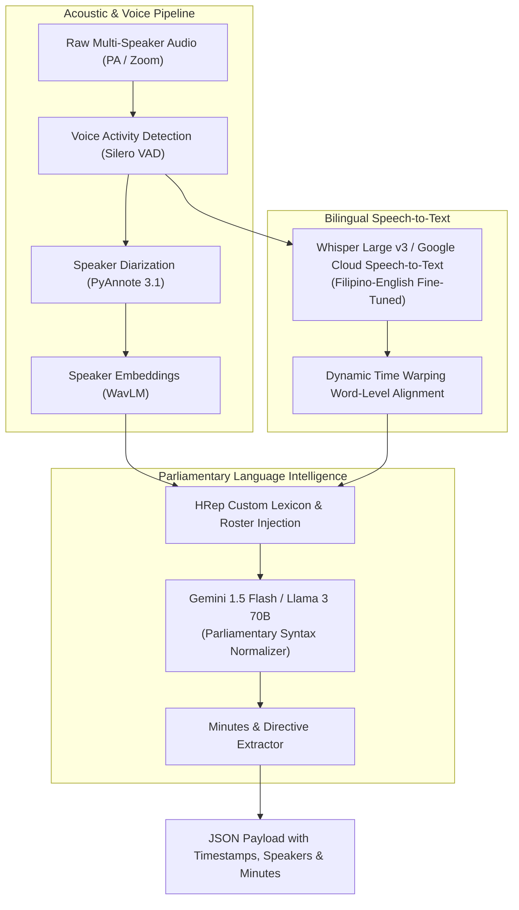
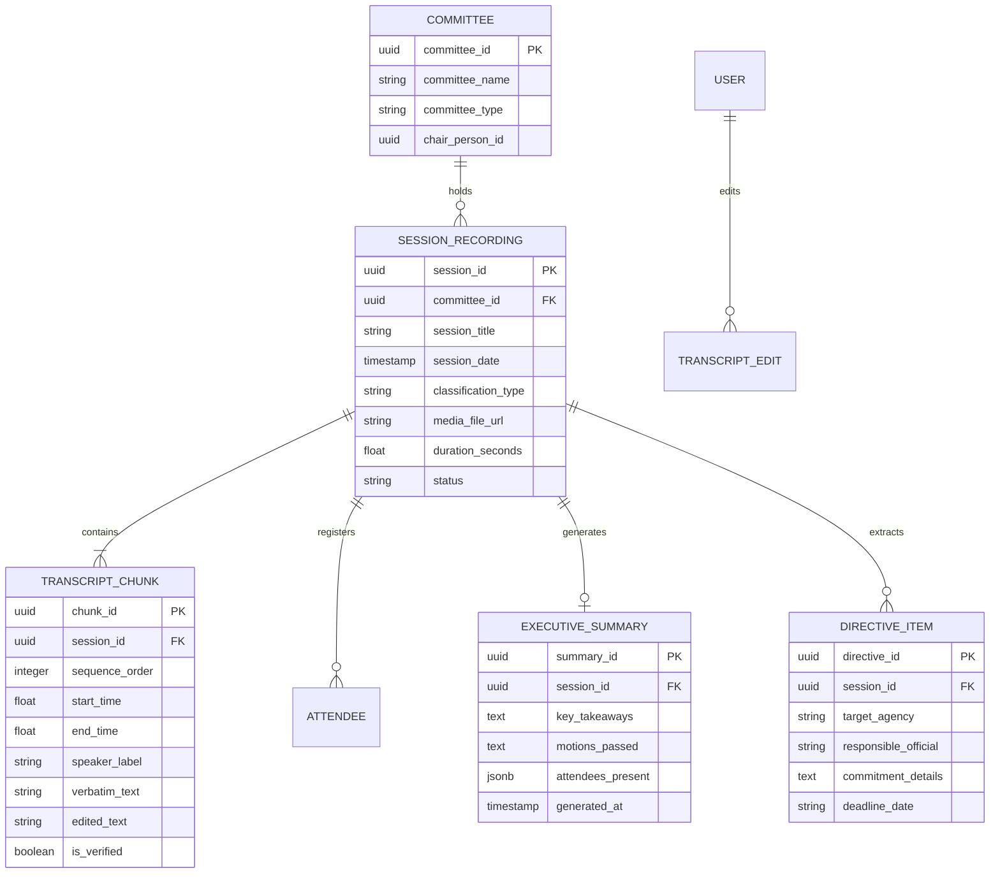
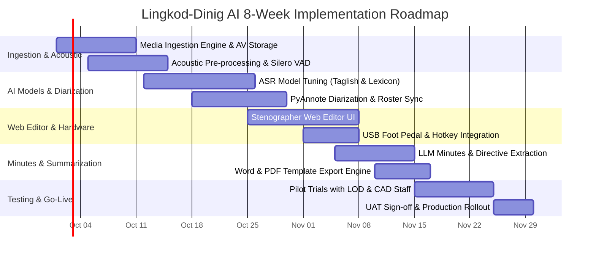

# BUSINESS REQUIREMENTS DOCUMENT (BRD)
## Lingkod-Dinig AI: AI-Assisted Legislative Transcription System
### Automated Speech-to-Text, Diarization, and Parliamentary Minutes Intelligence for Plenary Sessions and Committee Hearings

**Document Reference:** HREP-BRD-S13-2026-v1.0  
**System Code:** UGNAYAN-SYS-13  
**Deployment Tier:** Cross-Cutting Architectural Capability (High Priority)  
**Target Release:** Phase 1 (MVP: Month 3)  
**Classification:** Internal Restricted / Confidential Processing Capability  

---

### Table of Contents
1. [Document Control & Sign-off](#1-document-control--sign-off)
2. [Executive Summary & Strategic Mandate](#2-executive-summary--strategic-mandate)
3. [Business Problem Statement & Institutional Pain Points](#3-business-problem-statement--institutional-pain-points)
4. [Project Objectives & Quantifiable Benefits](#4-project-objectives--quantifiable-benefits)
5. [Stakeholder Analysis & Specialized Personas](#5-stakeholder-analysis--specialized-personas)
6. [Scope of Work: In-Scope vs. Out-of-Scope](#6-scope-of-work-in-scope-vs-out-of-scope)
7. [Transcription Pipeline & Parliamentary Workflow](#7-transcription-pipeline--parliamentary-workflow)
8. [Detailed Functional Requirements (FRs)](#8-detailed-functional-requirements-frs)
9. [Non-Functional Requirements (NFRs)](#9-non-functional-requirements-nfrs)
10. [AI Model Architecture, Diarization & Pipeline Specifications](#10-ai-model-architecture-diarization--pipeline-specifications)
11. [Data Architecture & Entity-Relationship Model](#11-data-architecture--entity-relationship-model)
12. [Confidentiality, Executive Sessions & Data Sovereignty](#12-confidentiality-executive-sessions--data-sovereignty)
13. [Gender-Responsive & Accessibility Features](#13-gender-responsive--accessibility-features)
14. [Risk Assessment & Mitigation Matrix](#14-risk-assessment--mitigation-matrix)
15. [Implementation Schedule & UAT Acceptance Criteria](#15-implementation-schedule--uat-acceptance-criteria)

---

### 1. Document Control & Sign-off

#### Document History
| Version | Date | Author / Role | Summary of Changes |
| :--- | :--- | :--- | :--- |
| **1.0** | 2026-09-01 | Principal AI Solutions Architect | Initial Baseline BRD for UGNAYAN System 13 |

#### Approvals
| Role | Name / Title | Department | Signature / Status |
| :--- | :--- | :--- | :--- |
| **Business Sponsor** | Secretary General | Office of the Secretary General (OSG) | Approved |
| **Operational Owner**| Director, Plenary Affairs | Legislative Operations Department (LOD) | Reviewed |
| **Operational Owner**| Director, Committee Affairs | Committee Affairs Department (CAD) | Reviewed |
| **Legal Advisor** | Director, Legal Affairs Dept. | Legal Affairs Department (LAD) | Reviewed |
| **Technical Authority**| Director, ICTS | Information & Communications Tech. Service | Reviewed |

---

### 2. Executive Summary & Strategic Mandate

The primary product of the House of Representatives is the spoken and recorded word: plenary debates, privilege speeches, sponsorship remarks, interpellations, and committee hearing investigations. Every single utterance in the Plenary Hall and 60+ Committee Rooms must be captured, transcribed verbatim, verified, and officially published as the **Congressional Record (Plenary Journal)** and **Committee Minutes of Proceedings**.

Currently, this monumental task falls on small teams of stenographers and verbatim reporters in the **Legislative Operations Department (LOD)** and **Committee Affairs Department (CAD)**. They manually listen to hours of recordings, typing word-for-word in shifting Taglish (English and Filipino), while deciphering overlapping voices and complex legislative jargon. During heavy legislative seasons, transcription backlogs stretch to **3 to 6 weeks**, directly stalling committee reports, bill approvals, and public transparency.

**Lingkod-Dinig AI (UGNAYAN System 13)** fulfills the explicit mandate of the UGNAYAN Charter to **"integrate AI-enabled solutions"** (Slide 3). It establishes an enterprise speech-to-text, acoustic diarization, and natural language intelligence platform engineered specifically for the Philippine parliamentary context. By converting raw multi-channel audio/video into 92%+ accurate drafts with speaker attribution in minutes, Lingkod-Dinig AI slashes turnaround time from weeks to hours while keeping stenographers in full editorial control.

---

### 3. Business Problem Statement & Institutional Pain Points

#### 1. The Transcription Bottleneck
- A standard 4-hour committee hearing or plenary session requires **16 to 24 human hours** of manual transcription by a senior verbatim reporter.
- With 15 to 25 simultaneous committee hearings per week during regular sessions, the CAD and LOD face an aggregate deficit of hundreds of hours weekly, resulting in persistent backlogs.

#### 2. Philippine Parliamentary Linguistic Complexity
- Philippine legislative discourse is rarely monolingual. Lawmakers and witnesses switch fluidly between English, Tagalog (Taglish), and occasional regional languages (Cebuano, Ilocano, Hiligaynon) mid-sentence.
- Off-the-shelf foreign transcription tools (e.g., standard Whisper or foreign cloud APIs) fail significantly on:
  - Filipino-English code-switching and local colloquialisms.
  - Parliamentary honorifics and phrases ("*Mr. Chair, may I interpellate the distinguished gentleman from Cavite*", "*I move to adopt the substitute bill*", "*Fiscalizer*", "*Bicameral conference committee*").
  - Philippine legal and agency acronyms (e.g., *NEDA, DBM, DPWH, PhilHealth, BARMM, GAA, COA, Sandiganbayan*).

#### 3. High Risk of Stalled Legislation
- Under House Rules, a standing committee cannot formally file a Committee Report on a bill without approved minutes and an verified transcript of proceedings. Transcription delays directly delay national legislation.

#### 4. The Challenge of Executive (Closed-Door) Sessions
- Critical congressional investigations involve classified national security, foreign relations, or sensitive law enforcement matters ("Executive Sessions"). Audio from these sessions cannot be transmitted to public, multi-tenant commercial cloud APIs where vendor terms permit data retraining.

---

### 4. Project Objectives & Quantifiable Benefits

#### Objectives
1. Deploy an end-to-end automated transcription and summarization platform capable of processing 1 hour of session audio/video into a formatted draft in under **10 minutes**.
2. Achieve a baseline **Word Error Rate (WER) $\le 8\%$** on Philippine parliamentary audio across both English and Tagalog code-switched dialogues.
3. Provide an interactive, audio-synchronized web editor designed specifically for legislative stenographers, supporting keyboard shortcuts and USB foot pedals.
4. Automate the generation of **Committee Minutes**, **Action Items**, and **Executive Summaries** using legislative large language model (LLM) prompts.

#### Quantifiable KPIs
- **Turnaround Acceleration:** 85% reduction in transcript finalization time (from 14 days down to 2–4 hours).
- **Stenographer Productivity:** 3.5x increase in finished pages per verbatim reporter per day.
- **Reporting Timeliness:** 100% of committee hearing minutes published within 24 hours of adjournment.
- **Data Security:** Zero external leakage of confidential Executive Session recordings.

---

### 5. Stakeholder Analysis & Specialized Personas

```
┌─────────────────────────────────────────────────────────────────────────────┐
│                       LINGKOD-DINIG USER PERSONAS                           │
├───────────────────────────────┬─────────────────────────────────────────────┤
│ 1. Ma. Elena "Lolit" Santos   │ Senior Stenographer / Verbatim Reporter     │
│    (LOD - Plenary Affairs)    │ Needs: Speed, Foot Pedal, Accurate Taglish  │
├───────────────────────────────┼─────────────────────────────────────────────┤
│ 2. Atty. Christian Gomez      │ Committee Secretary / Technical Staff (CAD) │
│    (Committee on Ways & Means)│ Needs: Speaker ID, Minutes Draft, Directives│
├───────────────────────────────┼─────────────────────────────────────────────┤
│ 3. Representative Patricia Ty │ Committee Chairperson / Member of Congress  │
│    (2nd District, Cebu)       │ Needs: 1-page Executive Summary, Search     │
├───────────────────────────────┼─────────────────────────────────────────────┤
│ 4. Patrick Arboleda           │ Audio-Visual Engineer (EPFD / ICTS)         │
│    (Broadcast & Sound Tech)   │ Needs: Batch Ingestion, PA Feed, Reliability│
└───────────────────────────────┴─────────────────────────────────────────────┘
```

#### Persona 1: Ma. Elena "Lolit" Santos (Senior Verbatim Reporter, LOD)
- **Profile:** Female, 52 years old, 26 years serving in the Plenary Stenographic Service. Expert in parliamentary rules, fast typist, but experiences physical strain and eye fatigue from constant rewinding.
- **Daily Task:** Transcribing 45-minute "takes" of intense plenary debate between majority and minority floor leaders.
- **Pain Points:** Audio quality can be muffled; lawmakers speak over each other; rewinding audio with mouse clicks breaks her typing rhythm; takes 6 hours to transcribe a single 1-hour take.
- **System Need:** Seamless integration with her existing USB foot pedal (Infinity / Olympus); audio that jumps automatically when clicking a word; smart auto-correction of lawmaker names and titles.

#### Persona 2: Atty. Christian Gomez (Committee Secretary, Committee Affairs Dept.)
- **Profile:** Male, 34 years old, legislative lawyer managing the Committee on Ways and Means.
- **Daily Task:** Overseeing 3 to 4 hearings a week on complex tax reform bills with 30+ invited resource persons (finance executives, chamber of commerce, civil society).
- **Pain Points:** Needs to produce the official Minutes of the Hearing and extract specific commitments made by cabinet secretaries within 48 hours for the Chairperson.
- **System Need:** Automatic identification of speakers; automated extraction of "Directives & Commitments" made by government agencies; 1-click export to House Committee Minutes template.

#### Persona 3: Hon. Patricia Ty (Committee Chairperson & Representative)
- **Profile:** Female, 48 years old, Chair of the Committee on Health. Extremely busy, attends 5 meetings a day, reviews bills while traveling.
- **Pain Points:** Does not have time to read a 120-page verbatim transcript; needs to know what the Department of Health (DOH) Secretary committed to regarding hospital budget subsidies.
- **System Need:** Instant 1-page AI Executive Summary; semantic search capability to query: "*What was PhilHealth's explanation on premium hikes during the August 14 hearing?*"

#### Persona 4: Patrick Arboleda (AV Broadcast Engineer, EPFD / PRIB)
- **Profile:** Male, 29 years old, handles audio feeds from the Plenary Soundcraft digital console, Zoom rooms, and YouTube live broadcasts.
- **Pain Points:** Currently exports MP3 files onto USB thumb drives and walks them to stenographers.
- **System Need:** Automated upload endpoint or network watch-folder where audio/video files automatically trigger the transcription pipeline upon hearing adjournment.

---

### 6. Scope of Work: In-Scope vs. Out-of-Scope

#### In-Scope (Phase 1 MVP)
1. **Multi-Channel Media Ingestion:** Drag-and-drop web uploader and automated network folder ingestion supporting MP3, WAV, M4A, MP4, MKV (up to 5GB per session).
2. **Specialized Speech-to-Text Pipeline:**
   - Multi-speaker separation (diarization) identifying Speaker 1, Speaker 2, etc.
   - Code-switched Tagalog-English transcription optimized for Philippine accents.
   - Specialized Legislative Terminology Dictionary (1,500+ pre-seeded parliamentary words, bills, legal terms).
   - Roster of 315+ House Members and cabinet officials for automated name attribution.
3. **Stenographer Interactive Editor:**
   - Audio waveform display synchronized with highlighted text.
   - Keyboard hotkey control (play, pause, rewind 3s, speed 0.75x–1.5x) and USB Foot Pedal mapping.
   - Bulk speaker rename ("Speaker 1" $\rightarrow$ "Hon. Albano").
   - Find and Replace with parliamentary auto-suggest.
4. **AI Parliamentary Minutes & Summary Generator:**
   - Automated 2-page Executive Summary.
   - Matrix of Directives, Commitments, and Motions passed.
   - List of resource persons and attendance registry.
5. **Multi-Format Export Engine:** 1-click export to official HRep Microsoft Word (.docx) templates, PDF, and raw text with timestamps.

#### Out-of-Scope (Deferred to Phase 2)
- **Real-Time Closed Captioning on Public Broadcasts:** Real-time live streaming TV subtitles (planned for Phase 2 once model latency is $<1.5$s).
- **Automated Bill Comparison Engine:** Deep semantic comparison between bill drafts (allocated to System 01).
- **Public Open-Data Transcript Portal:** Direct publishing to citizen portal (gated until HRep verification workflow completes).

---

### 7. Transcription Pipeline & Parliamentary Workflow



---

### 8. Detailed Functional Requirements (FRs)

#### 8.1 Module 1: Media Ingestion & Project Setup
- **FR-ING-001 (Must Have):** The system MUST support audio/video file uploads up to 5GB in formats: WAV, MP3, AAC, M4A, MP4, MOV, MKV.
- **FR-ING-002 (Must Have):** When creating a transcription job, the user MUST be able to select: (a) Session Type (Plenary, Standing Committee, Special Committee, Bicameral), (b) Committee Name, (c) Date and Time, (d) Classification (Public Hearing vs. Executive Session).
- **FR-ING-003 (Should Have):** The system MUST support pre-loading the Committee Roster (list of expected Representatives and invited Resource Persons) to dramatically boost speaker recognition accuracy.

#### 8.2 Module 2: Automated Speech-to-Text & Diarization
- **FR-ASR-001 (Must Have):** The ASR engine MUST transcribe spoken Tagalog, English, and Taglish code-switching with an overall WER $\le 8\%$ on clean audio.
- **FR-ASR-002 (Must Have):** The diarization engine MUST segment continuous speech into speaker turns with accurate start and end timestamps (millisecond precision).
- **FR-ASR-003 (Must Have):** The system MUST apply a domain-specific Parliamentary Lexicon of at least 1,500 terms, ensuring correct capitalization of terms like "*House Bill No.*", "*Republic Act No.*", "*Committee on Appropriations*", "*Presiding Officer*".
- **FR-ASR-004 (Must Have):** The system MUST correctly format numbers, currencies (e.g., "*PHP 5.768 trillion*"), dates, and legal statute citations.

#### 8.3 Module 3: Stenographer Editorial Web Application
- **FR-EDT-001 (Must Have):** The editor MUST present a synchronized audio player with dynamic text highlighting: clicking any word in the transcript MUST instantly jump the audio playback to that exact timestamp.
- **FR-EDT-002 (Must Have):** The editor MUST support variable playback speeds: 0.5x, 0.75x, 1.0x, 1.25x, 1.5x, 2.0x without pitch distortion.
- **FR-EDT-003 (Must Have):** The editor MUST support standard USB Foot Pedals (HID standard: Rewind, Play/Pause, Fast Forward) allowing stenographers to keep their hands continuously on the keyboard.
- **FR-EDT-004 (Must Have):** The user MUST be able to rename a speaker once (e.g., change "Speaker 2" to "REP. LAGMAN") and have the system propagate the change across the entire transcript.
- **FR-EDT-005 (Must Have):** The editor MUST support auto-save every 15 seconds and maintain a complete version history to prevent accidental data loss.

#### 8.4 Module 4: Parliamentary Intelligence & Minutes Generation
- **FR-INT-001 (Must Have):** The system MUST generate a structured **Executive Summary** (500–1,000 words) summarizing the primary topics discussed, key testimonies, and conclusions.
- **FR-INT-002 (Must Have):** The system MUST automatically identify and compile a table of **Motions and Decisions** (e.g., Motion to approve, Motion to table, Objections, Voting outcomes).
- **FR-INT-003 (Should Have):** The system MUST automatically extract a **Directives Matrix** detailing commitments made by invited agency officials (e.g., "*DOH committed to submit the list of pending barangay health stations within 5 working days*").

#### 8.5 Module 5: Export & Integration
- **FR-EXP-001 (Must Have):** The system MUST export final transcripts into pre-formatted HRep Microsoft Word templates adhering to official House margins, header/footer styles, line numbering, and font requirements.
- **FR-EXP-002 (Must Have):** The system MUST export official Committee Minutes in PDF format with digital watermarking and signature lines for the Committee Secretary and Chairperson.
- **FR-EXP-003 (Should Have):** The system MUST expose an internal REST API allowing the Document Management System (System 02) to ingest finalized transcripts and metadata automatically.

---

### 9. Non-Functional Requirements (NFRs)

#### 9.1 Performance & Processing Speed
- **NFR-PERF-001:** The system MUST process a 1-hour audio file through speech recognition, diarization, and LLM minutes extraction in **less than 10 minutes** (processing speed $\ge 6x$ real-time).
- **NFR-PERF-002:** The web editor MUST handle transcripts of up to 8 hours of continuous speech ($>100,000$ words) without browser UI lag or memory crashing.

#### 9.2 Data Privacy, Security & Sovereignty
- **NFR-SEC-001 (Data Sovereignty):** All audio, video, transcripts, and LLM inferences MUST be processed within the sovereign territory of the Republic of the Philippines or within a dedicated, isolated government-certified private cloud tenant.
- **NFR-SEC-002 (No Vendor Retraining):** Commercial cloud AI services (e.g., Google Cloud Vertex AI / Gemini Enterprise) MUST have contractual zero-data-retention and zero-model-retraining agreements active.
- **NFR-SEC-003:** Data at rest MUST be encrypted using AES-256; data in transit MUST use TLS 1.3.

#### 9.3 High Availability & Storage Scalability
- **NFR-AVAIL-001:** The system MUST have 99.9% availability during congressional calendar working hours.
- **NFR-STOR-001:** Storage architecture MUST scale to accommodate at least 3,000 hours of legislative audio/video annually (approx. 6TB of compressed media per year).

---

### 10. AI Model Architecture, Diarization & Pipeline Specifications



#### Linguistic Fine-Tuning Corpus
The ASR model will be supplemented with a continuous custom language model (CLM) trained on:
- Official Congressional Records (Plenary Journals) from the 17th, 18th, and 19th Congresses.
- Standing Rules of the House of Representatives.
- 1987 Philippine Constitution.
- Philippine General Appropriations Acts (GAA) from 2020 to 2026.

---

### 11. Data Architecture & Entity-Relationship Model



---

### 12. Confidentiality, Executive Sessions & Data Sovereignty

Congressional investigations frequently enter into **"Executive Sessions"** pursuant to Section 80 of the Rules of the House (matters affecting national security, foreign relations, pending criminal trials, or confidential personal reputation).

#### Security Enforcements for Executive Sessions:
1. **Isolated Processing Mode:** When an operator flags an upload as "Executive Session", the system automatically switches to an on-premise or sovereign private cloud container instance.
2. **Access Control:** Audio and transcripts are encrypted with a dedicated key accessible only to the Committee Chairperson, Committee Secretary, and authorized stenographers.
3. **No Cloud LLM Ingestion:** Executive sessions bypass multi-tenant public APIs; intelligence processing is routed to an on-premise, air-gapped local model (e.g., Llama 3 70B on local GPU cluster).
4. **Watermarked Digital Print:** All PDF/Word exports carry cryptographic, dynamic steganographic watermarks displaying the name of the downloading official, IP address, and timestamp to prevent leaks.

---

### 13. Gender-Responsive & Accessibility Features

1. **Voice Pitch & Demographic Diversity in Training:** Acoustic models are trained and balanced across diverse voice profiles (female lawmakers, male witnesses, elderly resource persons, high/low pitch variations) to eliminate demographic bias in speech recognition.
2. **Inclusive Editorial Workspace:** The web editor provides adjustable contrast modes, dyslexia-friendly fonts, customizable text sizing, and high-visibility audio scrubbers to support senior verbatim reporters with visual strain.
3. **Gender-Neutral Parliamentary Language Validation:** The AI grammar normalizer flags non-inclusive phrasing where appropriate and suggests standard gender-neutral alternatives in legislative summaries pursuant to RA 9710 guidelines.

---

### 14. Risk Assessment & Mitigation Matrix

| Risk ID | Risk Description | Severity | Likelihood | Mitigation Strategy |
| :--- | :--- | :---: | :---: | :--- |
| **RSK-AI-01**| Acoustic reverberation and poor mic technique in older Batasan committee rooms. | High | High | Implement front-end deep learning noise suppression (DeepFilterNet); collaborate with EPFD to standardize room mic placement. |
| **RSK-AI-02**| Stenographers feel threatened by AI automation, fearing job displacement. | High | Med | Formal change management campaign: Position Lingkod-Dinig AI as an "Executive Co-Pilot" that removes mechanical typing while elevating stenographers to "Legislative Editors & Quality Verifiers". |
| **RSK-AI-03**| Hallucination in AI-generated Committee Minutes summaries. | Critical| Med | All AI summaries display direct clickable citation links to the underlying verbatim timestamp; human review and sign-off remain legally mandatory. |
| **RSK-AI-04**| Accidental exposure of an Executive Session transcript. | Critical| Low | Strict air-gapped encryption; multi-person authorization required to download; full audit logging. |

---

### 15. Implementation Schedule & UAT Acceptance Criteria



#### User Acceptance Testing (UAT) Sign-off Criteria
- [ ] Word Error Rate (WER) verified at $\le 8\%$ on a test set of 10 real Plenary and Committee audio recordings.
- [ ] Diarization accurately segments distinct speakers with $\ge 88\%$ accuracy.
- [ ] Audio playback jumps synchronously when any word in the transcript is clicked.
- [ ] USB Foot Pedal seamlessly controls audio pause, rewind, and fast-forward without software conflict.
- [ ] Automated Committee Minutes and Directives Matrix successfully generated and approved by Committee Affairs directors.
- [ ] Executive Session air-gapped security protocol verified by HRep ICTS Cybersecurity Division.
