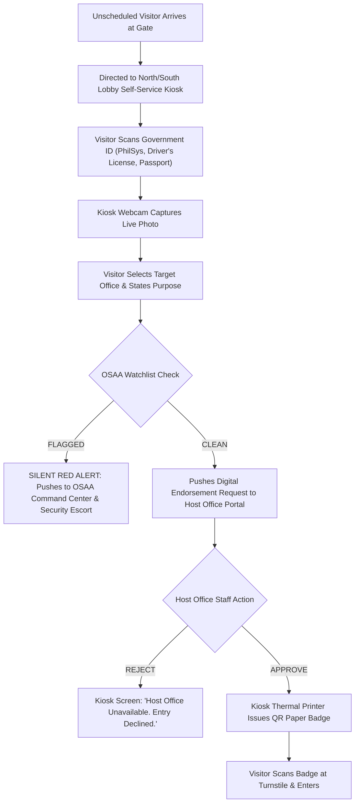
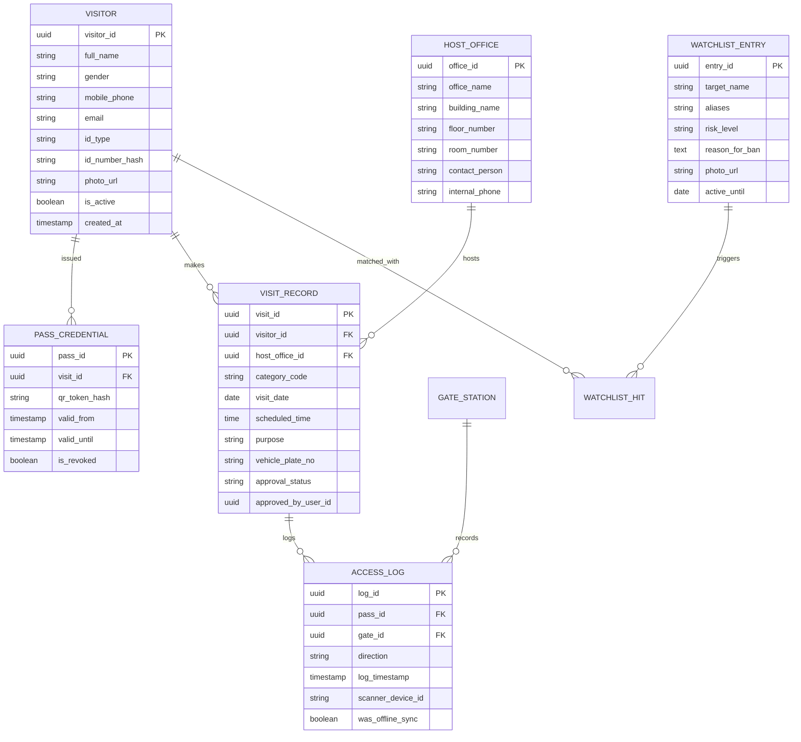
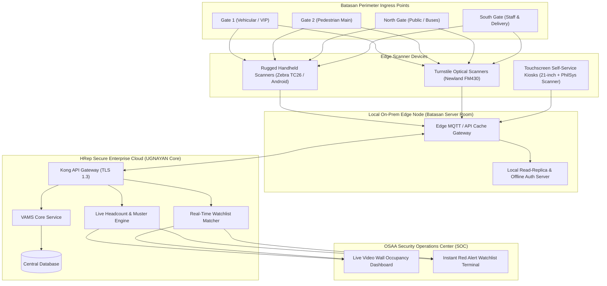
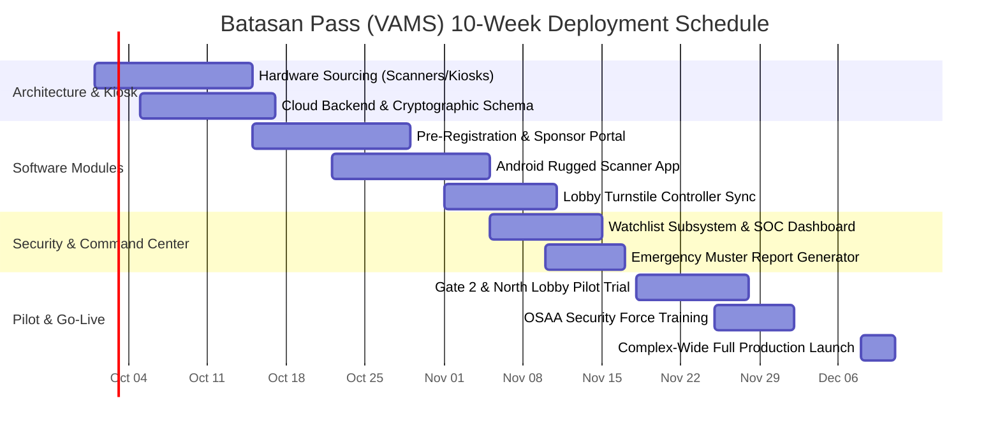

# BUSINESS REQUIREMENTS DOCUMENT (BRD)
## Batasan Pass: Visitor and Access Management System (VAMS)
### Secure Pre-Registration, QR-Code Credentialing, Real-Time Occupancy, and Automated Perimeter Access Control for the Batasan Pambansa Complex

**Document Reference:** HREP-BRD-S06-2026-v1.0  
**System Code:** UGNAYAN-SYS-06  
**Deployment Tier:** Tier 2 (Service Platform Systems)  
**Target Release:** Phase 1 (MVP: Month 3)  
**Classification:** Internal Restricted / Security Sensitive  

---

### Table of Contents
1. [Document Control & Sign-off](#1-document-control--sign-off)
2. [Executive Summary & Operational Context](#2-executive-summary--operational-context)
3. [Business Problem Statement & Security Vulnerabilities](#3-business-problem-statement--security-vulnerabilities)
4. [Project Objectives & Quantifiable Target Outcomes](#4-project-objectives--quantifiable-target-outcomes)
5. [Stakeholder Analysis & Comprehensive User Personas](#5-stakeholder-analysis--comprehensive-user-personas)
6. [Scope of Work: In-Scope vs. Out-of-Scope](#6-scope-of-work-in-scope-vs-out-of-scope)
7. [Visitor Classifications & Clearance Protocols](#7-visitor-classifications--clearance-protocols)
8. [End-to-End Access Control Process Workflows](#8-end-to-end-access-control-process-workflows)
9. [Detailed Functional Requirements (FRs)](#9-detailed-functional-requirements-frs)
10. [Non-Functional Requirements (NFRs)](#10-non-functional-requirements-nfrs)
11. [Data Architecture & Entity-Relationship Diagram](#11-data-architecture--entity-relationship-diagram)
12. [Hardware Integration & Gate Infrastructure Topology](#12-hardware-integration--gate-infrastructure-topology)
13. [Emergency Evacuation, Headcount & Watchlist Enforcement](#13-emergency-evacuation-headcount--watchlist-enforcement)
14. [Data Privacy Act (RA 10173) & GAD Accessibility Compliance](#14-data-privacy-act-ra-10173--gad-accessibility-compliance)
15. [Risk Management & Mitigation Strategy](#15-risk-management--mitigation-strategy)
16. [Implementation Roadmap & UAT Acceptance Criteria](#16-implementation-roadmap--uat-acceptance-criteria)

---

### 1. Document Control & Sign-off

#### Document History
| Version | Date | Author / Role | Summary of Changes |
| :--- | :--- | :--- | :--- |
| **1.0** | 2026-09-01 | Lead Physical Security & Enterprise Architect | Baseline BRD for UGNAYAN System 06 |

#### Approvals
| Role | Name / Title | Department | Signature / Status |
| :--- | :--- | :--- | :--- |
| **Business Sponsor** | Sergeant-at-Arms | Office of the Sergeant-at-Arms (OSAA) | Approved |
| **Institutional Sponsor**| Secretary General | Office of the Secretary General (OSG) | Approved |
| **Diplomatic Authority**| Director, IPAD | Inter-Parliamentary Relations & Special Affairs | Reviewed |
| **Facilities Authority** | Director, EPFD | Engineering & Physical Facilities Dept. | Reviewed |
| **Technical Authority** | Director, ICTS | Information & Communications Tech. Service | Reviewed |

---

### 2. Executive Summary & Operational Context

The Batasan Pambansa Complex in Batasan Hills, Quezon City, is a 16-hectare high-security national government installation housing the House of Representatives of the Philippines. On any given session day, the complex accommodates over **3,000 permanent and contractual Secretariat staff**, **315+ House Members**, and between **2,000 to 5,000 daily visitors**. 

These visitors represent a highly diverse cross-section of society: foreign ambassadors, cabinet secretaries, judicial officers, academic experts, private sector resource persons, accredited media journalists, commercial contractors, and busloads of provincial constituents seeking legislative assistance.

Perimeter security and access control are the statutory responsibility of the **Office of the Sergeant-at-Arms (OSAA)**. Currently, visitor processing relies heavily on physical paper visitor logbooks, manual inspection of plastic IDs, and telephone calls to congressional offices to verify appointments. This manual approach results in severe vehicular gridlock at Commonwealth Avenue gates, pedestrian bottlenecks at building lobbies, lost plastic badges, and—critically—a complete lack of real-time visibility into complex occupancy during security lockdowns or natural disasters.

**Batasan Pass (UGNAYAN System 06)** delivers a modern, contactless, and encrypted digital visitor access management ecosystem. By combining self-service web pre-registration, automated sponsor office verification, time-bound cryptographic QR-code digital credentials, and ruggedized gate scanner terminals, Batasan Pass slashes ingress wait times from minutes to **under 3 seconds** while providing OSAA with an instantaneous, real-time emergency headcount.

---

### 3. Business Problem Statement & Security Vulnerabilities

#### 1. Severe Congestion at Batasan Perimeter Gates
- During morning peak hours (8:30 AM to 10:30 AM) and ahead of 1:30 PM committee hearings, manual identity checking and logbook writing cause vehicular tailbacks extending onto IBP Road and Commonwealth Avenue.
- Security personnel at Gate 1, Gate 2, North Gate, and South Gate must physically write down visitor names, plate numbers, and destination offices in duplicate paper notebooks.

#### 2. Manual Phone Verification & Lost Productivity
- When an unannounced visitor or delegation arrives, gate guards must look up the host office internal intercom extension, dial the secretary, and wait for confirmation. If the phone is busy, the visitor is held at the gate, creating frustration for visiting dignitaries and local officials.

#### 3. Security Blindspots & Physical Badge Exploitation
- Traditional laminated plastic visitor badges carry generic labels ("VISITOR 042") with no photo or expiration timestamp. Badges are frequently not returned, swapped between individuals, or forged.
- OSAA has no automated system to alert guards if a person subject to an active subpoena, court hold-departure order, or institutional security watchlist attempts to enter.

#### 4. Critical Emergency Hazard: Zero Headcount Visibility
- In the event of an earthquake (Batasan sits near the West Valley Fault), fire, or security evacuation, OSAA Incident Commanders have no digital means to determine how many visitors are inside which building, making search-and-rescue operations hazardous and uncoordinated.

#### 5. Data Privacy Violations under RA 10173
- Physical visitor logbooks open on guard counters expose the personal names, government ID numbers, home addresses, and phone numbers of previous visitors to anyone standing in line, violating National Privacy Commission (NPC) regulations.

---

### 4. Project Objectives & Quantifiable Target Outcomes

#### Objectives
1. Implement a web-based pre-registration and visitor clearance portal enabling host offices to issue digital passes in advance.
2. Replace paper logbooks with high-speed optical barcode/QR-code scanning terminals at all perimeter gates and building turnstiles.
3. Establish a live, real-time Occupancy & Evacuation Muster Dashboard for the OSAA Command Center.
4. Integrate real-time automated security watchlist alerts to intercept unauthorized or banned individuals discreetly.
5. Provide walk-in self-service kiosks at the North and South Lobby entrances for unregistered guests.

#### Quantifiable KPIs
- **Gate Ingress Speed:** Average credential verification reduced from 180 seconds to **$\le 3$ seconds per visitor**.
- **Perimeter Line Reduction:** 80% reduction in peak-hour pedestrian and vehicular queues at Batasan gates.
- **Pre-Registration Rate:** $\ge 70\%$ of all scheduled committee resource persons and VIPs pre-registered prior to arrival.
- **Muster Accuracy:** 100% real-time headcount accuracy across Main Building, South Wing, North Wing, and Ramon V. Mitra Jr. Building.

---

### 5. Stakeholder Analysis & Comprehensive User Personas

```
┌─────────────────────────────────────────────────────────────────────────────┐
│                        BATASAN PASS USER PERSONAS                           │
├───────────────────────────────┬─────────────────────────────────────────────┤
│ 1. Mayor Ferdinand "Boy" Cruz │ Provincial Visitor / Resource Person        │
│    (LGU Chief Executive)      │ Needs: Fast Gate Access, VIP Parking, SMS   │
├───────────────────────────────┼─────────────────────────────────────────────┤
│ 2. Sheila Mae Alcantara       │ Congressional Appointments Secretary        │
│    (Office of Rep. Santos)    │ Needs: 1-Click Guest Invites, Bulk Approvals│
├───────────────────────────────┼─────────────────────────────────────────────┤
│ 3. Agent Roberto "Bert" Luna  │ OSAA Gate Security Marshal (Gate 2)         │
│    (Security Division)        │ Needs: Rugged Scanner, Instant Photo Check  │
├───────────────────────────────┼─────────────────────────────────────────────┤
│ 4. Dir. Ramonito Fernandez    │ Director of Protocol (IPAD)                 │
│    (Inter-Parliamentary Dept) │ Needs: Foreign Dignitary Protocol & Escorts │
├───────────────────────────────┼─────────────────────────────────────────────┤
│ 5. Gen. Hermogenes Valeriano  │ Chief, OSAA Security & Command Center       │
│    (Sergeant-at-Arms)         │ Needs: Live Occupancy, Watchlist Alerts     │
└───────────────────────────────┴─────────────────────────────────────────────┘
```

#### Persona 1: Mayor Ferdinand "Boy" Cruz (Local Chief Executive, Bulacan)
- **Profile:** Male, 54 years old, visiting the Committee on Local Government hearing to testify on municipal revenue code amendments. Accompanied by his municipal engineer and driver.
- **Pain Points:** Hates getting stuck in gate traffic; embarrassed when guards do not recognize his position and make him wait in the heat to fill out paper logbooks; worried about parking for his official vehicle.
- **System Need:** Receives a VIP digital pass via SMS 24 hours prior; arrives at Gate 2, driver displays QR code from windshield/phone; gate arm opens automatically in 3 seconds with designated VIP parking bay assigned.

#### Persona 2: Sheila Mae Alcantara (Congressional Appointments Secretary)
- **Profile:** Female, 27 years old, manages the calendar of a high-profile Party-List Representative.
- **Daily Task:** Scheduling 15 to 30 visitors daily (constituents, advocacy leaders, media, family members).
- **Pain Points:** Spends half her morning answering calls from the gate asking if so-and-so is allowed in; paper memos sent to OSAA get lost; constituents get turned away at the gate.
- **System Need:** Intuitive web interface to enter guest names and phone numbers in bulk; generates instant invitation links; tracks who has checked in at the gate in real-time.

#### Persona 3: Security Marshal Roberto "Bert" Luna (OSAA Gate Guard, Gate 2)
- **Profile:** Male, 39 years old, frontline security officer standing at the pedestrian gate under extreme weather conditions.
- **Daily Task:** Verifying IDs, issuing badges, checking bags, diffusing arguments with impatient visitors.
- **Pain Points:** Paper logs get soaked in the rain; handwriting is illegible; stressful when VIPs shout because of long lines; hard to identify fake IDs with the naked eye.
- **System Need:** Ruggedized handheld Android scanner with sun-readable screen; 1-second optical QR scan displaying the visitor's verified photo, sponsor office, and access tier on screen.

#### Persona 4: Dir. Ramonito Fernandez (Director of Protocol, IPAD)
- **Profile:** Male, 58 years old, coordinates foreign parliamentary delegations, ambassadors, and bilateral meetings.
- **Pain Points:** High protocol risk if an ambassador’s diplomatic convoy is delayed or subjected to inappropriate routine gate inspections.
- **System Need:** "Protocol White List" module allowing IPAD to register diplomatic vehicle plate numbers and delegation manifests with automatic green-light clearance and immediate push notification to the Protocol Escort team upon arrival.

#### Persona 5: Gen. Hermogenes Valeriano (Chief of Security / Sergeant-at-Arms)
- **Profile:** Male, 62 years old, retired Police Major General, head of OSAA.
- **Responsibilities:** Total complex perimeter security, counter-terrorism, disaster management, and order during plenary sessions.
- **System Need:** Command Center Video Wall dashboard showing: (1) Total active souls inside complex, (2) Building breakdown, (3) Live feed of watchlist hits, (4) Instant 1-click generation of the Evacuation Muster Report.

---

### 6. Scope of Work: In-Scope vs. Out-of-Scope

#### In-Scope (Phase 1 MVP)
1. **Visitor Pre-Registration Portal (Public & Sponsor-Initiated):**
   - Web application allowing visitors to pre-register with personal details, upload a government ID, and state their purpose and host office.
   - Sponsor Portal allowing Congressional and Secretariat offices to initiate invitations and endorse guest visits.
2. **Automated Approval & Credentialing Engine:**
   - Host office endorsement workflow (Single-click approval by authorized staff).
   - Dynamic cryptographic QR-code generation delivered via SMS, Email, and mobile wallet pass (Apple Wallet / Google Wallet).
3. **OSAA Gate Scanning & Turnstile Application:**
   - Android/iOS mobile scanner app for handheld rugged terminals (Zebra/Honeywell) and guard tablets.
   - Integration with turnstile optical barcode readers at building lobbies.
   - Offline validation mode using public-key cryptography (Ed25519) when network connectivity drops.
4. **Walk-in Self-Service Kiosks:**
   - Touchscreen kiosk UI deployed at North and South lobbies for unscheduled visitors.
   - Optical document scanner (Philippine National ID, Passport, Driver's License) with high-res webcam facial capture.
5. **Real-Time Occupancy & Emergency Muster Engine:**
   - Live occupant counter tracking entries and exits across each building.
   - 1-click export of the Batasan Evacuation Muster List for the Bureau of Fire Protection (BFP) and disaster responders.
6. **Watchlist & Security Alert Subsystem:**
   - Integration with internal OSAA watchlist of barred individuals with silent, instantaneous alerts to the Command Center.

#### Out-of-Scope (Phase 2 Roadmap)
- **Automated License Plate Recognition (ALPR) Cameras:** High-speed optical camera recognition on all vehicle lanes (planned for Phase 2 hardware procurement).
- **Facial Recognition Biometric Turnstiles:** Deep facial recognition gates (deferred pending National Privacy Commission AI ethics audit).
- **Physical Gun/Weapon Vault Armory Management:** Specialized armory inventory module (handled separately by OSAA internal weapons unit).

---

### 7. Visitor Classifications & Clearance Protocols

```
┌─────────────────────────────────────────────────────────────────────────────┐
│                     BATASAN PASS VISITOR CATEGORIES                         │
├───────────────┬──────────────────────────────────┬──────────────────────────┤
│ Category Code │ Classification Description       │ Permitted Access Zones   │
├───────────────┼──────────────────────────────────┼──────────────────────────┤
│ CAT-VIP       │ Dignitaries, Ambassadors, Cabinet│ All Complex + VIP Lounge │
├───────────────┼──────────────────────────────────┼──────────────────────────┤
│ CAT-RP        │ Committee Resource Persons/Witness│ Committee Rooms + CAD    │
├───────────────┼──────────────────────────────────┼──────────────────────────┤
│ CAT-MED       │ Accredited Media & Press         │ Press Gallery, Briefing  │
├───────────────┼──────────────────────────────────┼──────────────────────────┤
│ CAT-PUB       │ District Constituents & Guests   │ Host Office Floor Only   │
├───────────────┼──────────────────────────────────┼──────────────────────────┤
│ CAT-CON       │ Contractors, Maintenance, Delivery│ Specific EPFD Work Site  │
└───────────────┴──────────────────────────────────┴──────────────────────────┘
```

#### Clearance Rules:
- **CAT-VIP:** Pre-approved by IPAD or OSG. No queueing; automatic gate arm clearance; vehicle permitted in VIP Executive Drop-off.
- **CAT-RP:** Pre-approved by Committee Secretary (CAD). High-priority green lane; access limited to hearing room floors and session duration $+ 1$ hour.
- **CAT-MED:** Pre-approved by PPAB (Press Bureau). Access restricted to Press Working Room, Briefing Room, and Plenary Media Gallery.
- **CAT-PUB:** Approved by designated Congressional Office. Valid only on date of visit between 8:00 AM and 6:00 PM; access restricted to host office floor.
- **CAT-CON:** Approved by EPFD / ADMIN. Requires equipment pass-in/pass-out log; access restricted to designated work perimeter during approved hours.

---

### 8. End-to-End Access Control Process Workflows

#### Pre-Registered Visitor Workflow
```mermaid
sequenceDiagram
    autonumber
    actor Guest as Visitor / Dignitary
    actor Host as Congressional Host Office
    participant VAMS as Batasan Pass Core System
    actor Guard as OSAA Gate Security
    participant Turnstile as Lobby Turnstile Scanner

    Host->>VAMS: Creates visitor invitation (Name, Phone, Purpose, Date)
    VAMS->>Guest: Dispatches SMS & Email with secure pre-registration link
    Guest->>VAMS: Confirms identity, uploads PhilSys National ID & selfie
    VAMS->>VAMS: Checks against OSAA Watchlist (Clean)
    VAMS->>Guest: Issues dynamic QR Pass (SMS link / Apple & Google Wallet)
    
    Note over Guest,Guard: On Day of Visit at Batasan Gate
    Guest->>Guard: Presents QR Pass from mobile screen
    Guard->>VAMS: Scans QR code with handheld rugged scanner (<2s)
    VAMS-->>Guard: Displays: "VERIFIED: Hon. Guest - Office of Rep. Santos" + Photo
    Guard->>Guest: Grants vehicle / pedestrian entry
    
    Guest->>Turnstile: Scans QR code at building optical reader
    Turnstile->>VAMS: Logs Check-in Event (Main Building Floor 3)
    Turnstile-->>Guest: Turnstile unlocks; gate displays green arrow
    VAMS->>Host: Pushes notification: "Your guest Mayor Cruz has entered the building"
    
    Note over Guest,Turnstile: Ingress completed in under 10 seconds total!
```

#### Walk-in Unscheduled Visitor Workflow


---

### 9. Detailed Functional Requirements (FRs)

#### 9.1 Module 1: Pre-Registration & Digital Credentialing
- **FR-REG-001 (Must Have):** The system MUST provide a mobile-responsive public pre-registration web portal accessible on desktop, iOS, and Android.
- **FR-REG-002 (Must Have):** The pre-registration form MUST capture: Full Legal Name, Gender, Contact Number, Email, Organization/LGU, Vehicle Plate Number (if driving), Host Office, Purpose of Visit, and Date/Time of Arrival.
- **FR-REG-003 (Must Have):** The system MUST support direct upload or camera capture of one valid Philippine Government-issued ID (PhilSys National ID, Passport, Driver’s License, UMID, PRC, IBP).
- **FR-REG-004 (Must Have):** The system MUST generate a signed, tamper-evident cryptographic QR code (using HMAC-SHA256 or Ed25519) that regenerates every 30 seconds to prevent screenshot sharing.
- **FR-REG-005 (Should Have):** The system MUST allow visitors to add their pass directly to **Apple Wallet** and **Google Wallet** with one tap.
- **FR-REG-006 (Must Have - Delegation Group Mode):** Kiosks and the web portal MUST support a fast-track 'Delegation Mode' allowing bus tour leaders, mayors, and barangay delegation heads to scan a single primary government ID, input delegation headcount (up to 100 persons), and print sequential thermal QR wristbands or stickers upon host office digital endorsement.

#### 9.2 Module 2: Sponsor & Host Office Administration
- **FR-HST-001 (Must Have):** Congressional and Secretariat offices MUST have a dedicated dashboard to create single or bulk visitor invitations (e.g., inviting 50 attendees to a committee hearing via CSV upload).
- **FR-HST-002 (Must Have):** When an unannounced visitor registers at a kiosk, authorized host office personnel MUST receive an instant push notification on their desktop and smartphone with the visitor's photo and details to approve or decline in 1 click.
- **FR-HST-003 (Should Have):** Host offices MUST be able to view a live list of their currently arrived visitors and their building entry timestamps.
- **FR-HST-004 (Must Have - Constituent Assistance Routing):** If a host office fails to respond to an unannounced walk-in request within 15 minutes, the system MUST automatically route the visitor's ticket to the HRep Public Assistance / Constituent Lounge for reception and queuing, preventing gate congestion.

#### 9.3 Module 3: OSAA Security Scanner Application
- **FR-SCN-001 (Must Have):** The mobile scanner application MUST decode and validate QR codes in **under 500 milliseconds**.
- **FR-SCN-002 (Must Have):** Upon scanning, the app MUST display: (a) High-Resolution Photo, (b) Full Name, (c) Category Badge (VIP, Resource Person, Public), (d) Approved Date and Time Window, (e) Host Office, (f) Vehicle Plate Number, (g) Approved Building Zones.
- **FR-SCN-003 (Must Have):** The scanner application MUST function in **Offline Mode**: in case of complete Wi-Fi/LTE network blackout, the scanner must cryptographically verify the signature of the QR pass offline and cache the entry log for later synchronization.
- **FR-SCN-004 (Must Have):** The app MUST produce distinct, clear audio-visual signals: High-pitched chime + Green screen for *Entry Approved*; Low buzzer + Red screen for *Access Denied / Expired*; Pulsing Red Alert for *Watchlist Hit*.

#### 9.4 Module 4: Turnstile & Gate Hardware Integration
- **FR-HW-001 (Must Have):** The system MUST integrate with optical fixed barcode scanners mounted on entrance turnstiles via standard Wiegand or OSDP (Open Supervised Device Protocol) interfaces.
- **FR-HW-002 (Must Have):** The turnstile controller MUST trigger the physical relay to unlock the barrier within 300ms of a valid scan.
- **FR-HW-003 (Must Have):** Support for automated exit scanning: visitors scan their QR code at one-way exit turnstiles or vehicle gates to automatically decrement the complex occupancy counter.
- **FR-HW-004 (Must Have - Evening Muster Sweep):** At 8:00 PM daily, the system MUST trigger an automated SMS checkout check to all visitors who entered but have not scanned out, and flag un-exited passes on the OSAA Security Video Wall before the daily log reset.

#### 9.5 Module 5: Watchlist & Incident Management
- **FR-WCH-001 (Must Have):** OSAA administrators MUST have exclusive rights to manage the Security Watchlist (banned persons, subpoena evaders, security threats).
- **FR-WCH-002 (Must Have):** Watchlist checks MUST execute automatically during: (a) Pre-registration submission, (b) Kiosk registration, and (c) Live gate scanning.
- **FR-WCH-003 (Must Have):** When a watchlist match occurs at a gate, the guard scanner MUST display a discrete advisory ("*Please escort visitor to OSAA Station for verification*") while immediately broadcasting a silent priority red alert with GPS gate location and live camera stream to the OSAA Command Center.

---

### 10. Non-Functional Requirements (NFRs)

#### 10.1 Speed, Throughput & Latency
- **NFR-PERF-001:** Peak throughput capacity MUST support scanning and admitting at least **60 visitors per minute per gate station**.
- **NFR-PERF-002:** End-to-end cloud validation latency for live QR scans MUST NOT exceed **800 milliseconds** under full load.
- **NFR-PERF-003:** The public pre-registration portal MUST support up to 5,000 concurrent web sessions on morning session days.

#### 10.2 Robustness & Zero-Downtime Resilience
- **NFR-RES-001:** Gate scanners MUST maintain local SQLite caches containing valid daily public keys and active security watchlists, allowing 100% autonomous operation during network dropouts.
- **NFR-AVAIL-001:** Cloud infrastructure uptime MUST be $\ge 99.95\%$ backed by automated failover across Philippine data centers.

#### 10.3 Physical Hardware Standards
- **NFR-HW-001:** Mobile scanning terminals deployed at exterior gates MUST have an Ingress Protection rating of **IP65 or higher** (dust-tight and resistant to heavy tropical rainfall) with high-nit sunlight-readable displays ($\ge 500$ nits).

---

### 11. Data Architecture & Entity-Relationship Diagram



---

### 12. Hardware Integration & Gate Infrastructure Topology



---

### 13. Emergency Evacuation, Headcount & Watchlist Enforcement

#### Real-Time Evacuation Muster Protocol
In the event of an emergency (earthquake alert, fire alarm, chemical threat, or building evacuation):
1. **Instant Snapshot:** The system executes an instantaneous calculation:
   $$\text{Current Building Occupancy} = \sum \text{Check-Ins} - \sum \text{Check-Outs}$$
2. **Dynamic Zone Mapping:** The dashboard displays real-time headcounts segmented across:
   - Main Building (Plenary & Executive Floors)
   - South Wing
   - North Wing
   - Ramon V. Mitra Jr. Building
3. **Automated Responder Dispatch:** The system auto-generates a mobile-accessible **Evacuation Manifest** showing the names, contact numbers, and host locations of all unaccounted-for visitors, which is instantly transmitted to the Quezon City Bureau of Fire Protection (BFP) and the HRep Disaster Response Unit.

---

### 14. Data Privacy Act (RA 10173) & GAD Accessibility Compliance

#### 1. National Privacy Commission (NPC) Compliance
- **Data Minimization:** Only information essential for physical security is collected.
- **Automated Data Purging & Anonymization:** Under the approved HRep Security Privacy Policy, all sensitive visitor personal data (photos, ID document scans, vehicle license plates, mobile phone numbers) are **automatically permanently deleted after 30 calendar days**, unless tagged as evidence under an active legal hold by OSAA. Anonymized statistical records (visitor classification, host office, entry date/time) are retained indefinitely for institutional analytics and annual GAD compliance reporting.
- **Cryptographic Protection of Identification:** National ID numbers are stored as one-way cryptographic hashes (SHA-256 with salt) and cannot be retrieved in plaintext.

#### 2. Gender and Development (GAD) & Accessibility (RA 9710)
- **Accessible Kiosks:** Walk-in self-service kiosks feature dual-height screens compliant with Batas Pambansa Blg. 344 (Accessibility Law) for wheelchair users.
- **Priority Green Lanes:** Dedicated priority lanes at Gate 2 and North Lobby for senior citizens, pregnant women, nursing mothers, and persons with disabilities (PWDs).
- **Gender-Inclusive Registration:** Dropdown options provide respectful and inclusive title options without compulsory binary classifications.

---

### 15. Risk Management & Mitigation Strategy

| Risk ID | Risk Description | Severity | Likelihood | Mitigation Strategy |
| :--- | :--- | :---: | :---: | :--- |
| **RSK-SEC-01**| Visitor shares QR code screenshot with an unauthorized third party. | High | Med | Dynamic rotating QR codes: tokens refresh every 30 seconds within the app; gate scanners verify live timestamp signatures and display visitor's uploaded photo on screen. |
| **RSK-SEC-02**| Severe tropical rainstorm or cellular network outage cuts off Internet at Batasan gates. | Critical| Med | All gate scanners equipped with offline cryptographic public-key validation; local edge server syncs via internal fiber LAN. |
| **RSK-SEC-03**| Large unregistered provincial delegation (200+ citizens) arrives without notice. | High | High | Kiosks support "Delegation Group Registration" where the group leader registers once and generates quick wristbands for the entire group upon host office approval. |
| **RSK-SEC-04**| False positive match against the OSAA Watchlist causes embarrassment to a dignitary. | High | Low | Watchlist alerts do not sound public alarms; they trigger a discreet message on the guard's screen to request quiet secondary verification by an OSAA officer. |

---

### 16. Implementation Roadmap & UAT Acceptance Criteria



#### User Acceptance Testing (UAT) Sign-off Criteria
- [ ] Scan-to-display verification verified at $\le 1.5$ seconds across 500 consecutive test scans on Zebra handheld devices.
- [ ] Offline verification verified: scanner successfully validates authentic passes with Wi-Fi and 4G physically disabled.
- [ ] Rotating dynamic QR code prevents replay attacks from photographed screens.
- [ ] Walk-in kiosk successfully reads Philippine National ID (PhilSys QR) and captures facial photo within 45 seconds.
- [ ] Emergency Muster Report generates within 5 seconds, correctly reporting 100% of currently checked-in test occupants.
- [ ] OSAA Sergeant-at-Arms and ICTS Directors provide written UAT sign-off and operational commissioning.
