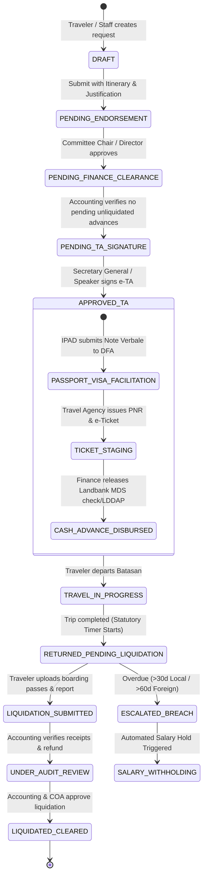
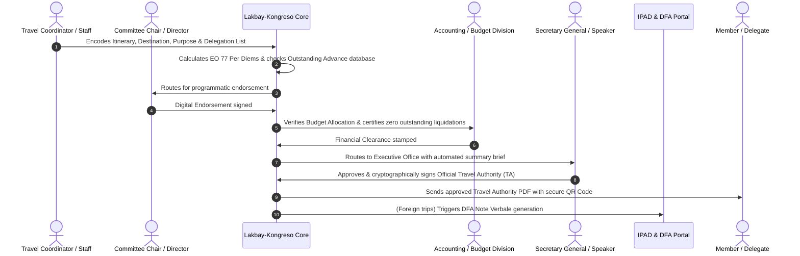
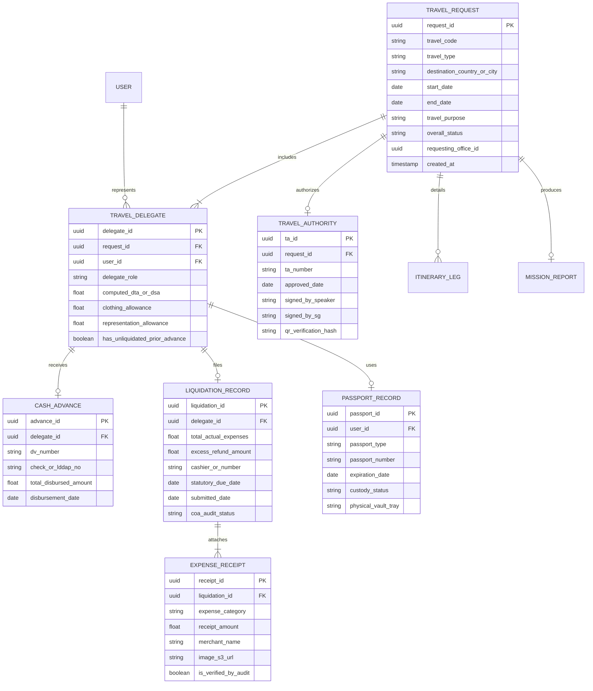
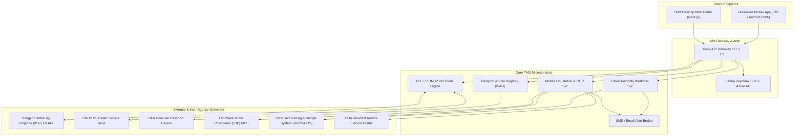
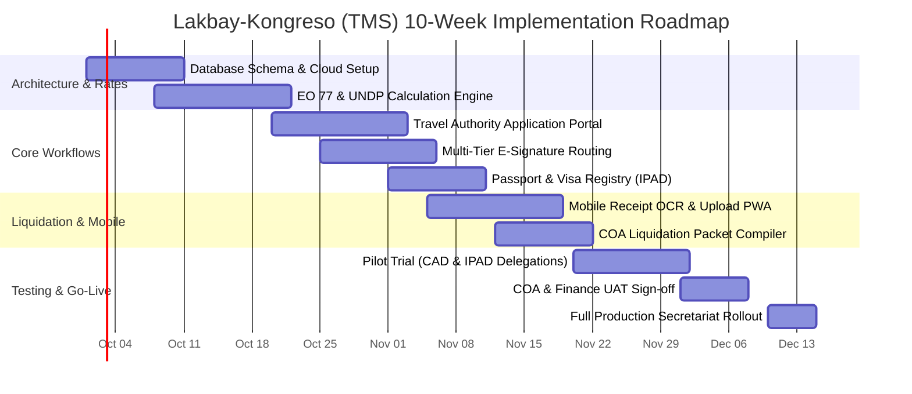

# BUSINESS REQUIREMENTS DOCUMENT (BRD)
## Lakbay-Kongreso: Enterprise Travel Management System (TMS)
### End-to-End Digital Workflow for Official Local and Foreign Travel Authorities, Passports, Per Diems, COA Liquidations, and Bilateral Parliamentary Mission Records

**Document Reference:** HREP-BRD-S07-2026-v1.0  
**System Code:** UGNAYAN-SYS-07  
**Deployment Tier:** Tier 2 (Service Platform Systems)  
**Target Release:** Phase 1 Extension / Early Phase 2  
**Classification:** Internal Restricted / Financial & Legal Administrative System  

---

### Table of Contents
1. [Document Control & Sign-off](#1-document-control--sign-off)
2. [Executive Summary & Statutory Framework](#2-executive-summary--statutory-framework)
3. [Business Problem Statement & Institutional Friction](#3-business-problem-statement--institutional-friction)
4. [Project Objectives & Success Metrics](#4-project-objectives--success-metrics)
5. [Stakeholder Analysis & Comprehensive User Personas](#5-stakeholder-analysis--comprehensive-user-personas)
6. [Project Scope: In-Scope vs. Out-of-Scope](#6-project-scope-in-scope-vs-out-of-scope)
7. [Regulatory Travel Rules & Computation Engine (EO 77)](#7-regulatory-travel-rules--computation-engine-eo-77)
8. [End-to-End Travel Lifecycle & Process Workflows](#8-end-to-end-travel-lifecycle--process-workflows)
9. [Detailed Functional Requirements (FRs)](#9-detailed-functional-requirements-frs)
10. [Non-Functional Requirements (NFRs)](#10-non-functional-requirements-nfrs)
11. [Data Architecture & Entity-Relationship Diagram](#11-data-architecture--entity-relationship-diagram)
12. [Financial, Diplomatic & External System Integrations](#12-financial-diplomatic--external-system-integrations)
13. [Gender-Responsive & Accessibility Features (GAD Travel Rules)](#13-gender-responsive--accessibility-features-gad-travel-rules)
14. [Risk Management & Audit Mitigation Strategy](#14-risk-management--audit-mitigation-strategy)
15. [Phased Implementation Roadmap & UAT Acceptance Criteria](#15-phased-implementation-roadmap--uat-acceptance-criteria)

---

### 1. Document Control & Sign-off

#### Document History
| Version | Date | Author / Role | Summary of Changes |
| :--- | :--- | :--- | :--- |
| **1.0** | 2026-09-01 | Lead Enterprise Financial & Systems Architect | Baseline BRD for UGNAYAN System 07 (Travel Management) |

#### Approvals
| Role | Name / Title | Department | Signature / Status |
| :--- | :--- | :--- | :--- |
| **Institutional Sponsor**| Secretary General | Office of the Secretary General (OSG) | Approved |
| **Operational Owner**| Director, IPAD | Inter-Parliamentary Relations & Special Affairs | Reviewed |
| **Financial Owner** | Director, Finance Department | Finance Department (Accounting & Budget) | Reviewed |
| **Operational Owner**| Director, Plenary Affairs | Legislative Operations Department (LOD) | Reviewed |
| **Auditing Observer**| Supervising Auditor, COA HRep | Commission on Audit (COA) Resident Unit | Consulted |
| **Technical Authority** | Director, ICTS | Information & Communications Tech. Service | Reviewed |

---

### 2. Executive Summary & Statutory Framework

Official travel is central to parliamentary democracy. Members of the House of Representatives of the Philippines (HRep) and Secretariat personnel travel extensively across the nation for committee public hearings, district consultations, ocular site inspections, and national disaster responses. Internationally, delegations represent the Republic of the Philippines in bilateral missions, parliamentary friendship groups, and multilateral assemblies such as the **ASEAN Inter-Parliamentary Assembly (AIPA)**, the **Inter-Parliamentary Union (IPU)**, and the **Asia-Pacific Parliamentary Forum (APPF)**.

However, the administrative, diplomatic, and accounting procedures required to authorize, finance, and liquidate official travel are notoriously labor-intensive, multi-departmental, and heavily scrutinized by the **Commission on Audit (COA)**. 

#### Governing Statutory Framework:
1. **Executive Order No. 77 (s. 2019):** Prescribes official local and foreign travel regulations, daily travel allowances (DTA), UNDP-indexed foreign subsistence rates (DSA), and mandatory travel authorizations.
2. **COA Circular No. 2012-001 & Circular No. 2023-004:** Prescribes strict rules on the grant, utilization, and liquidation of cash advances for official travel, stipulating that no new cash advance shall be granted unless the previous advance is fully liquidated within **30 days (local)** or **60 days (foreign)**.
3. **Republic Act No. 6713:** Code of Conduct and Ethical Standards for Public Officials and Employees regarding official accommodations, gifts, and reporting.
4. **Republic Act No. 11032:** Ease of Doing Business Act governing government processing timelines.

**Lakbay-Kongreso (UGNAYAN System 07)** delivers an enterprise cloud and mobile Travel Management System that unifies the entire travel lifecycle: from Travel Authority (TA) requests, multi-office clearances, DFA diplomatic passport and visa endorsements, automated EO 77 per diem calculations, and e-ticket staging, to paperless post-travel COA liquidation and bilateral mission archiving.

---

### 3. Business Problem Statement & Institutional Friction

#### 1. Fragmented, Multi-Office Paper Clearance Chokepoint
- A single foreign travel delegation requires up to **11 separate physical paper forms and clearances** routed across multiple offices: Committee Chairperson $\rightarrow$ Office of the Secretary General (OSG) $\rightarrow$ Speaker of the House $\rightarrow$ Inter-Parliamentary Relations Dept. (IPAD) $\rightarrow$ Budget Division $\rightarrow$ Accounting Division $\rightarrow$ Cash Division $\rightarrow$ Department of Foreign Affairs (DFA).
- If a lawmaker or staff member must travel on short notice (e.g., emergency humanitarian mission or sudden diplomatic summit), the physical paper routing creates extreme administrative panic, often requiring staff to physically track down signing officials at odd hours.

#### 2. Complex & Error-Prone Per Diem Computation
- Per diems, hotel allowances, and incidental expense computations differ drastically between local travel (EO 77 Tier 1/2/3 local hotel clusters) and foreign travel (United Nations Development Programme - UNDP Daily Subsistence Allowance tables in USD converted to Philippine Pesos at daily BSP rates).
- Finance accountants spend hundreds of manual hours manually cross-referencing paper tables, calculating clothing allowances, representation expenses, pre-travel terminal fees, and airfare deductions, leading to frequent computation disputes and audit suspensions.

#### 3. Chronic Unliquidated Cash Advance Backlogs
- Lawmakers and staff returning from travel frequently fail to submit liquidation documents within the mandatory statutory deadlines (30 days local / 60 days foreign).
- Physical paper receipts, airline boarding pass stubs, hotel folios, and Certificates of Appearance are frequently lost or damaged.
- This results in recurring **COA Audit Observation Memoranda (AOM)**, salary withholdings, and institutional reputational risk for the House of Representatives.

#### 4. Disconnected Diplomatic & Bilateral Records
- IPAD manages official diplomatic and official passports, visa applications, and bilateral mission records. Without a centralized digital registry, passport expiry dates are missed, diplomatic visa notes verbales are delayed at the DFA, and historical bilateral resolutions are stored in disparate filing cabinets rather than an institutional knowledge base.

---

### 4. Project Objectives & Success Metrics

#### Strategic Objectives
1. Digitize 100% of official Travel Authority (TA) applications and approvals across both local and foreign categories into a unified web and mobile portal.
2. Automate travel expense and per diem computations using a hardcoded, rules-based engine adhering strictly to **EO 77** and real-time **UNDP DSA / BSP foreign exchange tables**.
3. Establish a paperless, mobile-first **Digital COA Liquidation Engine** allowing travelers to photograph boarding passes, hotel folios, and certificates of appearance on the go.
4. Integrate with the **HRep Finance & Accounting System** to automate payroll deductions or travel allowance disbursements while preventing new cash advances if prior trips are unliquidated.
5. Create a secure institutional repository for **IPAD Bilateral Parliamentary Records** and official passport inventory tracking.

#### Quantifiable KPIs
- **Travel Authority Turnaround:** Processing time reduced from **10 working days to $\le 24$ hours** for emergency/urgent local trips, and from **3 weeks to $\le 3$ working days** for foreign missions.
- **Liquidation Compliance:** On-time statutory COA liquidation rate increased from **54% to $\ge 96\%$** within 6 months of rollout.
- **Zero Calculation Discrepancies:** 100% automated computation accuracy for local/foreign per diems compliant with EO 77.
- **Audit Suspensions:** 85% reduction in COA Audit Observation Memoranda related to travel documentation deficiencies.

---

### 5. Stakeholder Analysis & Comprehensive User Personas

```
┌─────────────────────────────────────────────────────────────────────────────┐
│                       LAKBAY-KONGRESO USER PERSONAS                         │
├───────────────────────────────┬─────────────────────────────────────────────┤
│ 1. Rep. Danilo "Danny" Ocampo │ District Representative (Bilateral Head)    │
│    (Chair, Foreign Affairs)   │ Needs: 1-Click Mobile Approval, No COA Delay│
├───────────────────────────────┼─────────────────────────────────────────────┤
│ 2. Atty. Camille Soriano      │ Committee Secretary / Delegation Custodian  │
│    (Committee Affairs Dept.)  │ Needs: Group Itinerary, Bulk Advances, Stubs│
├───────────────────────────────┼─────────────────────────────────────────────┤
│ 3. Dir. Edgardo Manalo        │ Director, Inter-Parliamentary Dept. (IPAD)  │
│    (Protocol & Foreign Travel)│ Needs: DFA Note Verbale, Passports, Bilateral│
├───────────────────────────────┼─────────────────────────────────────────────┤
│ 4. Zenaida "Ma'am Zeny" Cruz  │ Chief Accountant, Finance Department        │
│    (Accounting Division)      │ Needs: Strict EO 77 Logic, COA Checklists   │
├───────────────────────────────┼─────────────────────────────────────────────┤
│ 5. State Auditor IV Joy Ramos │ Supervising Auditor (COA Resident Team)     │
│    (Commission on Audit)      │ Needs: Immutable Audit Trails, Digital Stubs│
└───────────────────────────────┴─────────────────────────────────────────────┘
```

#### Persona 1: Hon. Danilo "Danny" Ocampo (Representative & Delegation Leader)
- **Profile:** Male, 55 years old, 3rd-term Representative, Chairman of the Committee on Foreign Affairs. Frequently leads congressional delegations to IPU Geneva, ASEAN parliamentary summits, and bilateral visits to Japan and South Korea.
- **Pain Points:** Extremely frustrated when his staff asks him to sign 15 different paper routing sheets for a single trip; hates receiving COA letters reminding him of unliquidated cash advances from 4 months ago because a boarding pass was misplaced.
- **System Need:** Native mobile app to review and approve travel requests with FaceID; instant receipt capture by his staff; real-time visibility into his clearance and liquidation status.

#### Persona 2: Atty. Camille Soriano (Committee Secretary & Delegation Custodian)
- **Profile:** Female, 36 years old, senior legislative attorney in CAD. Often designated as the "Special Disbursing Officer" (SDO) for committee field hearings and international study missions.
- **Pain Points:** Personally liable under COA rules for cash advances granted to the delegation; spends weeks after returning from trips chasing 8 different congressmen for their original airline boarding passes and certificates of appearance; manually prepares voluminous liquidation liquidation folders.
- **System Need:** Ability to manage delegation-level itineraries and group expenses; automated SMS reminders sent to delegates to photograph their boarding passes before leaving the airport; 1-click generation of the official COA Liquidation Report.

#### Persona 3: Dir. Edgardo Manalo (Director of Protocol & Foreign Travel, IPAD)
- **Profile:** Male, 59 years old, career parliamentary protocol expert. Coordinates official travel authorities directly with the Office of the Speaker, the Secretary General, and the Department of Foreign Affairs.
- **Pain Points:** Struggles to keep track of 300+ official and diplomatic red passports stored in IPAD safes; last-minute discoveries of expired visas or passports causes diplomatic emergencies; paper bilateral mission reports are filed away and never referenced again.
- **System Need:** Centralized digital Passport Vault tracking expiration dates and DFA physical locations; automated generation of DFA Note Verbale endorsement letters; searchable digital repository of all bilateral resolutions, bilateral agreements, and mission reports.

#### Persona 4: Zenaida "Ma'am Zeny" Cruz (Chief Accountant, Finance Department)
- **Profile:** Female, 57 years old, 30 years in government accounting. Strict guardian of government funds, deeply knowledgeable in COA rules, DBM circulars, and the General Appropriations Act (GAA).
- **Pain Points:** Overwhelmed by incorrect per diem computations submitted by congressional offices; constantly pressured to release cash advances when prior advances remain unliquidated; dreads COA audit season due to missing travel supporting documents.
- **System Need:** Automated computation engine that calculates exact per diems based on country, hotel rates, and meal deductions; hard system enforcement blocking new cash advances if an employee has an outstanding unliquidated advance exceeding statutory limits.

#### Persona 5: State Auditor IV Joy Ramos (COA Resident Supervising Auditor)
- **Profile:** Female, 46 years old, Certified Public Accountant assigned by the Commission on Audit to inspect HRep financial records.
- **Pain Points:** Sampling physical cardboard travel vouchers in dusty archive rooms; verifying whether airline ticket receipts are authentic or tampered with.
- **System Need:** Dedicated read-only COA Auditor Portal with search and export capabilities; cryptographic verification of digital boarding passes, electronic flight tickets, and geolocated Certificates of Appearance.

---

### 6. Project Scope: In-Scope vs. Out-of-Scope

#### In-Scope (Phase 1 / MVP Release)
1. **Digital Travel Authority (TA) Workflow:**
   - Online application for Official Local Travel (committee hearings, oversight oculars, district affairs).
   - Online application for Official Foreign Travel (inter-parliamentary, bilateral, multilateral study tours).
   - Multi-tier conditional approval routing (Staff $\rightarrow$ Division Chief $\rightarrow$ Director $\rightarrow$ Committee Chair $\rightarrow$ OSG $\rightarrow$ Speaker).
2. **Automated EO 77 & UNDP Per Diem Calculation Engine:**
   - Built-in rate matrix for Philippine local travel clusters (Cluster I, II, III).
   - Dynamic API integration with Bangko Sentral ng Pilipinas (BSP) foreign exchange rates and UNDP Daily Subsistence Allowance (DSA) tables.
   - Automated computation of Clothing Allowance, Pre-Travel Allowance, and Representation Expenses.
3. **Passport & Visa Management Subsystem (IPAD):**
   - Digital tracking of Diplomatic, Official, and Regular passports in IPAD custody.
   - Automated passport expiry alert engine (6-month expiration warnings).
   - Automated generation of DFA *Note Verbale* request letters and visa application packets.
4. **Flight & Hotel Booking Integration:**
   - Staging of official flight itineraries, airline booking references (PNR), and travel agency procurement vouchers.
5. **Mobile-First Digital COA Liquidation Engine:**
   - Mobile camera scanning and OCR of used boarding passes, e-tickets, and hotel bills.
   - Digital Certificate of Travel Completed and Certificate of Appearance with GPS geotagging.
   - Automated liquidation packet compilation compliant with COA Circular 2023-004.
6. **Bilateral & Mission Knowledge Archive (IPAD):**
   - Archiving of official narrative travel reports, bilateral communiqués, signed memoranda of understanding (MOUs), and delegate photos.

#### Out-of-Scope (Deferred to Future Phasing)
- **Direct Airline GDS Ticket Issuance:** Direct real-time credit card ticketing through Amadeus/Sabre (HRep mandates procurement through accredited government travel agencies pursuant to RA 9184).
- **Personal Unofficial Travel Tracking:** Personal vacation leaves abroad (handled under standard HR leave forms in System 08, though travel clearances are linked).
- **Automated Bank Cash Disbursement to Personal Wallets:** Direct API disbursement to GCash/Maya (disbursements must route through official Landbank of the Philippines MDS accounts).

---

### 7. Regulatory Travel Rules & Computation Engine (EO 77)

The system embeds the mathematical logic of **Executive Order No. 77 (s. 2019)** into its financial core:

#### 7.1 Local Travel Allowances (Section 5, EO 77)
$$\text{Total Local Daily Travel Allowance (DTA)} = \text{Hotel (50\%)} + \text{Meals (30\%)} + \text{Incidentals (20\%)}$$

| Cluster Tier | Destination Coverage | Maximum DTA / Day | Hotel Maximum (50%) | Meals (30%) | Incidentals (20%) |
| :---: | :--- | :---: | :---: | :---: | :---: |
| **Cluster I** | Regions I, II, III, VIII, IX, XII, CARAGA, BARMM | **PHP 1,500.00** | PHP 750.00 | PHP 450.00 | PHP 300.00 |
| **Cluster II** | Regions VI, VII, X, XI, MIMAROPA | **PHP 1,800.00** | PHP 900.00 | PHP 540.00 | PHP 360.00 |
| **Cluster III**| National Capital Region (NCR), Region IV-A, CAR | **PHP 2,200.00** | PHP 1,100.00| PHP 660.00 | PHP 440.00 |

*System Calculation Logic:*
- Day of departure and day of return receive 80% (Meals + Incidentals only, no hotel allowance).
- If meals or accommodations are sponsored by an LGU, host agency, or NGO, the system automatically deducts the respective 50% or 30% component.

#### 7.2 Foreign Travel Daily Subsistence Allowance (DSA - Section 12, EO 77)
$$\text{Total Foreign Allowance} = (\text{UNDP DSA Rate} \times \text{Country Multiplier}) + \text{Clothing Allowance} + \text{Pre-Travel Allowance}$$

- **Daily Subsistence Breakdown:** Hotel (50%), Meals (30%), Incidentals (20%).
- **Statutory Deductions:** If foreign hosts provide breakfast, lunch, or dinner, 10% is deducted per meal provided.
- **Clothing Allowance:** USD 400.00 (Tropical/Normal) or USD 600.00 (Cold Climate zones), allowable once every 24 months per traveler.
- **Representation Allowance:** Authorized exclusively for the Head of Delegation (Speaker, Deputy Speaker, or designated Delegation Chair).

---

### 8. End-to-End Travel Lifecycle & Process Workflows



#### Detailed Travel Authority Routing Sequence


---

### 9. Detailed Functional Requirements (FRs)

The requirements are prioritized using the MoSCoW standard (Must Have, Should Have, Could Have, Won't Have).

#### 9.1 Module 1: Travel Authority (TA) Application & Clearances
- **FR-TA-001 (Must Have):** The system MUST distinguish between four travel categories: (a) Official Local Legislative/Committee Travel, (b) Official Local District Travel, (c) Official Foreign Parliamentary Mission, (d) Official Foreign Study/Training.
- **FR-TA-002 (Must Have):** The system MUST require the user to upload: Formal Invitation Letter, Concept Note/Justification, and Terms of Reference (TOR).
- **FR-TA-003 (Must Have):** The system MUST automatically verify if any member of the proposed delegation has an outstanding, overdue unliquidated cash advance (>30 days local / >60 days foreign); if found, the system MUST programmatically block cash advance issuance, with an exception allowed only via an auditable, cryptographic emergency waiver signed exclusively by the Secretary General or Speaker, while automatically notifying Payroll for statutory salary deduction triggers.
- **FR-TA-004 (Must Have):** The system MUST support dynamic multi-tier digital signatures compliant with the Philippine National PKI (PNPKI) or cryptographic token stamps.
- **FR-TA-005 (Must Have):** The system MUST generate a tamper-evident Official Travel Authority document with a scannable QR code for airport and immigration inspection.

#### 9.2 Module 2: Automated Allowance & Financial Calculation Engine
- **FR-FIN-001 (Must Have):** The system MUST automatically calculate Local Daily Travel Allowances (DTA) based on the destination municipality/city mapping to EO 77 Clusters I, II, or III.
- **FR-FIN-002 (Must Have):** For foreign travel, the system MUST fetch current UNDP Daily Subsistence Allowance (DSA) rates and convert them to Philippine Pesos using the daily Bangko Sentral ng Pilipinas (BSP) reference exchange rate.
- **FR-FIN-003 (Must Have):** The system MUST provide toggle switches for: "Hotel Sponsored", "Breakfast Provided", "Lunch Provided", "Dinner Provided", automatically calculating mandatory statutory deductions pursuant to EO 77 Section 12.
- **FR-FIN-004 (Must Have):** The system MUST calculate Clothing Allowance entitlement by verifying the traveler's historical database records to ensure the 24-month moratorium has elapsed.
- **FR-FIN-005 (Should Have):** The system MUST generate the standardized Budget Utilization Request and Status (BURS) and Obligation Request and Status (ORS) forms required by government accounting standards.
- **FR-FIN-006 (Must Have - Dual Mode Calculation):** The system MUST support a 'Dual Calculation Mode': by default, it automatically computes standard EO 77 / UNDP fixed daily allowances; for authorized House Members and Delegation Heads, it permits an 'Actual Hotel Accommodation Reimbursement' mode (pursuant to EO 77 Section 6 & 14) requiring itemized official hotel receipts and justification of necessity.

#### 9.3 Module 3: Passport, Visa & Diplomatic Protocol Management (IPAD)
- **FR-DIP-001 (Must Have):** The system MUST maintain a secure registry of all diplomatic and official red passports, capturing: Passport Number, Issuing Date, Expiry Date, Physical Vault Storage Location, and Active Custody Status.
- **FR-DIP-002 (Must Have):** The system MUST trigger automated push notifications and emails to IPAD protocol officers and travelers **180 days (6 months)** prior to passport expiration.
- **FR-DIP-003 (Must Have):** The system MUST generate official *Note Verbale* endorsement templates addressed to the Department of Foreign Affairs (DFA) Consular Affairs Division, pre-populating traveler credentials, destination, and diplomatic purpose.
- **FR-DIP-004 (Should Have):** The system MUST track visa processing milestones: Application Submitted, Biometrics Scheduled, Visa Issued, Passport Released to Traveler.

#### 9.4 Module 4: Hybrid Flexible Ticketing & Itinerary Staging Engine
The system MUST support three flexible operational ticketing channels to accommodate diverse legislative and administrative needs:
- **FR-ITN-001A (Channel 1 - Accredited Travel Agency Portal):** The system MUST allow accredited HRep travel agencies to log into a secure vendor portal, review approved flight requisitions, and upload confirmed flight itineraries, PNR locators, and electronic ticket receipts (e-tickets) directly to the traveler's record.
- **FR-ITN-001B (Channel 2 - Direct Airline Corporate Account API):** The system MUST support direct API integration with Philippine carriers (e.g., Philippine Airlines, Cebu Pacific) via corporate booking accounts for fast-track, automated issuance of official domestic and regional flights against pre-authorized HRep credit lines.
- **FR-ITN-001C (Channel 3 - Congressional Staff Self-Booking & Advance Claim):** For urgent district travel or point-to-point provincial routes, the system MUST permit authorized congressional staff to book flights independently, upload booking confirmation receipts, and claim the exact ticket cost either via the pre-travel cash advance or post-travel reimbursement.
- **FR-ITN-002 (Must Have):** The system MUST automatically notify the traveler via SMS and email with flight numbers, terminal details, e-tickets, and baggage allowance details regardless of booking channel.
- **FR-ITN-003 (Should Have):** The system MUST support itinerary amendment workflows (flight re-booking, cancellation, extension of stay) with mandatory justification fields and approval by the Secretary General.

#### 9.5 Module 5: Mobile Post-Travel Liquidation & COA Audit
- **FR-LIQ-001 (Must Have):** The system MUST initiate an automated countdown timer upon the official trip end date: **30 calendar days for Local Travel** and **60 calendar days for Foreign Travel**.
- **FR-LIQ-002 (Must Have):** The mobile application MUST allow travelers and staff to photograph and upload used physical airline boarding passes, e-boarding pass barcodes, hotel receipts, terminal fees, and toll receipts.
- **FR-LIQ-003 (Must Have):** The system MUST support digital generation of the **Certificate of Travel Completed (Appendix A)** and **Certificate of Appearance**.
- **FR-LIQ-004 (Must Have):** The system MUST require the submission of a comprehensive **Narrative Travel Report / Mission Output Report** before a liquidation can be submitted.
- **FR-LIQ-005 (Must Have):** If excess cash advance remains unspent, the system MUST require the upload of the official Landbank/HRep Cashier Official Receipt (OR) evidencing the cash refund.
- **FR-LIQ-006 (Must Have):** When a statutory liquidation deadline is 7 days away, the system MUST send escalated SMS alerts to the traveler and Chief of Staff. If breached, it MUST automatically generate a Notice of Default and notify the Payroll Division for salary withholding.

#### 9.6 Module 6: Bilateral Archives & Institutional Memory
- **FR-ARC-001 (Must Have):** IPAD administrators MUST be able to catalog finalized travel reports into a searchable institutional knowledge repository indexed by: Country, Multilateral Body (IPU, AIPA, APPF), Parliamentary Friendship Committee, and Topic.
- **FR-ARC-002 (Should Have):** The system MUST allow tagging of bilateral resolutions, trade discussions, and international commitments to maintain continuity across congresses.

---

### 10. Non-Functional Requirements (NFRs)

#### 10.1 Financial Security & Cryptography
- **NFR-SEC-001:** All financial records, passport numbers, and personal details MUST be encrypted at rest using **AES-256** and in transit using **TLS 1.3**.
- **NFR-SEC-002:** Digital approvals for Travel Authorities and Liquidation Clearances MUST utilize asymmetric cryptographic key pairs with SHA-256 hashing to guarantee non-repudiation in court and COA hearings.
- **NFR-SEC-003:** Access to diplomatic passport scans and travel manifests MUST be restricted through strict Role-Based Access Control (RBAC) enforced by multi-factor authentication (MFA).

#### 10.2 Statutory Compliance & Auditability
- **NFR-AUD-001:** The system MUST preserve an immutable, append-only audit trail for every status change, approval, rejection, document view, and computational adjustment for a minimum statutory period of **10 years** in compliance with COA guidelines.
- **NFR-AUD-002:** Resident COA auditors MUST have real-time read-only access to query, filter, and export transaction audit histories and digital liquidation folders.

#### 10.3 Mobile Responsiveness & Offline Photo Upload
- **NFR-PERF-001:** The mobile web app and PWA MUST allow travelers in provincial districts or foreign airports with intermittent 3G/4G connectivity to capture receipt photos offline and queue them for automated upload upon reconnection.
- **NFR-PERF-002:** The system MUST scale image attachments automatically, compressing 10MB phone camera photos down to $<500$KB while maintaining OCR legibility to conserve government storage.

---

### 11. Data Architecture & Entity-Relationship Diagram



---

### 12. Financial, Diplomatic & External System Integrations



---

### 13. Gender-Responsive & Accessibility Features (GAD Travel Rules)

In strict adherence to Republic Act No. 9710 (Magna Carta of Women) and DBM-PCW GAD Joint Circulars:
1. **Lactation & Childcare Consideration Clearances:** Nursing mothers authorized for official travel can register special accommodation needs; per diem rules permit legitimate infant care freight or lactation storage incidentals within approved administrative thresholds.
2. **Accessible Travel Accommodations:** Delegates with physical disabilities or mobility impairments are automatically prioritized for accessible aircraft seating, wheelchair-accessible ground transport, and ground-floor/accessible hotel rooms.
3. **Sex-Disaggregated GAD Analytics:** The reporting subsystem automatically generates quarterly sex-disaggregated travel metrics (e.g., ratio of female to male delegation leaders, committee staff travel opportunities, international representation) to support HRep’s mandatory annual 5% GAD budget accomplishment audit.

---

### 14. Risk Management & Audit Mitigation Strategy

| Risk ID | Risk Description | Severity | Likelihood | Mitigation Strategy |
| :--- | :--- | :---: | :---: | :--- |
| **RSK-TRV-01**| Lawmaker travels without approved Travel Authority due to late paperwork. | Critical| Med | Provide "Emergency Fast-Track TA" workflow on mobile that can be endorsed by the Speaker/SG in $<1$ hour via SMS OTP. |
| **RSK-TRV-02**| Travel cash advances remain unliquidated beyond 60 days, attracting COA audit disallowances. | High | High | Hardcoded automated countdown timers; automated escalation to Chief of Staff at 45 days; automatic trigger to Payroll for salary deduction at 61 days. |
| **RSK-TRV-03**| Lost paper boarding passes prevent full liquidation clearance. | High | High | Mobile app features instant photo scanning at airport; integration with airline e-ticket verification; acceptance of digital airline app PDF passes. |
| **RSK-TRV-04**| Diplomatic passport expires while traveling abroad or immediately before departure. | Critical| Low | Automated 180-day and 90-day alert engine; IPAD vault dashboard alerts protocol officers months before international assembly calendars. |

---

### 15. Phased Implementation Roadmap & UAT Acceptance Criteria



#### User Acceptance Testing (UAT) Sign-off Criteria
- [ ] 100% computational accuracy of local DTA across Clusters I, II, and III compared against manual audit sheets.
- [ ] 100% computational accuracy of foreign DSA and currency conversions against UNDP rate tables and BSP exchange rates.
- [ ] Automated block triggered when a test user with an unliquidated advance attempts to file a new cash advance request.
- [ ] Official Travel Authority generated with a valid, cryptographically verifiable QR code.
- [ ] Digital liquidation package (boarding passes, certificate of appearance, narrative report) successfully compiled into a COA-compliant single PDF.
- [ ] Written UAT approval obtained from the Finance Director, IPAD Director, and COA Supervising Auditor.
