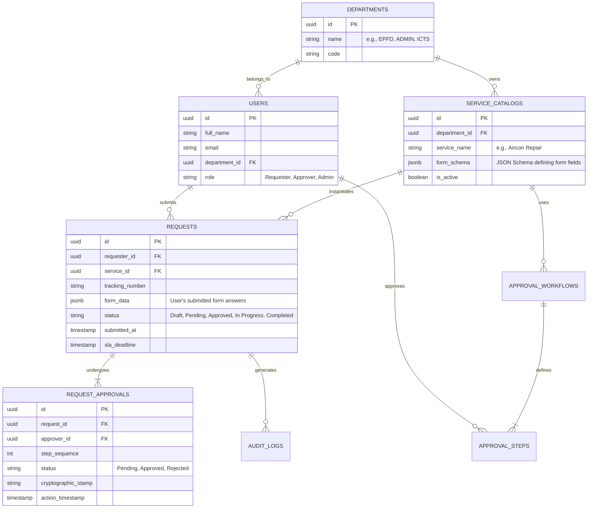

# Technical Design Document (TDD): HRep e-Request Portal (System 05)

## 1. Executive Summary
This document outlines the technical architecture, database schema, and AI integration strategy for the **HRep e-Request Portal**. The system is designed to digitalize the "Core 5" administrative services (Motor Pool, EPFD, ICTS, OSAA, LAD). 

To support a seamless developer experience and secure enterprise deployment, the architecture features a dual-mode execution strategy: a lightweight, self-contained **Localhost Development Environment** and a highly available, secure **Google Cloud Production Environment**. 

Additionally, this document specifies the design of a smart **Service Triage Agent** built using the Google **Agent Development Kit (ADK)** to automatically route and pre-fill forms based on natural language user requests.

---

## 2. System Architecture

The application follows a 12-factor app methodology, allowing the exact same application binary/container to run locally and in production by solely changing environment variables (e.g., `APP_ENV=local` vs `APP_ENV=production`).

### 2.1 Production Architecture (Google Cloud)
The production environment leverages fully managed, serverless Google Cloud Platform (GCP) services for high availability, zero-trust security, and compliance with Philippine RA 10173 (Data Privacy Act).


**Production Components:**
* **Identity & Access (Zero Trust):** Cloud Identity-Aware Proxy (IAP) intercepts all traffic, enforcing HRep Single Sign-On (Google Workspace/Azure AD) before requests even reach the application.
* **Compute Engine:** Google Cloud Run hosts the containerized web frontend and API backends, auto-scaling to zero during off-hours to save costs, and scaling up during heavy legislative days.
* **Database:** Cloud SQL for PostgreSQL (High Availability mode, encrypted at rest).
* **Storage:** Cloud Storage buckets for PDF/Docx attachments, strictly IAM-controlled and encrypted with Customer-Managed Encryption Keys (CMEK).
* **Secrets:** API Keys (e.g., PH Gov SMS Gateway) and DB credentials are dynamically loaded at runtime from Secret Manager.

### 2.2 Localhost Development Architecture
When running on a developer's machine (`APP_ENV=local`), the system defaults to a self-contained Docker Compose stack. It uses local volumes and mock services instead of cloud dependencies.


**Local Components:**
* **Mock Auth Middleware:** Bypasses IAP and injects static/mock JWT tokens representing dummy personas (e.g., `requester@hrep.gov.ph`, `director@hrep.gov.ph`).
* **Local Database:** A local `postgres:15-alpine` container initialized with static seed data (dummy users, forms, SLA metrics).
* **Local Storage:** File uploads are saved to the local file system (e.g., `./storage/uploads`) instead of Cloud Storage.

### 2.3 Environment Auto-Switching Strategy
The application logic implements a runtime dependency injection pattern based on the `APP_ENV` environment variable:

```python
# Pseudo-code architecture switch
if os.environ.get("APP_ENV") == "local":
    # Default to Localhost Config
    db_client = psycopg2.connect(host="localhost", dbname="erequest_local", user="dev")
    storage_client = LocalFileSystemStorage(base_path="./uploads")
    auth_middleware = MockDevelopmentAuth(static_user_id="user_123")
    sms_client = ConsoleLoggerSMSClient() # Prints SMS to terminal
else:
    # Production Config
    db_client = CloudSQLConnector()
    storage_client = GoogleCloudStorage(bucket_name="hrep-erequest-attachments-prod")
    auth_middleware = IAPValidationMiddleware()
    sms_client = PHGovSMSGateway(api_key=SecretManager.get("sms_key"))
```

---

## 3. Database Schema Design (PostgreSQL)

The database utilizes PostgreSQL, extensively leveraging the `JSONB` data type to support the dynamic Drag-and-Drop Form Builder. This allows the system to store dynamic, evolving forms without running `ALTER TABLE` migrations.

### 3.1 Entity-Relationship Diagram (ERD)



### 3.2 Key Table Specifications
1. **`service_catalogs.form_schema` (JSONB):** Stores the UI definitions built by the Visual Form Builder. Example:
   ```json
   {
     "fields": [
       {"name": "room_number", "type": "string", "required": true},
       {"name": "issue_description", "type": "text", "required": true}
     ]
   }
   ```
2. **`requests.form_data` (JSONB):** Stores the actual answers submitted by the user. Example:
   ```json
   {
     "room_number": "South Wing 214",
     "issue_description": "Water leaking from ceiling cassette."
   }
   ```

---

## 4. AI Agent Design (Agent Development Kit - ADK)

While standard requests are structured, many users prefer to simply state their problem. We will implement an **e-Request Triage Agent** using the ADK framework.

### 4.1 Agent Role & Objective
- **Name:** HRep Triage Agent
- **Goal:** To receive natural language conversational input (e.g., *"My laptop won't connect to the Wi-Fi in the plenary hall"*), automatically identify the correct service from the Service Catalog, extract the required parameters, and draft the request ticket on the user's behalf.

### 4.2 ADK Implementation

#### A. System Prompt (`instructions.md`)
```markdown
You are the HRep Service Triage Agent. Your job is to help Congressional staff file support requests.
You have access to the HRep Service Catalog containing the 'Core 5' services:
1. Motor Pool / Vehicle Dispatch
2. EPFD (Building/AC Maintenance)
3. ICTS (IT/Tech Support)
4. OSAA (Security/ID Replacement)
5. LAD (Contract Review)

When a user describes an issue:
1. Identify the correct service category.
2. Extract relevant entities (Location, Asset, Issue Description, Date/Time).
3. If information is missing (e.g., they ask for a vehicle but didn't provide a destination), ask for it.
4. Once you have all required fields, use the `draft_erequest` tool to submit the form.
```

#### B. Agent Tools (`tools.json`)
The agent is equipped with custom tools that interact with our PostgreSQL database via an API layer.

1. **`search_service_catalog`**: 
   - *Description:* Searches the database for the correct form schema based on the user's issue.
   - *Parameters:* `query` (string).
2. **`draft_erequest`**:
   - *Description:* Submits the parsed JSON payload into the `requests` table and sets the status to "Draft", returning a URL to the user to review and finalize.
   - *Parameters:* `service_id` (uuid), `form_data` (json map).

#### C. Interaction Flow
1. **User (via Chat UI):** "I need a van tomorrow at 8am to go to the Senate."
2. **Agent:** Calls `search_service_catalog(query="van transport")`.
3. **Agent:** Identifies the Motor Pool Dispatch form. Realizes it requires `passenger_count`.
4. **Agent:** "I can arrange a Motor Pool dispatch for your trip to the Senate tomorrow at 8 AM. How many passengers will be traveling?"
5. **User:** "Just 3 of us."
6. **Agent:** Calls `draft_erequest(service_id="...", form_data={"destination": "Senate", "date": "2026-09-02T08:00:00Z", "passengers": 3})`.
7. **Agent:** "I've drafted your request. Please click [here](/requests/draft/1234) to review and submit!"
