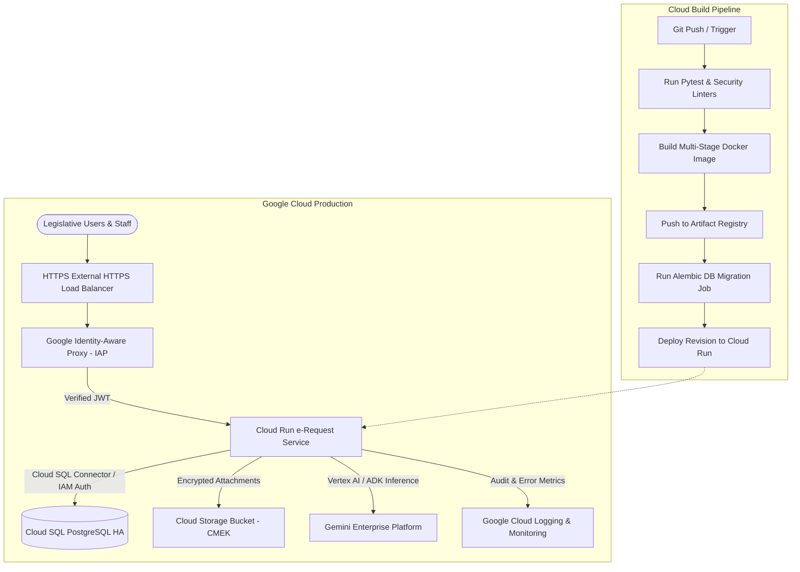

# 📋 Production Deployment Plan & Codebase Remediation: HRep e-Request Portal

## Goal Description
This plan establishes a production-grade deployment strategy for the **HRep e-Request Portal (System 05)** on **Google Cloud Platform (GCP)**. It reviews the Python/FastAPI codebase, identifies production readiness gaps (security, database lifecycle, authentication, cloud storage, and CI/CD), and provides concrete remediation steps, Terraform Infrastructure-as-Code (IaC), and automated deployment pipelines.

---

## 🔍 Codebase Production-Readiness Audit & Findings

| Area | Current State | Production Risk / Gap | Remediation Action |
| :--- | :--- | :--- | :--- |
| **1. Database Lifecycle & Concurrency** | `Base.metadata.create_all()` and `seed_data()` run on every app startup. | Multi-instance Cloud Run scaling creates race conditions, deadlocks, and duplicate seed attempts. | Gate seeding to `APP_ENV=local` only. Implement **Alembic** migrations for zero-downtime production schema management. |
| **2. DB Connection Pooling** | Default SQLite/Postgres engine without pool configuration. | Cloud SQL connections could exhaust during legislative session traffic spikes. | Configure SQLAlchemy `QueuePool` with `pool_size=10`, `max_overflow=20`, `pool_pre_ping=True`, and `pool_recycle=1800`. |
| **3. IAP Security & Non-Repudiation** | Reads plain text `X-Goog-Authenticated-User-Email` header. | Vulnerable to header spoofing if traffic bypasses the Load Balancer / IAP proxy. | Implement **Cryptographic IAP JWT Verification** using `google-auth` verifying `X-Goog-IAP-JWT-Assertion` and audience claims. |
| **4. File Uploads & Storage** | Local directory `./uploads` placeholder. | Attachments (PDF affidavits, MOAs, trip justifications) will not persist across Cloud Run container recycles. | Implement hybrid storage adapter (`GCSStorageService` for Cloud Storage with signed URLs in prod, `LocalStorageService` in local mode). |
| **5. AI Agent Live Integration** | Heuristic entity extraction working for local testing. | Lacks live Gemini 1.5 / 2.0 Flash call via Vertex AI / Google GenAI SDK. | Add dual-mode ADK execution: Vertex AI / Gemini API via ADC when deployed on GCP, with graceful fallback to heuristic engine for local/offline testing. |
| **6. Security & Observability** | Open CORS (`*`), basic prints, no security response headers. | Non-compliant with National Privacy Commission (NPC) / OWASP standards. | Add Cloud Logging JSON structured logger, rate limiting, and HTTP Security Headers (HSTS, CSP, X-Frame-Options). |
| **7. Infrastructure & CI/CD** | Manual gcloud bash snippets. | Prone to human configuration drift and lack of reproducibility. | Create modular **Terraform** configs (`terraform/`) and **Cloud Build** pipeline (`cloudbuild.yaml`). |

---

## Key Architectural Highlights

---

### Component Breakdown & Manifest Reference

1. **Alembic Schema Migrations:**
   - Configuration: [`e-requests/alembic.ini`](file:///usr/local/google/home/markea/Desktop/hor/e-requests/alembic.ini)
   - Initial Version: [`e-requests/alembic/versions/001_initial_schema.py`](file:///usr/local/google/home/markea/Desktop/hor/e-requests/alembic/versions/001_initial_schema.py)
2. **Cryptographic IAP Auth Token Verification:**
   - Implementation: [`e-requests/app/routers/auth.py`](file:///usr/local/google/home/markea/Desktop/hor/e-requests/app/routers/auth.py)
3. **Storage Service Adapter (GCS & Local):**
   - Implementation: [`e-requests/app/services/storage.py`](file:///usr/local/google/home/markea/Desktop/hor/e-requests/app/services/storage.py)
4. **Terraform Infrastructure as Code:**
   - Main Stack: [`e-requests/terraform/main.tf`](file:///usr/local/google/home/markea/Desktop/hor/e-requests/terraform/main.tf)
   - Variables & Outputs: [`e-requests/terraform/variables.tf`](file:///usr/local/google/home/markea/Desktop/hor/e-requests/terraform/variables.tf), [`e-requests/terraform/outputs.tf`](file:///usr/local/google/home/markea/Desktop/hor/e-requests/terraform/outputs.tf)
5. **Cloud Build CI/CD:**
   - Pipeline: [`e-requests/cloudbuild.yaml`](file:///usr/local/google/home/markea/Desktop/hor/e-requests/cloudbuild.yaml)
6. **Automated Unit & Router Test Suite:**
   - Test Cases: [`e-requests/tests/`](file:///usr/local/google/home/markea/Desktop/hor/e-requests/tests/)
