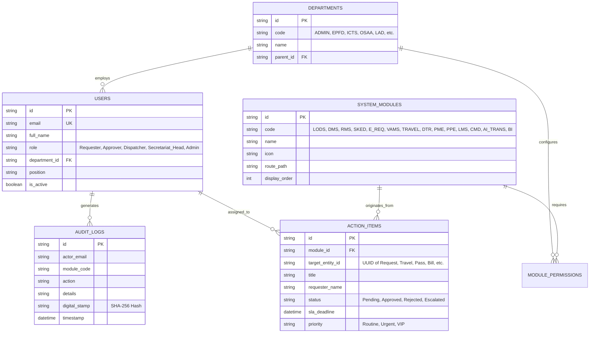
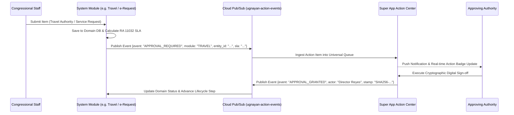

# Technical Design Document (TDD): UGNAYAN Super App Platform Architecture
## Enterprise Modular Shell, Gateway, Unified Identity & Cross-Module Event Mesh

**Document Reference:** HREP-UGNAYAN-TDD-2026-008  
**Target Organization:** House of Representatives of the Philippines (HRep) Secretariat  
**Author:** Technical Consulting & Solutions Architecture Team  
**Date:** September 2026  
**Status:** Approved for Core Platform Engineering  

---

### Executive Overview

The **UGNAYAN Super App** is the foundational digital platform for the House of Representatives of the Philippines. It unifies all **14 functional systems** into a single, cohesive, cloud-native portal accessible by 315+ Congressional Members, 3,000+ legislative and plantilla staff, committee secretariats, and accredited institutional stakeholders.

Rather than deploying isolated web silos, the UGNAYAN platform adopts an **Asynchronous Micro-Frontend & Event-Driven Modular Architecture**. Each functional capability (e.g., e-Requests, Batasan Pass, Lakbay-Kongreso, Batas-Bayan, DTR) operates as an independently deployable module integrated into the core Super App Shell via unified Single Sign-On (SSO), a shared Action Center, an immutable audit event stream, and a common design system.

```
┌────────────────────────────────────────────────────────────────────────────────────────────────────────┐
│                                   UGNAYAN SUPER APP ECOSYSTEM                                          │
├────────────────────────────────────────────────────────────────────────────────────────────────────────┤
│ 🌐 Super App Shell (Web PWA / Mobile Responsive • Tailwind CSS Design System • HRep Navy & Gold)       │
├────────────────────────────────────────────────────────────────────────────────────────────────────────┤
│ 🛡️ API Gateway & Security Layer (Google Cloud IAP • Keycloak OIDC SSO • Cloud Armor WAF • TLS 1.3)     │
├────────────────────────────────────────────────────────────────────────────────────────────────────────┤
│ 🔔 Cross-Cutting Platform Services                                                                     │
│  ├── Unified Action Center (Cross-Module Approval Queue, Escalations, Push & Email Alerts)             │
│  ├── ADK AI Gateway (Gemini 2.5 Flash Triage, Semantic Document Retrieval, Taglish NLU)                │
│  ├── Immutable Ledger & Audit Engine (SHA-256 Digital Signature Chain, COA / NAP Compliance)           │
│  └── Master Data Hub (Department Hierarchy, Employee Directory, Committee Rosters, Statutory Calendar)│
├────────────────────────────────────────────────────────────────────────────────────────────────────────┤
│ 🧩 Functional System Modules (Independently Deployable Micro-Services)                                 │
│  ├── Tier 1: LODS (01) • DMS (02) • RMS (03) • Kumberso-Sked (04) • e-Requests (05)                    │
│  ├── Tier 2: Batasan Pass VAMS (06) • Lakbay-Kongreso (07) • Lingkod-Kawani DTR (08)                   │
│  ├── Tier 3: Target-Kongreso PM&E (09) • Asset-Track PPE (10) • Kongreso Academy LMS (11)              │
│  └── Tier 4: Command Center (12) • Lingkod-Dinig AI (13) • HRep Insights BigQuery (14)                 │
├────────────────────────────────────────────────────────────────────────────────────────────────────────┤
│ 💾 Data & Event Mesh (Cloud SQL PostgreSQL HA • Google Cloud Storage • Cloud Pub/Sub • BigQuery)       │
└────────────────────────────────────────────────────────────────────────────────────────────────────────┘
```

---

### 1. Platform Architectural Principles

1. **Zero-Trust Identity & Single Sign-On:** Strict enforcement of Google Cloud Identity-Aware Proxy (IAP) and Keycloak OIDC. Passwordless application security with role-based access control (RBAC) across 15 Secretariat departments.
2. **Modular Micro-Frontend Architecture:** The Super App Shell dynamically discovers and mounts functional modules based on the authenticated user's permission claims (`claims.roles`).
3. **Statutory Non-Repudiation:** Every state change, approval, or endorsement generates a SHA-256 cryptographic audit token (`SHA256-AUTHENTICATED-USER-TIMESTAMP`) committed to an append-only audit stream.
4. **Dual-Mode Portability:** All modules support zero-cloud local execution (`APP_ENV=local` with SQLite) and Google Cloud Production (`APP_ENV=production` with Cloud SQL, GCS, Pub/Sub, and Secret Manager).
5. **Statutory Timekeeping:** Universal working-day SLA calculation pursuant to RA 11032 (8:00 AM – 5:00 PM, excluding weekends and official Philippine holidays).

---

### 2. Core Super App Data Model & Shared Schema

All modules share master entities managed through a centralized PostgreSQL schema:



---

### 3. Unified Cross-Module Action Center & Event Bus

The Super App provides a **Unified Action Center** where approving authorities (Division Chiefs, Bureau Directors, Committee Chairpersons, Secretary General) review and act upon pending tasks across all 14 systems in a single consolidated queue.

#### Event-Driven Message Flow (Google Cloud Pub/Sub)


---

### 4. Shared API Gateway & Routing Specification

The API Gateway routes inbound requests to modular micro-services based on path prefixes:

| Path Prefix | Target Module Service | Primary Responsibility |
| :--- | :--- | :--- |
| `/api/auth/*` | Auth & Profile Gateway | IAP JWT Verification, Keycloak SSO, User Provisioning |
| `/api/actions/*` | Universal Action Hub | Cross-module pending approvals, SLA alerts, batch sign-offs |
| `/api/lods/*` | System 01: Legislative Ops | Bill filing, reading stages, committee reports, voting |
| `/api/dms/*` | System 02: Document Mgmt | Housedocs archives, versioning, full-text OCR search |
| `/api/rms/*` | System 03: Records Mgmt | Historical declassification, retention rules, NAP transfers |
| `/api/calendar/*` | System 04: Kumberso-Sked | Committee room bookings, hearing schedules, VIP calendars |
| `/api/requests/*` | System 05: e-Request Portal | Administrative service requests, motor pool, EPFD repairs |
| `/api/vams/*` | System 06: Batasan Pass | Guest pre-registration, rotating QR passes, gate scanners |
| `/api/travel/*` | System 07: Lakbay-Kongreso | EO 77 per diems, Travel Authorities, COA liquidations |
| `/api/dtr/*` | System 08: Lingkod-Kawani | Biometric attendance, CSC leave ledger, plantilla records |
| `/api/pme/*` | System 09: Target-Kongreso | OPCR/IPCR performance scoring, budget execution tracking |
| `/api/ppe/*` | System 10: Asset-Track | Property Plant & Equipment, RFID asset scans, COA count |
| `/api/lms/*` | System 11: Kongreso Academy | Legislative staff onboarding, certification courses |
| `/api/command/*` | System 12: Command Center | Real-time executive KPIs for Speaker & Secretary General |
| `/api/transcribe/*`| System 13: Lingkod-Dinig AI | Google Meet Gemini Notes bridge, hearing transcriptions |
| `/api/analytics/*` | System 14: HRep Insights | BigQuery data lakehouse queries, statutory compliance BI |

---

### 5. Statutory Compliance & Non-Functional Hardening

1. **Republic Act No. 10173 (Data Privacy Act):** All PII fields (blood types, home addresses, passport numbers, biometric IDs) are tokenized at rest with AES-256 and restricted by strict RBAC scopes.
2. **Republic Act No. 11032 (Ease of Doing Business):** Automated SLA escalation timers trigger email/push alerts at 75% elapsed working hours and log automatic statutory breaches.
3. **COA Circular 2012-001 & 2023-004:** Immutable audit logging with cryptographic signatures ensures all financial and property transactions pass Commission on Audit scrutiny.
4. **WCAG 2.1 AA & BP 344 (Accessibility):** High contrast color ratios, keyboard focus indicators, screen reader ARIA labels, and responsive layout across all desktop and mobile viewports.
