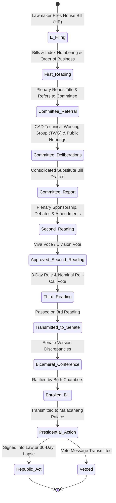

# Business Requirements Document (BRD)
## System 01: Legislative Operations Digital System (Batas-Bayan / LODS)
### UGNAYAN Super App - Legislative Core Module

**Document Reference:** HREP-UGNAYAN-BRD-2026-009  
**Target Organization:** House of Representatives of the Philippines (HRep) Secretariat  
**Primary Department Owners:** Legislative Operations Department (LOD), Committee Affairs Department (CAD), Bills and Index Service, Plenary Affairs Bureau  
**Date:** September 2026  
**Status:** Approved for Core Engineering  

---

### 1. Executive Summary & Business Problem

The **Legislative Operations Digital System (Batas-Bayan / LODS)** is the core statutory engine of the Philippine House of Representatives. Under the 1987 Philippine Constitution and the House Rules of the 19th/20th Congress, the 315+ House Members file, deliberate, amend, and enact hundreds of House Bills (HB) and House Resolutions (HR) each session.

#### Current Pain Points:
1. **Manual Bill Filing & Physical Indexing:** Lawmakers physically submit hard-copy bills to the Bills and Index Service for numbering, barcode stamping, and manual ledger entry.
2. **Disconnected Committee & Plenary Stages:** Amendments made during committee hearings (CAD) are manually transcribed and cross-referenced with plenary drafts, causing reconciliation bottlenecks and printing delays for the Order of Business.
3. **Voting & Roll Call Opacity:** Plenary voting results, viva voce tallies, and nominal voting records require manual stenographic tabulation before inclusion in the official Congressional Journal.
4. **Bicameral Conference & Enrolled Bill Tracking:** Tracking identical vs. reconciled provisions between House and Senate versions relies on manual paper side-by-side matrices.

---

### 2. User Personas & Stakeholder Matrix

| Persona Code | Role & Title | Department / Office | Core Responsibility & Needs |
| :--- | :--- | :--- | :--- |
| **PER-LOD-01** | Representative (Lawmaker) / Chief of Staff | Congressional District / Party-List Office | Electronic bill filing, co-authorship requests, live status tracking from 1st reading to Republic Act enactment. |
| **PER-LOD-02** | Bills & Index Officer | Legislative Operations (LOD) | Electronic bill validation, automatic sequential numbering (`HB-XXXX`), title indexing, and formal referral to committees. |
| **PER-LOD-03** | Committee Secretary | Committee Affairs (CAD) | Ingests referred bills, schedules committee deliberations, logs amendments, drafts Committee Reports, tracks votes. |
| **PER-LOD-04** | Plenary Affairs Director | Plenary Affairs Bureau | Compiles the official Calendar of Business, manages floor debate amendments, logs nominal voting tallies. |
| **PER-LOD-05** | Secretary General | Office of the Secretary General (OSG) | Formal certification of Enrolled Bills, transmission to the Senate of the Philippines and Malacañang Palace. |

---

### 3. End-to-End Legislative Lifecycle Workflow

---

### 4. Detailed Functional Requirements

#### FR-LOD-01: Electronic Bill Filing & Co-Authorship Endorsement
- **Description:** Congressional offices submit digital bills (`.docx` + `.pdf`) through the Super App.
- **Rules:** 
  - Validates mandatory bill components: Explanatory Note, Title, Enacting Clause, Body Sections, Separability Clause, Repealing Clause, and Effectivity Clause.
  - Generates atomic sequential numbering: `HB-[CongressNumber]-[SequentialNumber]` (e.g. `HB-20-00421`).
  - Allows primary authors to send digital co-authorship invitations to other House Members with 1-click digital sign-off.

#### FR-LOD-02: Committee Deliberation & Amendment Matrix Engine
- **Description:** Committee secretaries manage the lifecycle of referred measures, consolidation of companion bills, and substitute bill authoring.
- **Rules:**
  - Automated generation of side-by-side **Legislative Matrix**: Compares original filing, TWG inputs, stakeholder position papers, and approved committee amendments.
  - Digital routing and signature of Committee Reports by Committee Chairpersons and majority members.

#### FR-LOD-03: Plenary Order of Business & Nominal Voting Integration
- **Description:** Real-time generation of the Daily Calendar of Business (Unfinished Business, Business for the Day, Business for a Certain Date) and nominal roll-call voting tracker.
- **Rules:**
  - Plenary tablet interface for lawmakers to view real-time text of floor amendments.
  - Secure biometric or digital token voting interface recording `Yes`, `No`, and `Abstain` tallies with immediate publication to the Congressional Journal.

#### FR-LOD-04: Bicameral Conference & Republic Act Lifecycle Tracker
- **Description:** Tracks bicameral harmonization between House and Senate bills, certification of the Enrolled Bill, and Presidential action.
- **Rules:**
  - Automated 30-day statutory countdown for Presidential approval under Article VI, Section 27(1) of the 1987 Constitution (preventing unintended lapse into law).
  - Assigns official Republic Act number (e.g., `RA 12024`) and synchronizes with the National Archives and Official Gazette.

---

### 5. Super App Integration Specification

1. **Identity & Roles:** Integrates with `@hrep.gov.ph` IAP claims; grants lawmaker permissions to authenticated Representatives and drafting access to authorized staff.
2. **Action Center:** Sends pending Committee Report endorsements and co-authorship requests directly to the Super App universal action queue.
3. **AI Assist (ADK):** Integrates with Gemini 2.5 Flash for automated bill summarization, statutory cross-reference checking (detecting affected previous Republic Acts), and Taglish-to-English legal brief drafting.
4. **Data Privacy (RA 10173):** Protects confidential draft bills and executive session committee amendments until formal public filing.
