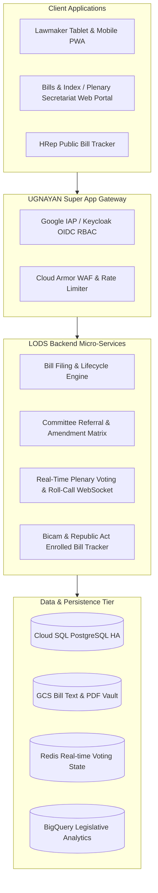

# Technical Design Document (TDD)
## System 01: Legislative Operations Digital System (Batas-Bayan / LODS)
### UGNAYAN Super App - Legislative Core Module

**Document Reference:** HREP-UGNAYAN-TDD-2026-010  
**Target Organization:** House of Representatives of the Philippines (HRep) Secretariat  
**Author:** Technical Consulting & Solutions Architecture Team  
**Date:** September 2026  
**Status:** Approved for Core Engineering  

---

### 1. System Architecture & Component Design

The Legislative Operations Digital System (LODS) is built as a high-throughput, event-driven module in the UGNAYAN platform. It exposes RESTful APIs for web/tablet clients, streams real-time plenary voting data via WebSockets, and synchronizes document versions with the Document Management System (DMS).



---

### 2. Database Schema Design (PostgreSQL)

```sql
-- 1. Bills & Measures Master Table
CREATE TABLE legislative_measures (
    id VARCHAR(36) PRIMARY KEY DEFAULT gen_random_uuid(),
    measure_type VARCHAR(20) NOT NULL, -- HOUSE_BILL, HOUSE_RESOLUTION, CONCURRENT_RESOLUTION
    congress_number INT NOT NULL DEFAULT 20,
    measure_number INT NOT NULL, -- e.g. 421 -> HB-20-00421
    title TEXT NOT NULL,
    short_title VARCHAR(255) NOT NULL,
    explanatory_note TEXT,
    primary_author_id VARCHAR(36) NOT NULL REFERENCES users(id),
    status VARCHAR(50) NOT NULL DEFAULT 'FILED', -- FILED, FIRST_READING, COMMITTEE_DELIBERATION, COMMITTEE_REPORT, SECOND_READING, THIRD_READING, SENATE_TRANSMITTED, BICAMERAL, ENROLLED, ENACTED_RA, VETOED
    date_filed TIMESTAMP WITH TIME ZONE DEFAULT CURRENT_TIMESTAMP,
    full_text_url TEXT NOT NULL,
    current_committee_id VARCHAR(36) REFERENCES departments(id),
    republic_act_number VARCHAR(50), -- e.g. RA 12024
    date_enacted TIMESTAMP WITH TIME ZONE,
    created_at TIMESTAMP WITH TIME ZONE DEFAULT CURRENT_TIMESTAMP,
    updated_at TIMESTAMP WITH TIME ZONE DEFAULT CURRENT_TIMESTAMP,
    CONSTRAINT unq_congress_measure UNIQUE (congress_number, measure_type, measure_number)
);

CREATE INDEX idx_measures_status ON legislative_measures(status);
CREATE INDEX idx_measures_author ON legislative_measures(primary_author_id);
CREATE INDEX idx_measures_committee ON legislative_measures(current_committee_id);

-- 2. Co-Authorship Table
CREATE TABLE measure_co_authors (
    id VARCHAR(36) PRIMARY KEY DEFAULT gen_random_uuid(),
    measure_id VARCHAR(36) NOT NULL REFERENCES legislative_measures(id) ON DELETE CASCADE,
    member_id VARCHAR(36) NOT NULL REFERENCES users(id),
    is_confirmed BOOLEAN DEFAULT FALSE,
    confirmed_at TIMESTAMP WITH TIME ZONE,
    digital_signature VARCHAR(255),
    created_at TIMESTAMP WITH TIME ZONE DEFAULT CURRENT_TIMESTAMP
);

-- 3. Committee Amendments & Legislative Matrix
CREATE TABLE committee_amendments (
    id VARCHAR(36) PRIMARY KEY DEFAULT gen_random_uuid(),
    measure_id VARCHAR(36) NOT NULL REFERENCES legislative_measures(id),
    committee_id VARCHAR(36) NOT NULL REFERENCES departments(id),
    section_number VARCHAR(50) NOT NULL,
    original_text TEXT NOT NULL,
    proposed_amendment TEXT NOT NULL,
    proponent_name VARCHAR(150),
    status VARCHAR(30) DEFAULT 'PROPOSED', -- PROPOSED, ADOPTED, REJECTED
    adopted_at TIMESTAMP WITH TIME ZONE
);

-- 4. Plenary Voting Sessions & Nominal Ballots
CREATE TABLE voting_sessions (
    id VARCHAR(36) PRIMARY KEY DEFAULT gen_random_uuid(),
    measure_id VARCHAR(36) NOT NULL REFERENCES legislative_measures(id),
    reading_stage VARCHAR(30) NOT NULL, -- SECOND_READING, THIRD_READING, BICAM_RATIFICATION
    voting_type VARCHAR(30) NOT NULL, -- VIVA_VOCE, DIVISION, NOMINAL_ROLL_CALL
    total_yes INT DEFAULT 0,
    total_no INT DEFAULT 0,
    total_abstain INT DEFAULT 0,
    outcome VARCHAR(20), -- APPROVED, REJECTED
    opened_at TIMESTAMP WITH TIME ZONE DEFAULT CURRENT_TIMESTAMP,
    closed_at TIMESTAMP WITH TIME ZONE
);

CREATE TABLE nominal_ballots (
    id VARCHAR(36) PRIMARY KEY DEFAULT gen_random_uuid(),
    voting_session_id VARCHAR(36) NOT NULL REFERENCES voting_sessions(id),
    member_id VARCHAR(36) NOT NULL REFERENCES users(id),
    vote VARCHAR(10) NOT NULL, -- YES, NO, ABSTAIN
    digital_token VARCHAR(255) NOT NULL,
    timestamp TIMESTAMP WITH TIME ZONE DEFAULT CURRENT_TIMESTAMP,
    CONSTRAINT unq_session_member UNIQUE (voting_session_id, member_id)
);
```

---

### 3. REST API & WebSocket Interface Specification

#### API Endpoints
- `POST /api/lods/measures/`: File a new House Bill / Resolution.
- `GET /api/lods/measures/?status=THIRD_READING&limit=20`: List filtered measures with pagination.
- `GET /api/lods/measures/{id}/matrix`: Generate real-time comparative legislative amendment matrix.
- `POST /api/lods/measures/{id}/co-author`: Send/confirm co-authorship invitations.
- `POST /api/lods/voting/sessions/start`: Open a plenary voting session.
- `POST /api/lods/voting/cast`: Cast nominal roll-call ballot (authenticated lawmaker).

#### WebSocket Endpoint for Live Plenary Floor
- `ws://host/api/lods/ws/voting/{session_id}`: Streams live tally updates (`yes_count`, `no_count`, `active_members`) to floor monitors and lawmaker tablets.

---

### 4. AI & ADK Integration (Gemini 2.5 Flash)

1. **Automatic Legislative Summarization:** Generates plain-language executive briefs (English & Tagalog) from complex statutory bill texts.
2. **Statutory Impact Analysis:** Checks bill text against existing statutes (Republic Acts, Presidential Decrees) to automatically populate the *Repealing Clause Matrix*.
