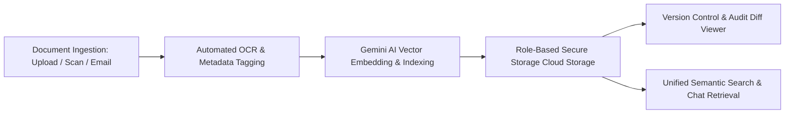

# Business Requirements Document (BRD)
## System 02: Document Management System (DMS / Housedocs Modernization)
### UGNAYAN Super App - Document Intelligence Module

**Document Reference:** HREP-UGNAYAN-BRD-2026-011  
**Target Organization:** House of Representatives of the Philippines (HRep) Secretariat  
**Primary Department Owners:** Legislative Information Resources Management Dept. (LIRMD), ICTS, Administrative Department, Committee Affairs (CAD)  
**Date:** September 2026  
**Status:** Approved for Core Engineering  

---

### 1. Executive Summary & Business Problem

The **Document Management System (DMS / Housedocs Modernization)** serves as the enterprise document repository and knowledge index for all legislative, administrative, financial, and legal records produced within the House of Representatives.

#### Current Pain Points:
1. **Fragmentation of Legacy Systems:** Critical institutional knowledge is scattered across the legacy *Housedocs* application, local *Globodox* servers, disparate Google Drive folders, and physical cabinet archives.
2. **Lack of Full-Text Optical Character Recognition (OCR):** Scanned committee submissions, signed position papers, and Republic Act copies are unsearchable PDF scans, requiring staff to manually flip through hundreds of pages.
3. **Uncontrolled Document Versioning:** Committee drafts and administrative contracts undergo revisions across multiple emails, creating high risk of executing outdated or unverified draft agreements.
4. **Data Privacy & Access Leaks:** Inconsistent permission controls across Google Drive links lead to accidental exposure of confidential legislative working drafts.

---

### 2. User Personas & Stakeholder Matrix

| Persona Code | Role & Title | Department | Core Responsibility & Needs |
| :--- | :--- | :--- | :--- |
| **PER-DMS-01** | Legislative Researcher / Policy Analyst | CPBRD / LIRMD | Needs instant full-text keyword and semantic search across decades of legislative bills, committee reports, and policy briefs. |
| **PER-DMS-02** | Committee Secretary | Committee Affairs (CAD) | Uploads witness position papers, drafts substitute bills with strict version control (v1.0, v1.1, v2.0), and watermarks confidential drafts. |
| **PER-DMS-03** | Legal Counsel | Legal Affairs (LAD) | Redlines contracts, tracks changes, checks version diffs, and attaches digital legal clearances. |
| **PER-DMS-04** | Records Officer | Records Management (RMS) | Classifies documents according to National Archives of the Philippines (NAP) taxonomy and defines retention/disposition rules. |

---

### 3. Core Functional Requirements

#### FR-DMS-01: Centralized Secure Ingestion & Dynamic Metadata
- **Description:** Supports drag-and-drop ingestion of documents (`.pdf`, `.docx`, `.xlsx`, `.jpg`, `.tiff`) up to 100MB per file.
- **Rules:** Automatically extracts metadata (Author, Department, Congress Number, Bill Reference, Creation Date) and assigns a unique Document Accession Number (`HREP-DOC-YYYY-XXXXX`).

#### FR-DMS-02: Cloud Vision OCR & AI Semantic Indexing
- **Description:** Every uploaded image or PDF is automatically parsed through Google Cloud Vision / Document AI OCR.
- **Rules:** Extracts full text, tables, and signatures. Generates vector embeddings stored in the semantic search catalog, enabling natural-language search (e.g., *"Find all position papers regarding the 2026 general appropriations bill for Department of Health"*).

#### FR-DMS-03: Immutable Version Control & Collaborative Redlining
- **Description:** Version history tracking with visual side-by-side diffing between revisions.
- **Rules:** 
  - Major versions (v1.0, v2.0) represent approved milestones; minor versions (v1.1, v1.2) represent working drafts.
  - Automatic digital watermarking (`CONFIDENTIAL - COMMITTEE ON APPROPRIATIONS - [USER EMAIL]`) on downloaded draft copies.

#### FR-DMS-04: Granular RBAC & National Archives Retention
- **Description:** Document-level and folder-level security classifications: `Public`, `Internal HRep`, `Restricted Committee`, `Executive Session / Confidential`.
- **Rules:** Automatic tagging of disposition schedules (Permanent, 5 Years, 10 Years) aligned with National Archives of the Philippines (NAP) guidelines.
