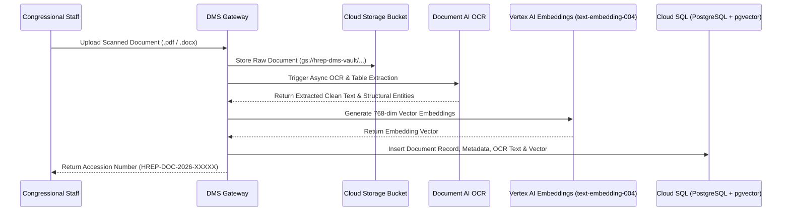

# Technical Design Document (TDD)
## System 02: Document Management System (DMS / Housedocs Modernization)
### UGNAYAN Super App - Document Intelligence Module

**Document Reference:** HREP-UGNAYAN-TDD-2026-012  
**Target Organization:** House of Representatives of the Philippines (HRep) Secretariat  
**Author:** Technical Consulting & Solutions Architecture Team  
**Date:** September 2026  
**Status:** Approved for Core Engineering  

---

### 1. Architectural Overview & Cloud Pipeline

The DMS modernization leverages **Google Cloud Document AI** and **Vertex AI Vector Search** combined with **Cloud SQL PostgreSQL (with `pgvector`)** and **Google Cloud Storage (GCS)** to provide sub-second semantic document retrieval across millions of historical pages.



---

### 2. Database Schema (PostgreSQL with `pgvector`)

```sql
CREATE EXTENSION IF NOT EXISTS "uuid-ossp";
CREATE EXTENSION IF NOT EXISTS "vector";

-- 1. Folders & Taxonomic Hierarchy
CREATE TABLE dms_folders (
    id VARCHAR(36) PRIMARY KEY DEFAULT gen_random_uuid(),
    name VARCHAR(150) NOT NULL,
    parent_id VARCHAR(36) REFERENCES dms_folders(id),
    department_id VARCHAR(36) REFERENCES departments(id),
    classification VARCHAR(30) DEFAULT 'INTERNAL', -- PUBLIC, INTERNAL, RESTRICTED, CONFIDENTIAL
    created_at TIMESTAMP WITH TIME ZONE DEFAULT CURRENT_TIMESTAMP
);

-- 2. Documents Master Record
CREATE TABLE dms_documents (
    id VARCHAR(36) PRIMARY KEY DEFAULT gen_random_uuid(),
    accession_number VARCHAR(50) UNIQUE NOT NULL, -- HREP-DOC-YYYY-00001
    folder_id VARCHAR(36) REFERENCES dms_folders(id),
    title VARCHAR(255) NOT NULL,
    description TEXT,
    document_type VARCHAR(50) NOT NULL, -- BILL_DRAFT, COMMITTEE_REPORT, POSITION_PAPER, CONTRACT, MEMORANDUM, REPUBLIC_ACT
    author_id VARCHAR(36) REFERENCES users(id),
    department_id VARCHAR(36) REFERENCES departments(id),
    current_version INT DEFAULT 1,
    storage_path TEXT NOT NULL, -- GCS URI
    file_size_bytes BIGINT NOT NULL,
    mime_type VARCHAR(100) NOT NULL,
    is_locked BOOLEAN DEFAULT FALSE,
    locked_by_user_id VARCHAR(36) REFERENCES users(id),
    retention_category VARCHAR(50) DEFAULT 'PERMANENT', -- PERMANENT, 10_YEARS, 5_YEARS
    created_at TIMESTAMP WITH TIME ZONE DEFAULT CURRENT_TIMESTAMP,
    updated_at TIMESTAMP WITH TIME ZONE DEFAULT CURRENT_TIMESTAMP
);

-- 3. Document Versions & OCR Content
CREATE TABLE dms_document_versions (
    id VARCHAR(36) PRIMARY KEY DEFAULT gen_random_uuid(),
    document_id VARCHAR(36) NOT NULL REFERENCES dms_documents(id) ON DELETE CASCADE,
    version_number INT NOT NULL,
    storage_path TEXT NOT NULL,
    ocr_extracted_text TEXT,
    text_embedding vector(768), -- Vertex AI text-embedding-004
    change_summary TEXT,
    uploaded_by VARCHAR(36) REFERENCES users(id),
    created_at TIMESTAMP WITH TIME ZONE DEFAULT CURRENT_TIMESTAMP,
    CONSTRAINT unq_doc_version UNIQUE (document_id, version_number)
);

CREATE INDEX idx_dms_versions_embedding ON dms_document_versions USING ivfflat (text_embedding vector_cosine_ops);
CREATE INDEX idx_dms_doc_search ON dms_documents USING gin(to_tsvector('english', title || ' ' || COALESCE(description, '')));
```

---

### 3. REST API Specification

- `POST /api/dms/documents/upload`: Multipart upload with automatic Document AI OCR processing.
- `GET /api/dms/documents/search?q={query}&semantic=true`: Hybrid keyword + vector semantic search.
- `GET /api/dms/documents/{id}/versions`: Retrieve full version audit trail and diffs.
- `GET /api/dms/documents/{id}/download?watermark=true`: Download with user email & timestamp watermark.
