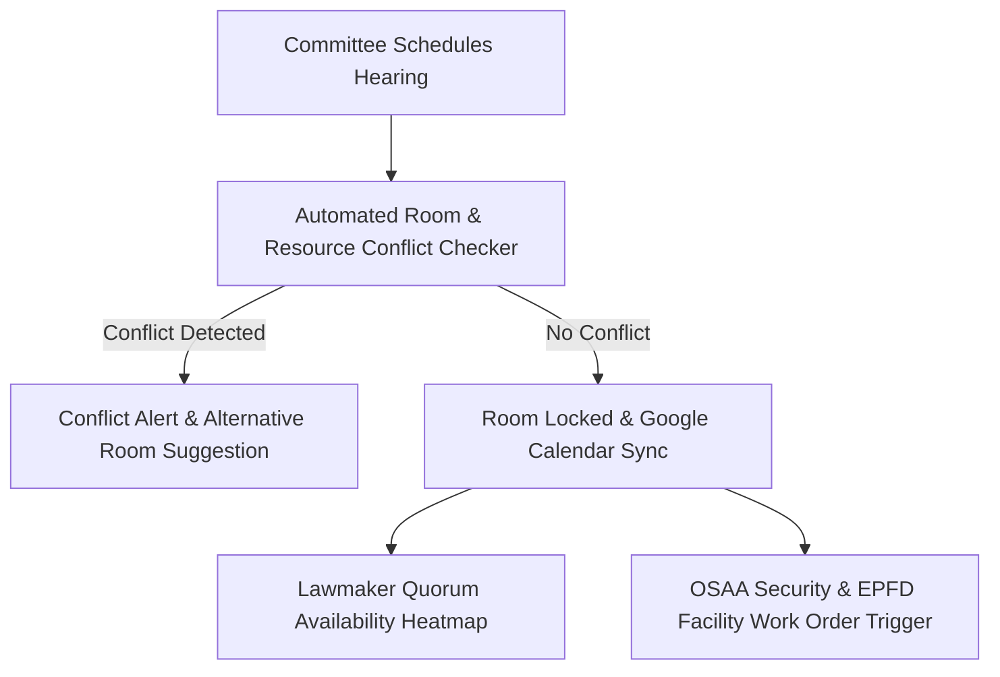

# Business Requirements Document (BRD)
## System 04: Shared Calendar & Scheduling System (Kumberso-Sked)
### UGNAYAN Super App - Operational Scheduling Module

**Document Reference:** HREP-UGNAYAN-BRD-2026-015  
**Target Organization:** House of Representatives of the Philippines (HRep) Secretariat  
**Primary Department Owners:** Committee Affairs Department (CAD), Plenary Affairs Bureau, Administrative Department, Office of the Speaker  
**Date:** September 2026  
**Status:** Approved for Core Engineering  

---

### 1. Executive Summary & Business Problem

The Batasan Pambansa complex hosts 60+ standing committees, 15 special committees, daily plenary sessions, and high-level bilateral diplomatic visits. Scheduling conflicts frequently arise due to overlapping hearing room reservations, double-booked committee rooms (e.g. Mitra Hall, Belmonte Hall, South Wing Annex rooms), quorum clashes where lawmakers sit on multiple committees meeting concurrently, and unscheduled plenary floor call-ups.

#### Current Pain Points:
1. **Isolated Department Calendars:** CAD, Plenary, ADMIN, and Speaker's Office use separate Google Sheets and physical whiteboards, resulting in room booking conflicts.
2. **Member Schedule Overlaps (Quorum Clashes):** A Representative assigned to both the Committee on Appropriations and Committee on Ways and Means is often scheduled for simultaneous hearings.
3. **Resource Clashes (AV / Hybrid Streaming / Stenographers):** EPFD and ICTS lack advance visibility to allocate portable sound systems, Zoom hybrid rigs, and stenographers to meeting rooms.

---

### 2. User Personas & Stakeholder Matrix

| Persona Code | Role & Title | Department | Core Responsibility & Needs |
| :--- | :--- | :--- | :--- |
| **PER-SKED-01** | Committee Secretary | Committee Affairs (CAD) | Reserves hearing rooms, invites resource speakers, checks member quorum availability, and syncs notice of meeting. |
| **PER-SKED-02** | Room Logistics Officer | Engineering & Facilities (EPFD) / Admin | Approves room allocations, checks A/C, seating capacity, and audio-visual readiness. |
| **PER-SKED-03** | Legislative Staff / Lawmaker | Congressional District Office | Views a unified, color-coded calendar of all committee hearings, plenary calls, and district events on mobile. |
| **PER-SKED-04** | OSAA Protocol Officer | Office of the Sergeant-at-Arms | Receives automated notifications of VIP attendees and high-profile hearings to position security details. |

---

### 3. Core Functional Requirements

#### FR-SKED-01: Intelligent Hearing Room Booking & Conflict Matrix
- **Description:** Real-time visual scheduling matrix for all Batasan rooms with capacity constraints and AV capabilities.
- **Rules:** Automated collision prevention ensuring no room or equipment is double-booked.

#### FR-SKED-02: Member Quorum Heatmap & Overlap Analyzer
- **Description:** When scheduling a hearing, the system analyzes the committee membership roster against all other scheduled events to calculate expected quorum probability.
- **Rules:** Flags red alerts if >40% of committee members have concurrent hearing obligations.

#### FR-SKED-03: Google Workspace Calendar & Mobile Push Synchronization
- **Description:** Bi-directional sync with Google Calendar (`@hrep.gov.ph`) and automated Notice of Meeting SMS/Push notifications.
