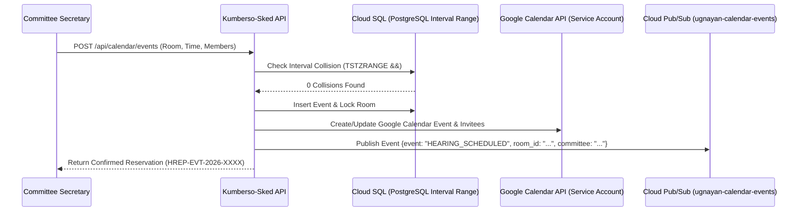

# Technical Design Document (TDD)
## System 04: Shared Calendar & Scheduling System (Kumberso-Sked)
### UGNAYAN Super App - Operational Scheduling Module

**Document Reference:** HREP-UGNAYAN-TDD-2026-016  
**Target Organization:** House of Representatives of the Philippines (HRep) Secretariat  
**Author:** Technical Consulting & Solutions Architecture Team  
**Date:** September 2026  
**Status:** Approved for Core Engineering  

---

### 1. Architectural Design & Google Calendar Integration

The Kumberso-Sked module utilizes a **PostgreSQL Spatial & Time-Interval Indexing Engine** with bi-directional **Google Calendar API Webhooks** to synchronize events directly with lawmakers' and secretariats' official Google Workspace accounts.



---

### 2. Database Schema (PostgreSQL)

```sql
-- 1. Meeting Venues & Hearing Rooms
CREATE TABLE calendar_venues (
    id VARCHAR(36) PRIMARY KEY DEFAULT gen_random_uuid(),
    name VARCHAR(100) NOT NULL, -- Mitra Hall, Belmonte Hall, South Wing Rm 14
    building VARCHAR(50) NOT NULL,
    capacity INT NOT NULL,
    has_hybrid_av BOOLEAN DEFAULT TRUE,
    is_active BOOLEAN DEFAULT TRUE
);

-- 2. Master Calendar Events (Using PostgreSQL TSRANGE for zero double-booking)
CREATE TABLE calendar_events (
    id VARCHAR(36) PRIMARY KEY DEFAULT gen_random_uuid(),
    event_code VARCHAR(50) UNIQUE NOT NULL,
    title VARCHAR(255) NOT NULL,
    event_type VARCHAR(50) NOT NULL, -- COMMITTEE_HEARING, PLENARY_SESSION, TWG, VIP_VISIT, PRESS_BRIEFING
    organizer_id VARCHAR(36) NOT NULL REFERENCES users(id),
    department_id VARCHAR(36) REFERENCES departments(id),
    venue_id VARCHAR(36) NOT NULL REFERENCES calendar_venues(id),
    start_time TIMESTAMP WITH TIME ZONE NOT NULL,
    end_time TIMESTAMP WITH TIME ZONE NOT NULL,
    google_event_id VARCHAR(255),
    status VARCHAR(30) DEFAULT 'CONFIRMED', -- DRAFT, CONFIRMED, RESCHEDULED, CANCELLED
    created_at TIMESTAMP WITH TIME ZONE DEFAULT CURRENT_TIMESTAMP,
    CONSTRAINT chk_time_order CHECK (end_time > start_time)
);

CREATE INDEX idx_calendar_time ON calendar_events(start_time, end_time);
CREATE INDEX idx_calendar_venue ON calendar_events(venue_id);

-- 3. Committee Hearing Invitees & Quorum Tracker
CREATE TABLE calendar_event_invitees (
    id VARCHAR(36) PRIMARY KEY DEFAULT gen_random_uuid(),
    event_id VARCHAR(36) NOT NULL REFERENCES calendar_events(id) ON DELETE CASCADE,
    member_id VARCHAR(36) NOT NULL REFERENCES users(id),
    rsvp_status VARCHAR(20) DEFAULT 'INVITED', -- INVITED, ACCEPTED, DECLINED, TENTATIVE
    is_quorum_member BOOLEAN DEFAULT TRUE,
    attendance_recorded BOOLEAN DEFAULT FALSE,
    CONSTRAINT unq_event_member UNIQUE (event_id, member_id)
);
```

---

### 3. REST API Specification

- `POST /api/calendar/events`: Schedule hearing / event with automatic conflict detection.
- `GET /api/calendar/events?start={date}&end={date}&venue_id={id}`: Query venue timeline.
- `GET /api/calendar/quorum-check?committee_id={id}&time_window={range}`: Analyze member quorum availability heatmap.
- `POST /api/calendar/events/{id}/sync-gcal`: Push immediate sync to Google Workspace calendars.
