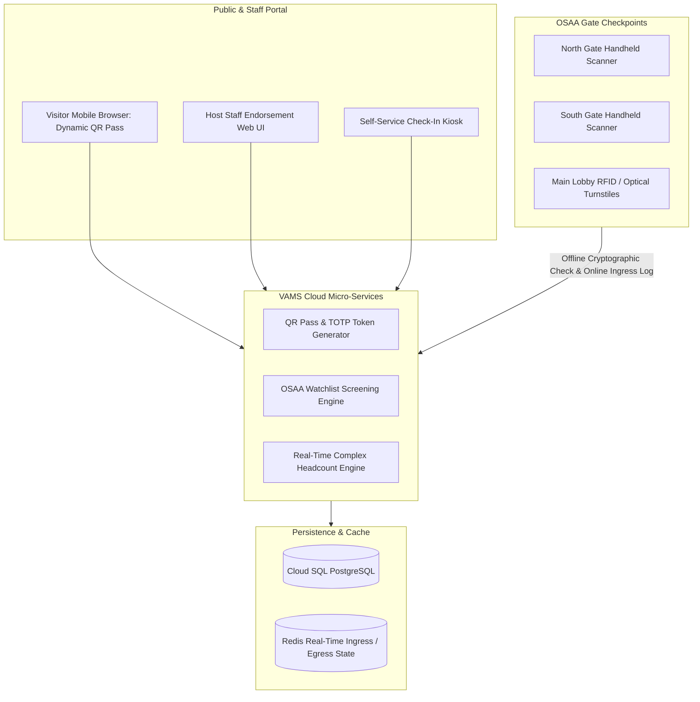

# Technical Design Document (TDD)
## System 06: Visitor Access Management System (Batasan Pass / VAMS)
### UGNAYAN Super App - Perimeter Security & Protocol Module

**Document Reference:** HREP-UGNAYAN-TDD-2026-017  
**Target Organization:** House of Representatives of the Philippines (HRep) Secretariat  
**Primary Department Owners:** Office of the Sergeant-at-Arms (OSAA), Legislative Security Bureau, Administrative Department  
**Companion BRD:** [03_BRD_VISITOR_ACCESS_MANAGEMENT_SYSTEM.md](03_BRD_VISITOR_ACCESS_MANAGEMENT_SYSTEM.md)  
**Date:** September 2026  
**Status:** Approved for Core Engineering  

---

### 1. System Architecture & Gate Scanner Topology

Batasan Pass / VAMS manages physical perimeter access across all Batasan Pambansa gates (North Gate, South Gate, Main Building, Mitra Hall, Annexes) using **Time-based One-Time Password (TOTP) Dynamic QR Codes** and handheld Android barcode scanners operated by OSAA personnel.



---

### 2. Cryptographic Dynamic QR Code Specification

To prevent screenshot pass forgery and credential sharing:
1. **Dynamic TOTP Encryption:** Passes display a rotating dynamic QR code refreshed every 30 seconds:
   $$\text{Token} = \text{HMAC-SHA256}(\text{PassID} \mathbin{\Vert} \lfloor\text{Timestamp} / 30\rfloor, \text{SecretKey})$$
2. **Offline Scanner Verification:** OSAA handheld scanners cache public keys to cryptographically verify passes even during transient Wi-Fi drops at outer gates.

---

### 3. Database Schema (PostgreSQL)

```sql
-- 1. Visitor Profiles (RA 10173 Encrypted PII)
CREATE TABLE vams_visitors (
    id VARCHAR(36) PRIMARY KEY DEFAULT gen_random_uuid(),
    full_name VARCHAR(150) NOT NULL,
    id_type VARCHAR(50) NOT NULL, -- PASSPORT, DRIVERS_LICENSE, UMID, NATIONAL_ID
    id_number_hash VARCHAR(64) NOT NULL, -- SHA-256 for privacy-preserving deduplication
    organization VARCHAR(150),
    mobile_number VARCHAR(20) NOT NULL,
    email VARCHAR(120),
    is_watchlisted BOOLEAN DEFAULT FALSE,
    watchlist_reason TEXT,
    created_at TIMESTAMP WITH TIME ZONE DEFAULT CURRENT_TIMESTAMP
);

-- 2. Visitor Access Passes & Endorsements
CREATE TABLE vams_passes (
    id VARCHAR(36) PRIMARY KEY DEFAULT gen_random_uuid(),
    pass_code VARCHAR(50) UNIQUE NOT NULL, -- BP-2026-XXXXX
    visitor_id VARCHAR(36) NOT NULL REFERENCES vams_visitors(id),
    host_user_id VARCHAR(36) NOT NULL REFERENCES users(id),
    purpose VARCHAR(100) NOT NULL, -- COMMITTEE_WITNESS, VIP_GUEST, MEDIA, CONSTITUENT, CONTRACTOR
    destination_building VARCHAR(100) NOT NULL,
    valid_from TIMESTAMP WITH TIME ZONE NOT NULL,
    valid_until TIMESTAMP WITH TIME ZONE NOT NULL,
    status VARCHAR(30) DEFAULT 'APPROVED', -- PENDING, APPROVED, REJECTED, CHECKED_IN, CHECKED_OUT, EXPIRED
    qr_secret_key VARCHAR(64) NOT NULL,
    approved_by VARCHAR(36) REFERENCES users(id),
    created_at TIMESTAMP WITH TIME ZONE DEFAULT CURRENT_TIMESTAMP
);

-- 3. Real-Time Gate Ingress / Egress Logs
CREATE TABLE vams_access_logs (
    id VARCHAR(36) PRIMARY KEY DEFAULT gen_random_uuid(),
    pass_id VARCHAR(36) NOT NULL REFERENCES vams_passes(id),
    gate_name VARCHAR(50) NOT NULL, -- NORTH_GATE, SOUTH_GATE, MAIN_LOBBY
    direction VARCHAR(10) NOT NULL, -- INGRESS, EGRESS
    scanned_by_user_id VARCHAR(36) NOT NULL REFERENCES users(id),
    timestamp TIMESTAMP WITH TIME ZONE DEFAULT CURRENT_TIMESTAMP
);

CREATE INDEX idx_vams_active_passes ON vams_passes(valid_from, valid_until, status);
CREATE INDEX idx_vams_logs_time ON vams_access_logs(timestamp);
```

---

### 4. Real-Time Emergency Muster Headcount Engine

A Redis-backed headcount engine tracks all personnel and visitors currently inside the Batasan complex:
$$\text{CurrentHeadcount} = \sum \text{Ingress} - \sum \text{Egress}$$
In the event of an earthquake or security evacuation, OSAA security commanders generate the **Emergency Muster Report** in <1 second via `GET /api/vams/muster/headcount`.
