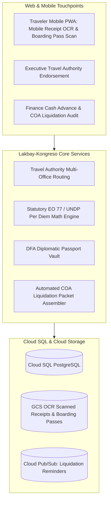

# Technical Design Document (TDD)
## System 07: Travel Management System (Lakbay-Kongreso)
### UGNAYAN Super App - Travel & Financial Governance Module

**Document Reference:** HREP-UGNAYAN-TDD-2026-018  
**Target Organization:** House of Representatives of the Philippines (HRep) Secretariat  
**Primary Department Owners:** Inter-Parliamentary Relations & Special Affairs Dept. (IPAD), Finance Department, Office of the Secretary General  
**Companion BRD:** [04_BRD_TRAVEL_MANAGEMENT_SYSTEM.md](04_BRD_TRAVEL_MANAGEMENT_SYSTEM.md)  
**Date:** September 2026  
**Status:** Approved for Core Engineering  

---

### 1. System Architecture & Computational Engine

Lakbay-Kongreso automates the end-to-end official travel workflow for House Members and Secretariat staff, enforcing strict statutory per diem math under **Executive Order No. 77 (s. 2019)**, **UNDP Daily Subsistence Allowances (DSA)**, and **COA Circulars 2012-001 / 2023-004**.



---

### 2. Statutory Per Diem Mathematical Engine (EO 77 & UNDP)

$$\text{TotalLocalDTA} = \sum_{d=1}^{N} \left( \text{HotelRate}(\text{Cluster}) \times 0.50 + \text{Meals}(\text{Cluster}) \times 0.30 + \text{Incidental} \times 0.20 \right)$$
- **Cluster I (₱1,500/day):** Regions I, II, III, IV-B, V, VIII, IX, XII, CAR, BARMM.
- **Cluster II (₱1,800/day):** Regions VI, VII, X, XI, Caraga.
- **Cluster III (₱2,200/day):** NCR, Region IV-A (CALABARZON).

---

### 3. Database Schema (PostgreSQL)

```sql
-- 1. Travel Authorities Master Table
CREATE TABLE travel_authorities (
    id VARCHAR(36) PRIMARY KEY DEFAULT gen_random_uuid(),
    ta_number VARCHAR(50) UNIQUE NOT NULL, -- TA-2026-00124
    traveler_id VARCHAR(36) NOT NULL REFERENCES users(id),
    travel_type VARCHAR(20) NOT NULL, -- LOCAL, FOREIGN
    destination_city VARCHAR(100) NOT NULL,
    destination_country VARCHAR(100) DEFAULT 'Philippines',
    purpose_of_travel TEXT NOT NULL,
    departure_date DATE NOT NULL,
    return_date DATE NOT NULL,
    total_days INT NOT NULL,
    estimated_budget_php NUMERIC(12, 2) NOT NULL,
    status VARCHAR(50) DEFAULT 'PENDING_APPROVAL', -- PENDING_APPROVAL, APPROVED_SECGEN, CASH_ADVANCE_RELEASED, TRAVEL_COMPLETED, LIQUIDATED, OVERDUE
    secgen_approval_stamp VARCHAR(255),
    created_at TIMESTAMP WITH TIME ZONE DEFAULT CURRENT_TIMESTAMP
);

-- 2. DFA Diplomatic & Official Passport Vault
CREATE TABLE travel_passports (
    id VARCHAR(36) PRIMARY KEY DEFAULT gen_random_uuid(),
    user_id VARCHAR(36) NOT NULL REFERENCES users(id),
    passport_type VARCHAR(20) NOT NULL, -- DIPLOMATIC, OFFICIAL, REGULAR
    passport_number VARCHAR(30) UNIQUE NOT NULL,
    expiry_date DATE NOT NULL,
    custody_status VARCHAR(30) DEFAULT 'IN_VAULT', -- IN_VAULT, RELEASED_TO_TRAVELER, DFA_RENEWAL
    vault_location VARCHAR(50) DEFAULT 'IPAD Safe A',
    last_released_at TIMESTAMP WITH TIME ZONE
);

-- 3. COA Liquidation Packets
CREATE TABLE travel_liquidations (
    id VARCHAR(36) PRIMARY KEY DEFAULT gen_random_uuid(),
    ta_id VARCHAR(36) UNIQUE NOT NULL REFERENCES travel_authorities(id),
    liquidation_deadline DATE NOT NULL, -- 30 days local / 60 days foreign post-travel
    actual_spent_php NUMERIC(12, 2) NOT NULL,
    refund_amount_php NUMERIC(12, 2) DEFAULT 0.00,
    reimbursement_due_php NUMERIC(12, 2) DEFAULT 0.00,
    is_coa_approved BOOLEAN DEFAULT FALSE,
    coa_auditor_email VARCHAR(120),
    submitted_at TIMESTAMP WITH TIME ZONE,
    approved_at TIMESTAMP WITH TIME ZONE
);
```

---

### 4. REST API Specification

- `POST /api/travel/ta/`: Draft and submit Travel Authority with instant EO 77 / UNDP per diem calculation.
- `GET /api/travel/passports/expiring?within_months=6`: IPAD diplomatic passport renewal alert monitor.
- `POST /api/travel/liquidations/{ta_id}/upload-receipt`: Upload boarding pass / hotel invoice with Cloud Document AI OCR itemization.
- `GET /api/travel/liquidations/overdue`: Finance COA AOM risk tracker (mandatory 30-day/60-day liquidation countdown).
