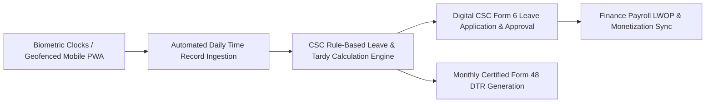

# Business Requirements Document (BRD)
## System 08: HR & Attendance Management System (Lingkod-Kawani DTR)
### UGNAYAN Super App - Human Capital & Civil Service Compliance Module

**Document Reference:** HREP-UGNAYAN-BRD-2026-019  
**Target Organization:** House of Representatives of the Philippines (HRep) Secretariat  
**Primary Department Owners:** Human Resources Management Service (HRMS), Finance Department, Internal Audit  
**Date:** September 2026  
**Status:** Approved for Core Engineering  

---

### 1. Executive Summary & Statutory Problem

The **Lingkod-Kawani HR & Attendance Management System (DTR)** automates daily time recording, leave credit administration, and plantilla tracking for 3,000+ legislative and Secretariat employees in compliance with **Civil Service Commission (CSC) Omnibus Rules on Leave (Rule XVI)**, **CSC MC No. 41, s. 1998**, and **RA 6713 (Code of Conduct and Ethical Standards for Public Officials and Employees)**.

#### Current Pain Points:
1. **Manual Biometric Terminal Reconciliation:** Biometric fingerprint logs from disparate hardware clocks across Batasan buildings require manual USB exporting and tedious Excel reconciliations.
2. **Paper Leave Forms (CSC Form No. 6):** Leave applications (Vacation, Sick, Mandatory 5-day Forced Leave, Maternity, Paternity, Solo Parent, Magna Carta of Women) navigate slow physical signature chains.
3. **Complex Legislative Shift Schedules:** Session days (requiring extended evening floor coverage) vs. non-session recess periods require dynamic flexible timeband rules that legacy HR systems fail to compute accurately.

---

### 2. User Personas & Stakeholder Matrix

| Persona Code | Role & Title | Department | Core Responsibility & Needs |
| :--- | :--- | :--- | :--- |
| **PER-HR-01** | Congressional / Plantilla Employee | Any Department | Clock in/out via biometric scanner or geofenced mobile app, apply for digital leave (CSC Form 6), view real-time leave credit balances. |
| **PER-HR-02** | Department Director / Division Chief | Any Department | Reviews subordinate DTR logs, approves digital overtime/compensatory time-off (CTO), and endorses leave requests. |
| **PER-HR-03** | HR Leave Administration Officer | Human Resources (HRMS) | Manages automated monthly leave credit accrual (1.25 days VL / 1.25 days SL per month), processes monetizations, generates CSC Form 48. |
| **PER-HR-04** | Payroll & Compensation Officer | Finance Department | Automatically computes tardiness, undertime, and leave without pay (LWOP) deductions for exact payroll integration. |

---

### 3. Core Functional Requirements

#### FR-HR-01: Omnichannel Attendance Ingestion & Geofencing
- **Description:** Synchronizes punch logs from physical Batasan biometric turnstiles and geofenced mobile PWA (for official fieldwork/district offices).
- **Rules:** Flags unauthorized out-of-bounds clock-ins; auto-detects half-day, undertime, and overtime during active plenary sessions.

#### FR-HR-02: CSC Rule-Based Automated Leave Ledger
- **Description:** Real-time ledger calculating statutory monthly accruals (1.25 days VL, 1.25 days SL) pursuant to CSC Memorandum Circulars.
- **Rules:**
  - Automated mandatory 5-day Forced Leave (FL) tracking and year-end forfeiture warning.
  - Special leave entitlement validations: Magna Carta of Women Special Leave (up to 60 days post-gynecological surgery under RA 9710), Solo Parent Leave (7 days under RA 8972/RA 11861), 10-day VAWC Leave (RA 9262).

#### FR-HR-03: Electronic CSC Form 48 Generation & Digital Sign-off
- **Description:** Generates statutory Civil Service Form No. 48 DTR with cryptographic supervisor certification.
