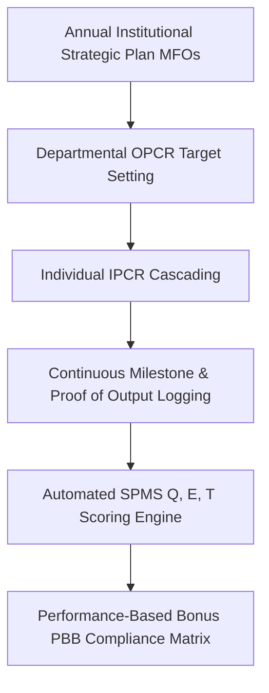

# Business Requirements Document (BRD)
## System 09: Planning, Monitoring & Evaluation System (Target-Kongreso SPMS)
### UGNAYAN Super App - Strategic Performance & SPMS Module

**Document Reference:** HREP-UGNAYAN-BRD-2026-021  
**Target Organization:** House of Representatives of the Philippines (HRep) Secretariat  
**Primary Department Owners:** Knowledge Management and Strategy Bureau (KMSB), Planning Service, Office of the Secretary General  
**Date:** September 2026  
**Status:** Approved for Core Engineering  

---

### 1. Executive Summary & Regulatory Problem

The **Planning, Monitoring & Evaluation System (Target-Kongreso)** automates the institutional performance scorecard of the HRep Secretariat in compliance with the **Civil Service Commission Strategic Performance Management System (SPMS)**, **CSC MC No. 6, s. 2012**, and the **DBM National Expenditure Program (NEP) Performance Indicators**.

#### Current Pain Points:
1. **Disconnected Strategic Targets:** Institutional Major Final Outputs (MFOs) defined in the Office Performance Commitment and Review (OPCR) are not digitally linked to individual employee IPCRs.
2. **Tedious Mid-Year & Year-End Performance Evaluation:** Departments spend weeks manually consolidating Excel sheets to calculate numerical ratings for Quality, Efficiency, and Timeliness (Q, E, T).
3. **Lack of Real-Time Budget-to-Output Linkage:** Inability to track budget utilization rates against actual legislative/administrative deliverables.

---

### 2. User Personas & Stakeholder Matrix

| Persona Code | Role & Title | Department | Core Responsibility & Needs |
| :--- | :--- | :--- | :--- |
| **PER-PME-01** | Planning & Strategy Director | KMSB / Planning Service | Sets institutional MFO targets, monitors Secretariat-wide quarterly milestones, and submits SPMS reports to CSC/DBM. |
| **PER-PME-02** | Department Head / Bureau Director | Any Department | Drafts departmental OPCR, cascades success indicators to divisions, and evaluates unit performance. |
| **PER-PME-03** | Individual Staff Member | Any Department | Encodes IPCR accomplishment proofs, self-evaluates (Q, E, T), and submits for supervisor review. |

---

### 3. Core Functional Requirements

#### FR-PME-01: Hierarchical SPMS Cascading Engine
- **Description:** Cascades institutional MFO targets $\rightarrow$ Department OPCRs $\rightarrow$ Division OPCRs $\rightarrow$ Individual IPCRs.
- **Rules:** Ensures 100% mathematical weight distribution (Core Functions: 80%, Support Functions: 20%).

#### FR-PME-02: Automated CSC (Q, E, T) Performance Rating Engine
- **Description:** Calculates performance ratings (1 to 5 scale: Outstanding, Very Satisfactory, Satisfactory, Unsatisfactory, Poor) across three dimensions:
  - **Quality (Q):** Error rate and adherence to parliamentary/administrative standards.
  - **Efficiency (E):** Output produced per standard time/resource.
  - **Timeliness (T):** Delivery within statutory RA 11032 / House Rules deadlines.

#### FR-PME-03: Performance-Based Bonus (PBB) & DBM Compliance Analytics
- **Description:** Generates the certified PBB eligibility ranking matrix and institutional accomplishment report.
