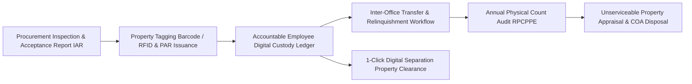

# Business Requirements Document (BRD)
## System 10: Inventory Management System (HRep Asset-Track PPE)
### UGNAYAN Super App - Property, Plant & Equipment (PPE) Module

**Document Reference:** HREP-UGNAYAN-BRD-2026-023  
**Target Organization:** House of Representatives of the Philippines (HRep) Secretariat  
**Primary Department Owners:** Administrative Department (Property & Procurement Service), Finance Department, Resident COA Auditors  
**Date:** September 2026  
**Status:** Approved for Core Engineering  

---

### 1. Executive Summary & Statutory Problem

The **HRep Asset-Track Inventory Management System** automates the lifecycle tracking of all government Property, Plant & Equipment (PPE), semi-expendable supplies, and IT assets across the Batasan Pambansa complex in compliance with the **Government Accounting Manual (GAM) for National Government Agencies (Volume I, Chapter 10)**, **COA Circular No. 2020-006**, and **RA 9184 (Government Procurement Reform Act)**.

#### Current Pain Points:
1. **Manual Physical Property Counts:** Annual physical inventory counts require manual barcode scanning and paper Property Acknowledgment Receipts (PAR / ICS).
2. **Untracked Custody Transfers:** Equipment transferred between congressional offices during district leadership transitions often goes unrecorded, creating unliquidated property liabilities for outgoing lawmakers.
3. **Slow Property Clearance for Exiting Employees:** Employees and lawmakers waiting for separation clearance spend days hunting down physical property clearance signatures across multiple offices.

---

### 2. User Personas & Stakeholder Matrix

| Persona Code | Role & Title | Department | Core Responsibility & Needs |
| :--- | :--- | :--- | :--- |
| **PER-PPE-01** | Property Custodian / Inspector | Administrative Dept. (Property Div.) | Issues Property Acknowledgment Receipts (PAR), conducts RFID/QR scans, manages disposal of unserviceable assets. |
| **PER-PPE-02** | Accountable Officer / Lawmaker / Staff | Congressional Office | Signs digital PAR/ICS for laptops/vehicles, requests property transfers, views personal accountability ledger. |
| **PER-PPE-03** | Resident COA Auditor | Commission on Audit (COA) | Reviews the Report on Physical Count of Property, Plant and Equipment (RPCPPE) and unserviceable property disposal packets. |

---

### 3. Core Functional Requirements

#### FR-PPE-01: Barcode / RFID Asset Tagging & Digital PAR/ICS
- **Description:** Automatic generation of unique Asset Tracking Numbers (`HREP-PPE-YYYY-XXXXX`) and digital Property Acknowledgment Receipts (PAR for assets >₱50k) / Inventory Custodian Slips (ICS for items $\le$₱50k).
- **Rules:** Cryptographic digital signature by the receiving accountable officer.

#### FR-PPE-02: 1-Click Electronic Property Clearance for Exiting Personnel
- **Description:** Automatically checks the employee's custody ledger; if all assets are returned or transferred, instantly issues the certified Property Clearance.
- **Rules:** Flags missing or damaged items with automated depreciation compensation calculation.

#### FR-PPE-03: Annual RPCPPE & COA Disposal Packet Assembler
- **Description:** Generates statutory COA Form RPCPPE and Inventory & Inspection Report of Unserviceable Property (IIRUP) for public auction.
