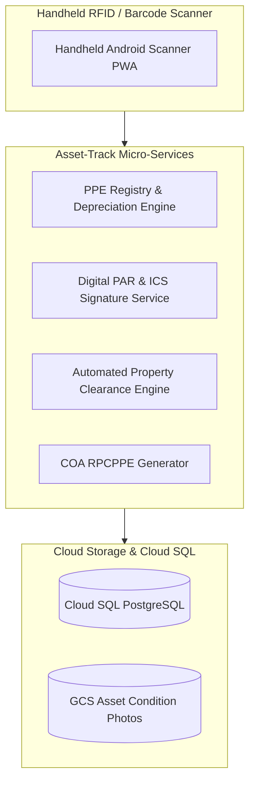

# Technical Design Document (TDD)
## System 10: Inventory Management System (HRep Asset-Track PPE)
### UGNAYAN Super App - Property, Plant & Equipment (PPE) Module

**Document Reference:** HREP-UGNAYAN-TDD-2026-024  
**Target Organization:** House of Representatives of the Philippines (HRep) Secretariat  
**Author:** Technical Consulting & Solutions Architecture Team  
**Date:** September 2026  
**Status:** Approved for Core Engineering  

---

### 1. Architectural Overview & Asset Lifecycle Engine

Asset-Track maintains real-time property accountability using **Zebra / Honeywell Handheld RFID & QR Scanners** integrated with Cloud SQL PostgreSQL and GCS asset photo vaults.



---

### 2. Database Schema (PostgreSQL)

```sql
-- 1. Property, Plant & Equipment Master Registry
CREATE TABLE ppe_assets (
    id VARCHAR(36) PRIMARY KEY DEFAULT gen_random_uuid(),
    property_number VARCHAR(50) UNIQUE NOT NULL, -- e.g. HREP-PPE-2026-00412
    rfid_tag_id VARCHAR(64) UNIQUE,
    article_name VARCHAR(150) NOT NULL,
    description TEXT NOT NULL,
    serial_number VARCHAR(100),
    category VARCHAR(50) NOT NULL, -- IT_EQUIPMENT, MOTOR_VEHICLE, OFFICE_FURNITURE, AUDIO_VISUAL
    acquisition_date DATE NOT NULL,
    acquisition_cost_php NUMERIC(12, 2) NOT NULL,
    estimated_useful_life_years INT NOT NULL,
    current_book_value_php NUMERIC(12, 2) NOT NULL,
    condition_status VARCHAR(30) DEFAULT 'SERVICEABLE', -- SERVICEABLE, UNREPAIRABLE, CONDEMNED, DISPOSED
    current_custodian_id VARCHAR(36) NOT NULL REFERENCES users(id),
    location_building_room VARCHAR(100) NOT NULL,
    photo_url TEXT,
    created_at TIMESTAMP WITH TIME ZONE DEFAULT CURRENT_TIMESTAMP,
    updated_at TIMESTAMP WITH TIME ZONE DEFAULT CURRENT_TIMESTAMP
);

CREATE INDEX idx_ppe_custodian ON ppe_assets(current_custodian_id);
CREATE INDEX idx_ppe_category ON ppe_assets(category);

-- 2. Property Acknowledgment Receipts (PAR / ICS)
CREATE TABLE ppe_custody_receipts (
    id VARCHAR(36) PRIMARY KEY DEFAULT gen_random_uuid(),
    receipt_type VARCHAR(10) NOT NULL, -- PAR (>50k), ICS (<=50k)
    receipt_number VARCHAR(50) UNIQUE NOT NULL,
    asset_id VARCHAR(36) NOT NULL REFERENCES ppe_assets(id),
    accountable_officer_id VARCHAR(36) NOT NULL REFERENCES users(id),
    issued_by_user_id VARCHAR(36) NOT NULL REFERENCES users(id),
    date_acknowledged TIMESTAMP WITH TIME ZONE DEFAULT CURRENT_TIMESTAMP,
    digital_signature_stamp VARCHAR(255) NOT NULL,
    is_active_custody BOOLEAN DEFAULT TRUE
);

-- 3. Inter-Office Property Transfers
CREATE TABLE ppe_transfers (
    id VARCHAR(36) PRIMARY KEY DEFAULT gen_random_uuid(),
    asset_id VARCHAR(36) NOT NULL REFERENCES ppe_assets(id),
    from_user_id VARCHAR(36) NOT NULL REFERENCES users(id),
    to_user_id VARCHAR(36) NOT NULL REFERENCES users(id),
    reason TEXT NOT NULL,
    transfer_status VARCHAR(30) DEFAULT 'PENDING_ACCEPTANCE', -- PENDING_ACCEPTANCE, COMPLETED, REJECTED
    approved_at TIMESTAMP WITH TIME ZONE
);
```

---

### 3. REST API Specification

- `POST /api/ppe/assets/`: Register new property with automatic straight-line depreciation calculation.
- `GET /api/ppe/custodian/me`: Retrieve logged-in employee's active property liabilities.
- `POST /api/ppe/transfers/`: Initiate digital custody transfer to another lawmaker/staff.
- `GET /api/ppe/clearance/status?user_id={id}`: Check eligibility for instant separation property clearance.
