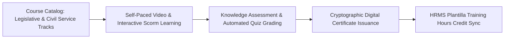

# Business Requirements Document (BRD)
## System 11: Learning Management System (Kongreso Academy LMS)
### UGNAYAN Super App - Capacity Building & Staff Development Module

**Document Reference:** HREP-UGNAYAN-BRD-2026-025  
**Target Organization:** House of Representatives of the Philippines (HRep) Secretariat  
**Primary Department Owners:** Human Resource Development Department (HRDD), Knowledge Management and Strategy Bureau (KMSB), Legislative Training Institute  
**Date:** September 2026  
**Status:** Approved for Core Engineering  

---

### 1. Executive Summary & Business Problem

The **Kongreso Academy Learning Management System (LMS)** delivers structured digital training, legislative staff onboarding, and continuing civil service professional development across the House of Representatives in compliance with **CSC MC No. 43, s. 1993** (Human Resource Development in the Civil Service) and **CSC Leadership & Competency Standards**.

#### Current Pain Points:
1. **Manual Training Attendance & Certification:** In-person seminar attendance is recorded on paper sign-up sheets, delaying the issuance of certified training certificates required for plantilla promotions.
2. **Lack of Standardized Legislative Onboarding:** Newly appointed congressional staff lack accessible self-paced courses on bill drafting, parliamentary procedure, and House rules.
3. **Unmonitored Mandatory Training Hours:** Inability to track if plantilla personnel satisfy the mandatory 40 hours of annual training required by CSC guidelines.

---

### 2. User Personas & Stakeholder Matrix

| Persona Code | Role & Title | Department | Core Responsibility & Needs |
| :--- | :--- | :--- | :--- |
| **PER-LMS-01** | Training Administrator | HRDD / Training Division | Publishes self-paced modules, schedules live webinars, configures quizzes, and issues verifiable digital certificates. |
| **PER-LMS-02** | Legislative / Plantilla Staff | Any Department | Takes online onboarding courses (e.g. *Parliamentary Procedure 101*, *Gender Sensitivity Training*), tracks training hours on mobile. |
| **PER-LMS-03** | Committee Secretary | Committee Affairs (CAD) | Enrolls in specialized technical drafting courses and legal analysis workshops. |

---

### 3. Core Functional Requirements

#### FR-LMS-01: Micro-Learning & SCORM Compliance
- **Description:** Supports SCORM 1.2 / 2004, interactive HTML5 video lessons, downloadable legislative guides, and pre/post-tests.
- **Rules:** Mandatory core tracks:
  - *Track A:* Congressional Staff Induction (House Rules, Ethics, Bill Drafting).
  - *Track B:* Civil Service Compliance (CSC Rules, Anti-Red Tape Act, Data Privacy).
  - *Track C:* Gender and Development (GAD Sensitivity & Magna Carta of Women).

#### FR-LMS-02: Verifiable Digital Certificates & QR Code Verification
- **Description:** Upon course completion and achieving $\ge 80\%$ quiz score, generates a PDF Certificate of Training.
- **Rules:** Embeds a verifiable QR code linking to `https://ugnayan.hrep.gov.ph/verify-cert/[UUID]`.

#### FR-LMS-03: Automated HRMS Training Hours Sync
- **Description:** Automatically increments the employee's official CSC training credit record in the HR database upon certificate issuance.
