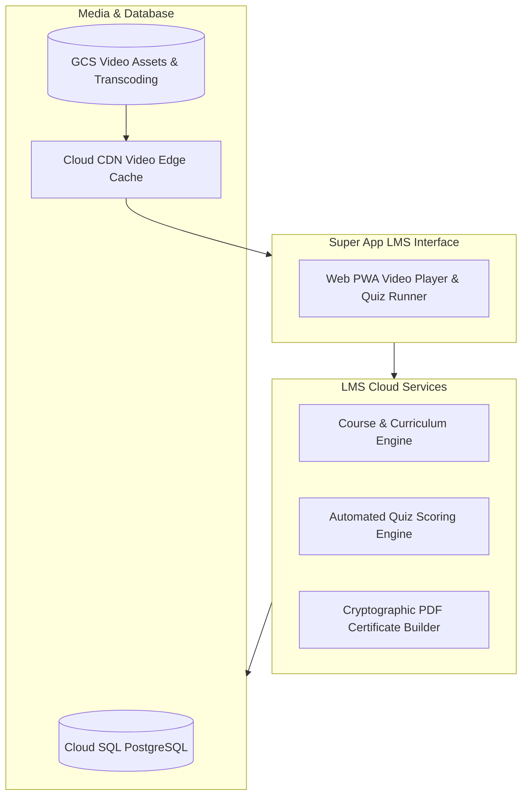

# Technical Design Document (TDD)
## System 11: Learning Management System (Kongreso Academy LMS)
### UGNAYAN Super App - Capacity Building & Staff Development Module

**Document Reference:** HREP-UGNAYAN-TDD-2026-026  
**Target Organization:** House of Representatives of the Philippines (HRep) Secretariat  
**Author:** Technical Consulting & Solutions Architecture Team  
**Date:** September 2026  
**Status:** Approved for Core Engineering  

---

### 1. Architectural Overview & Cloud Video Streaming

Kongreso Academy utilizes **Google Cloud Storage (GCS)** and **Cloud CDN** for low-latency video delivery, integrated with a PostgreSQL course progression engine.



---

### 2. Database Schema (PostgreSQL)

```sql
-- 1. Course Catalog Master Table
CREATE TABLE lms_courses (
    id VARCHAR(36) PRIMARY KEY DEFAULT gen_random_uuid(),
    course_code VARCHAR(50) UNIQUE NOT NULL, -- e.g. LEG-101
    title VARCHAR(255) NOT NULL,
    description TEXT NOT NULL,
    track_category VARCHAR(50) NOT NULL, -- LEGISLATIVE_PROCEDURE, CIVIL_SERVICE_ETHICS, GAD_SENSITIVITY, IT_SKILLS
    training_hours_credit INT NOT NULL,
    is_mandatory_onboarding BOOLEAN DEFAULT FALSE,
    thumbnail_url TEXT,
    created_at TIMESTAMP WITH TIME ZONE DEFAULT CURRENT_TIMESTAMP
);

-- 2. Course Modules & Lessons
CREATE TABLE lms_lessons (
    id VARCHAR(36) PRIMARY KEY DEFAULT gen_random_uuid(),
    course_id VARCHAR(36) NOT NULL REFERENCES lms_courses(id) ON DELETE CASCADE,
    lesson_order INT NOT NULL,
    title VARCHAR(255) NOT NULL,
    video_url TEXT,
    content_markdown TEXT,
    duration_minutes INT NOT NULL
);

-- 3. Employee Course Enrollment & Progression
CREATE TABLE lms_enrollments (
    id VARCHAR(36) PRIMARY KEY DEFAULT gen_random_uuid(),
    course_id VARCHAR(36) NOT NULL REFERENCES lms_courses(id),
    user_id VARCHAR(36) NOT NULL REFERENCES users(id),
    progress_percentage INT DEFAULT 0,
    quiz_score_percentage INT,
    is_completed BOOLEAN DEFAULT FALSE,
    certificate_number VARCHAR(64) UNIQUE,
    certificate_pdf_url TEXT,
    completed_at TIMESTAMP WITH TIME ZONE,
    CONSTRAINT unq_user_course UNIQUE (user_id, course_id)
);
```

---

### 3. REST API Specification

- `GET /api/lms/courses/`: List available legislative and civil service training tracks.
- `POST /api/lms/enroll/{course_id}`: Enroll authenticated employee in course.
- `POST /api/lms/progress/{lesson_id}`: Update video completion progress.
- `POST /api/lms/quiz/submit`: Grade assessment and auto-generate certified PDF certificate.
