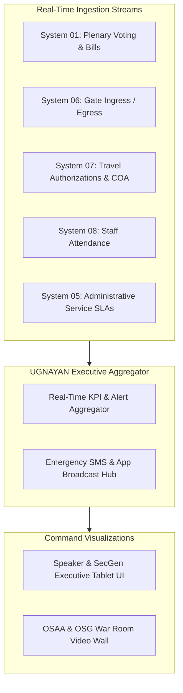

# Business Requirements Document (BRD)
## System 12: Live Executive Dashboard & Monitoring (UGNAYAN Command Center)
### UGNAYAN Super App - Executive Intelligence & Operations Center

**Document Reference:** HREP-UGNAYAN-BRD-2026-027  
**Target Organization:** House of Representatives of the Philippines (HRep) Secretariat  
**Primary Department Owners:** Office of the Speaker, Office of the Secretary General (OSG), Knowledge Management and Strategy Bureau (KMSB), ICTS  
**Date:** September 2026  
**Status:** Approved for Core Engineering  

---

### 1. Executive Summary & Business Problem

The **UGNAYAN Command Center** provides the Speaker of the House, the Secretary General, and Bureau Directors with real-time operational visibility across all legislative, administrative, financial, security, and facility activities in the Batasan complex.

#### Current Pain Points:
1. **Zero Real-Time Situational Awareness:** Executive leadership relies on delayed end-of-week paper briefing binders to know how many bills are in committee, how many guests are on campus, or whether statutory SLAs are breaching.
2. **Siloed Departmental Reporting:** No single executive screen connects plenary floor status, committee quorum alerts, travel cash advance exposure, and perimeter gate ingress.
3. **Delayed Crisis Decision-Making:** During severe weather suspensions or complex security lockdowns, commanders lack instant communication channels to push emergency broadcasts.

---

### 2. User Personas & Stakeholder Matrix

| Persona Code | Role & Title | Office | Core Responsibility & Needs |
| :--- | :--- | :--- | :--- |
| **PER-CMD-01** | Speaker of the House | Office of the Speaker | Real-time overview of Priority Legislative Agenda (LEDAC) bills, plenary attendance quorum, and landmark voting tallies. |
| **PER-CMD-02** | Secretary General | Office of the SecGen (OSG) | Comprehensive operational dashboard: Secretariat SLA health, gate visitor headcounts, COA liquidation liabilities, and pending executive sign-offs. |
| **PER-CMD-03** | Sergeant-at-Arms | OSAA Command Center | Perimeter gate ingress/egress velocities, emergency complex headcount, watchlist trigger alerts. |

---

### 3. Core Functional Requirements

#### FR-CMD-01: Executive Legislative & Operational KPI Matrix
- **Description:** Real-time dashboard widgets:
  - *Legislative:* Active LEDAC priority measures, bills passed on 3rd reading, committee hearing count today.
  - *Operations & SLA:* Overall Secretariat RA 11032 SLA compliance score (e.g. 98.4%), pending approval backlogs.
  - *Perimeter Security:* Real-time Batasan campus headcount (staff + guests), current vehicle entries.
  - *Financial Governance:* Total active travel cash advances and upcoming 30-day COA liquidation deadlines.

#### FR-CMD-02: Instant Emergency Alert & Institutional Broadcast Hub
- **Description:** 1-click broadcast of institutional announcements (e.g. *"Session suspended due to Typhoon warning; all personnel advised to initiate remote work"*).
