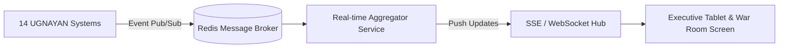

# Technical Design Document (TDD)
## System 12: Live Executive Dashboard & Monitoring (UGNAYAN Command Center)
### UGNAYAN Super App - Executive Intelligence & Operations Center

**Document Reference:** HREP-UGNAYAN-TDD-2026-028  
**Target Organization:** House of Representatives of the Philippines (HRep) Secretariat  
**Author:** Technical Consulting & Solutions Architecture Team  
**Date:** September 2026  
**Status:** Approved for Core Engineering  

---

### 1. Architectural Design & Streaming WebSocket Engine

The Command Center aggregates metrics from all 14 UGNAYAN micro-services using **Redis Pub/Sub** and pushes live updates to executive tablet and video-wall interfaces over **Server-Sent Events (SSE) / WebSockets**.



---

### 2. Database Schema (PostgreSQL & Redis Time-Series)

```sql
-- 1. Executive Snapshot Log Table
CREATE TABLE cmd_kpi_snapshots (
    id VARCHAR(36) PRIMARY KEY DEFAULT gen_random_uuid(),
    snapshot_timestamp TIMESTAMP WITH TIME ZONE DEFAULT CURRENT_TIMESTAMP,
    active_campus_headcount INT NOT NULL,
    bills_filed_current_congress INT NOT NULL,
    bills_passed_third_reading INT NOT NULL,
    active_committee_hearings_today INT NOT NULL,
    secretariat_sla_compliance_percent NUMERIC(5, 2) NOT NULL,
    overdue_travel_liquidations_count INT NOT NULL,
    unresolved_urgent_requests_count INT NOT NULL
);

CREATE INDEX idx_cmd_snapshot_time ON cmd_kpi_snapshots(snapshot_timestamp);

-- 2. Emergency Broadcast Audit Logs
CREATE TABLE cmd_broadcast_logs (
    id VARCHAR(36) PRIMARY KEY DEFAULT gen_random_uuid(),
    sender_user_id VARCHAR(36) NOT NULL REFERENCES users(id),
    title VARCHAR(150) NOT NULL,
    message_body TEXT NOT NULL,
    target_audience VARCHAR(50) NOT NULL, -- ALL_CONGRESS, LAWMAKERS_ONLY, SECRETARIAT_STAFF, PUBLIC
    sms_dispatched_count INT DEFAULT 0,
    push_dispatched_count INT DEFAULT 0,
    secgen_authorization_stamp VARCHAR(255) NOT NULL,
    dispatched_at TIMESTAMP WITH TIME ZONE DEFAULT CURRENT_TIMESTAMP
);
```

---

### 3. REST API & WebSocket Specification

- `GET /api/command/live-kpis`: Instant snapshot of institutional KPIs.
- `GET /api/command/stream`: Server-Sent Events (SSE) streaming real-time metric deltas every 5 seconds.
- `POST /api/command/broadcast`: Dispatch verified emergency notification across SMS, mobile push, and portal banners.
